# day51-项目第一天

# 学习目标

1. 了解项目生命周期

2. 能够完成用户注册案例
3. 能够完成用户登录与退出案例
4. 可以实现BaseServlet优化请求处理

# 第1章 内容回顾

# 第2章 项目环境搭建

声明：凡是导入的资源，无需编写，直接使用第三方的，

如果不满足需求，可以对导入的资源进行修改和添加

## 2.1 导入静态页面

将“资料/01-静态页面”导入到项目的webapp目录下，如图

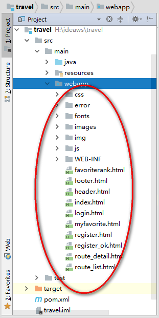

## 2.2 创建包结构

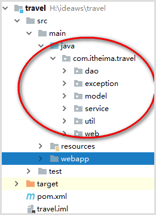

## 2.3 导入pom依赖

```xml
<project xmlns="http://maven.apache.org/POM/4.0.0" xmlns:xsi="http://www.w3.org/2001/XMLSchema-instance"
  xsi:schemaLocation="http://maven.apache.org/POM/4.0.0 http://maven.apache.org/maven-v4_0_0.xsd">

  <modelVersion>4.0.0</modelVersion>
  <groupId>com.itheima</groupId>
  <artifactId>travel</artifactId>
  <packaging>war</packaging>
  <version>1.0-SNAPSHOT</version>
    <name>travel</name>
  <url>http://maven.apache.org</url>

  <dependencies>
    <dependency>
      <groupId>junit</groupId>
      <artifactId>junit</artifactId>
      <version>3.8.1</version>
      <scope>test</scope>
    </dependency>
      <!--servlet-->
      <dependency>
          <groupId>javax.servlet</groupId>
          <artifactId>javax.servlet-api</artifactId>
          <version>3.1.0</version>
          <scope>provided</scope>
      </dependency>


      <!--mysql驱动-->
      <dependency>
          <groupId>mysql</groupId>
          <artifactId>mysql-connector-java</artifactId>
          <version>5.1.26</version>
          <scope>compile</scope>
      </dependency>
      <!--druid连接池-->
      <dependency>
          <groupId>com.alibaba</groupId>
          <artifactId>druid</artifactId>
          <version>1.0.9</version>
      </dependency>
      <!--jdbcTemplate-->
      <dependency>
          <groupId>org.springframework</groupId>
          <artifactId>spring-core</artifactId>
          <version>4.1.2.RELEASE</version>
          <scope>compile</scope>
      </dependency>
      <dependency>
          <groupId>org.springframework</groupId>
          <artifactId>spring-jdbc</artifactId>
          <version>4.1.2.RELEASE</version>
          <scope>compile</scope>
      </dependency>
      <dependency>
          <groupId>org.springframework</groupId>
          <artifactId>spring-tx</artifactId>
          <version>4.1.2.RELEASE</version>
          <scope>compile</scope>
      </dependency>
      <dependency>
          <groupId>org.springframework</groupId>
          <artifactId>spring-beans</artifactId>
          <version>4.1.2.RELEASE</version>
          <scope>compile</scope>
      </dependency>
      <dependency>
          <groupId>commons-logging</groupId>
          <artifactId>commons-logging</artifactId>
          <version>1.1.1</version>
          <scope>compile</scope>
      </dependency>
      <!--beanUtils-->
      <dependency>
          <groupId>commons-beanutils</groupId>
          <artifactId>commons-beanutils</artifactId>
          <version>1.9.2</version>
          <scope>compile</scope>
      </dependency>
      <!--jackson-->
      <dependency>
          <groupId>com.fasterxml.jackson.core</groupId>
          <artifactId>jackson-databind</artifactId>
          <version>2.3.3</version>
      </dependency>
      <dependency>
          <groupId>com.fasterxml.jackson.core</groupId>
          <artifactId>jackson-core</artifactId>
          <version>2.3.3</version>
      </dependency>
      <dependency>
          <groupId>com.fasterxml.jackson.core</groupId>
          <artifactId>jackson-annotations</artifactId>
          <version>2.3.3</version>
      </dependency>


      <!--javaMail-->
      <dependency>
          <groupId>javax.mail</groupId>
          <artifactId>javax.mail-api</artifactId>
          <version>1.5.6</version>
      </dependency>
      <dependency>
          <groupId>com.sun.mail</groupId>
          <artifactId>javax.mail</artifactId>
          <version>1.5.3</version>
      </dependency>
      <!--jedis-->
      <dependency>
          <groupId>redis.clients</groupId>
          <artifactId>jedis</artifactId>
          <version>2.7.0</version>
      </dependency>

  </dependencies>


  <build>
      <!--maven插件-->
    <plugins>
        <!--jdk编译插件-->
      <plugin>
        <groupId>org.apache.maven.plugins</groupId>
        <artifactId>maven-compiler-plugin</artifactId>
        <version>3.2</version>
        <configuration>
          <source>1.9</source>
          <target>1.9</target>
          <encoding>utf-8</encoding>
        </configuration>
      </plugin>
        <!--tomcat插件-->
    <plugin>
        <groupId>org.apache.tomcat.maven</groupId>
        <artifactId>tomcat7-maven-plugin</artifactId>
        <version>2.2</version>
        <configuration>
            <port>8080</port>
            <path>/travel</path>
        </configuration>
    </plugin>
    </plugins>
  </build>
</project>
```


## 2.4 导入配置文件

将“资料/02-配置文件”导入到resource资源目录中

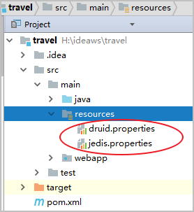

## 2.5 导入工具类

将“资料/03-工具类”导入到util包中

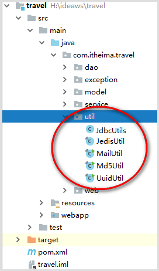

## 2.6 导入数据库脚本

到mysql数据库执行“资料/04-数据库脚本”，表之间的关系如下图


## 2.7 导入/创建实体

将“资料/05-实体类”打入到model包中

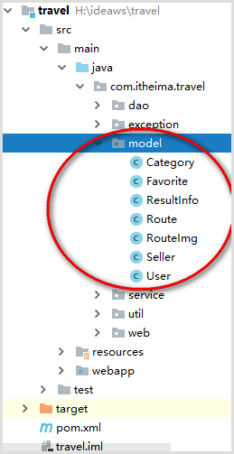

## 2.8 导入/创建其它公共类

将“资料/06-其他常用类”导入到如下包中

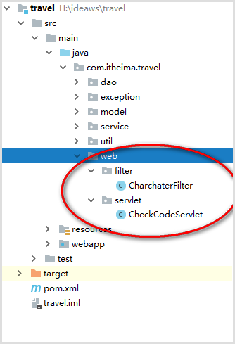

# 第3章 案例-用户注册

## 3.1 实现用户注册添加用户功能

### 3.1.1 案例需求

实现用户注册，要求前端发送异步请求注册。用户注册成功后，要求发送激活注册账号邮件，只有用户通过邮件激活后用户才可以进行登录操作。

### 3.1.2 实现效果

效果1——注册成功跳转效果


效果2——用户名前端验证效果

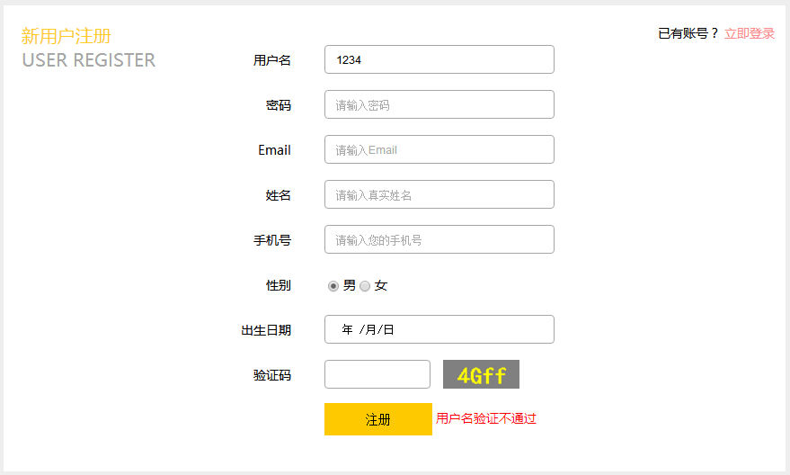

效果3——验证码后端验证错误效果


效果4——用户名后端验证已被注册效果

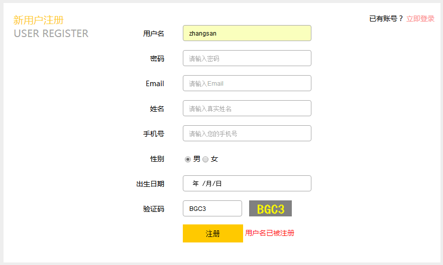

效果5——激活邮件

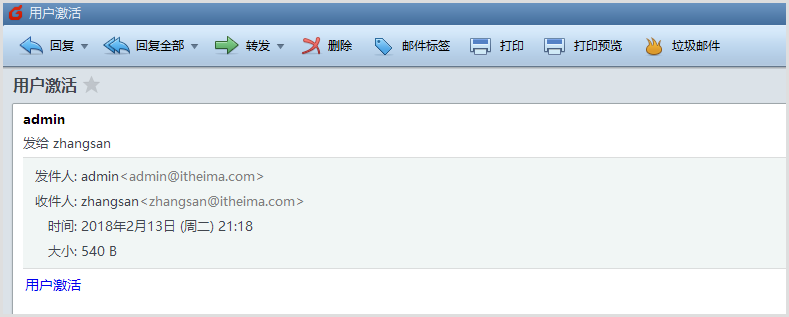

效果6——数据库成功注册信息(用户处于未激活状态)

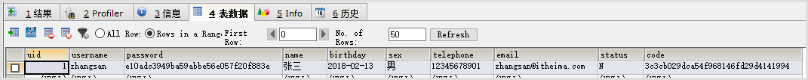

### 3.1.3 实现分析


### 3.1.4 实现步骤

1. 给注册页面表单注册表单提交事件，并进行前端数据验证用户名，用户名的要求长度为6~18个字符是必须以英文字母开头，其它字符组成可以为是数字、英文字母、下划线等。
2. 注册页面进行完成前端校验后，提交表单数据发送异步ajax注册请求给UserServlet
3. UserServlet处理用户注册请求，首先验证验证码，验证码验证成功后封装客户端请求数据到User对象，调用业务逻辑类UserService的用户注册register方法，封装好的User对象作为方法参数。
4. UserService注册业务方法内部首先要进行后端数据校验，防止前端浏览器屏蔽js代码导致前端校验无效，后端校验保证数据安全性，这里简单进行用户名非空判断就可以，课下完成其他数据校验。其次判断当前用户名是否已被注册，如果没有被注册才可以向数据添加新用户，添加前需要设置用户为未激活和激活码，并且对密码进行MD5加密（防止企业内部员工数据泄密），密码加密了就不能泄密了，因为MD5是不可逆的加密算法。最后调用数据访问类UserDao添加用户。最后注册成功后发送账号激活邮件。
5. UserService需要操作tab_user进行注册添加用户操作。
6. UserServlet获取注册结果进行返还给客户端浏览器json数据


### 3.1.5 实现代码

#### 3.1.5.1 register.html前端验证与提交异步注册请求代码

```html
<div class="rg_form_center">
					<script type="text/javascript">
						//加载事件
						$(function () {
							//注册表单提交事件
							$("#registerForm").submit(function () {
								//校验用户名，校验要求用户名字符长度6~18个字符，首字符必须为英文字母，其它字符范围为数字或英文字母或下划线
								var reg = /^[a-zA-Z]\w{5,17}$/;
								//获取用户名输入的值
								var username = $("#username").val();
								//正则表达式验证
								if(reg.test(username)){
								    //清空验证消息
									$("#msg").html("");
								    //发送异步请求进行注册
									var url="user";//UserServlet
									var data = $("#registerForm").serialize();
									var callback =function(resultInfo){
									    //判断返回数据状态
										if(resultInfo.flag){
										    //注册成功，跳转到注册成功页面
											location.href="register_ok.html";
										}else{
										    //注册失败
                                            $("#msg").html(resultInfo.errorMsg);
										}
									};
									var type="json";
									$.post(url,data,callback,type);
								}else{
								    //提示用户名不合法
                                    $("#msg").html("用户名验证不通过");
								    return false;//验证不通过，不提交表单
								}

                            });
                        });
					</script>
					<!--注册表单-->
    				<form id="registerForm">
						<!--提交处理请求的标识符-->
						<input type="hidden" name="action" value="register">
    					<table style="margin-top: 25px;">
    						<tr>
    							<td class="td_left">
    								<label for="username">用户名</label>
    							</td>
    							<td class="td_right">
    								<input type="text" id="username" name="username" placeholder="请输入账号">
    							</td>
    						</tr>
    						<tr>
    							<td class="td_left">
    								<label for="password">密码</label>
    							</td>
    							<td class="td_right">
    								<input type="text" id="password" name="password" placeholder="请输入密码">
    							</td>
    						</tr>
    						<tr>
    							<td class="td_left">
    								<label for="email">Email</label>
    							</td>
    							<td class="td_right">
    								<input type="text" id="email" name="email" placeholder="请输入Email">
    							</td>
    						</tr>
    						<tr>
    							<td class="td_left">
    								<label for="name">姓名</label>
    							</td>
    							<td class="td_right">
    								<input type="text" id="name" name="name" placeholder="请输入真实姓名">
    							</td>
    						</tr>
    						<tr>
    							<td class="td_left">
    								<label for="telephone">手机号</label>
    							</td>
    							<td class="td_right">
    								<input type="text" id="telephone" name="telephone" placeholder="请输入您的手机号">
    							</td>
    						</tr>
    						<tr>
    							<td class="td_left">
    								<label for="sex">性别</label>
    							</td>
    							<td class="td_right gender">
    								<input type="radio" id="sex" name="sex" value="男" checked> 男
    								<input type="radio" name="sex" value="女"> 女
    							</td>
    						</tr>
    						<tr>
    							<td class="td_left">
    								<label for="birthday">出生日期</label>
    							</td>
    							<td class="td_right">
    								<input type="date" id="birthday" name="birthday" placeholder="年/月/日">
    							</td>
    						</tr>
    						<tr>
    							<td class="td_left">
    								<label for="check">验证码</label>
    							</td>
    							<td class="td_right check">
    								<input type="text" id="check" name="check" class="check">
    								
									<script type="text/javascript">
										//图片点击事件
										function changeCheckCode(img) {
											img.src="checkCode?"+new Date().getTime();
                                        }
									</script>
    							</td>
    						</tr>
    						<tr>
    							<td class="td_left"> 
    							</td>
    							<td class="td_right check"> 
    								<input type="submit" class="submit" value="注册">
									<span id="msg" style="color: red;"></span>
    							</td>
    						</tr>
    					</table>
    				</form>
    			</div>
```

#### 3.1.5.2 UserServlet处理异步注册请求代码

```java
package com.itheima.travel.web.servlet;

import com.fasterxml.jackson.databind.ObjectMapper;
import com.itheima.travel.exception.UserNameExistsException;
import com.itheima.travel.exception.UserNameNotNullException;
import com.itheima.travel.model.ResultInfo;
import com.itheima.travel.model.User;
import com.itheima.travel.service.UserService;
import org.apache.commons.beanutils.BeanUtils;

import javax.servlet.ServletException;
import javax.servlet.annotation.WebServlet;
import javax.servlet.http.HttpServlet;
import javax.servlet.http.HttpServletRequest;
import javax.servlet.http.HttpServletResponse;
import java.io.IOException;

@WebServlet("/user")
public class UserServlet extends HttpServlet {

    /**
     * 实例用户业务类
     */
    private UserService userService = new UserService();

    /**
     * 处理get请求
     * @param request
     * @param response
     * @throws ServletException
     * @throws IOException
     */
    @Override
    protected void doGet(HttpServletRequest request, HttpServletResponse response) throws ServletException, IOException {
        //获得请求的标识符
        String action = request.getParameter("action");
        //处理注册请求
        if("register".equals(action)){
            register(request,response);
        }
    }

    /**
     * 处理注册请求
     * @param request
     * @param response
     * @throws ServletException
     * @throws IOException
     */
    private void register(HttpServletRequest request, HttpServletResponse response) throws ServletException, IOException {
        //1.定义返回结果对象
        ResultInfo resultInfo =null;
        //2.验证码验证
        //2.1获取用户输入的验证
        String userCheckCode = request.getParameter("check");
        //2.2服务器生成的验证码
        String serverCheckCode= (String) request.getSession().getAttribute("CHECKCODE_SERVER");
        //2.3校验
        if(serverCheckCode!=null && !serverCheckCode.equalsIgnoreCase(userCheckCode)){
            resultInfo = new ResultInfo(false,"验证码错误");
        }else {
            try {
                //3.获取数据并封装数据到User对象
                User user = new User();
                BeanUtils.populate(user, request.getParameterMap());
                //4.调用业务逻辑层注册用户
                boolean flag = userService.register(user, request.getContextPath());
                //5.获取注册结果
                if (flag) {
                    resultInfo = new ResultInfo(true);
                }
            } catch (UserNameNotNullException e) {
                resultInfo = new ResultInfo(false, e.getMessage());
            } catch (UserNameExistsException e) {
                resultInfo = new ResultInfo(false, e.getMessage());
            } catch (Exception e) {
                //打印异常信息
                e.printStackTrace();
                //用户处理不了的异常，要去到友好页面
                throw new RuntimeException(e);
            }
        }
        //6.将resultInfo转换为json数据返回给客户端
        String jsonData =  new ObjectMapper().writeValueAsString(resultInfo);
        //7.输出给浏览器
        response.getWriter().write(jsonData);
    }

    @Override
    protected void doPost(HttpServletRequest req, HttpServletResponse resp) throws ServletException, IOException {
        doGet(req,resp);
    }
}

```

#### 3.1.5.3 UserService处理用户注册业务代码

自定义异常代码——UserNameExistsException

```java
package com.itheima.travel.exception;

/**
 * 用户名已存在异常
 */
public class UserNameExistsException extends Exception {
    public UserNameExistsException(){}
    public UserNameExistsException(String msg){
        super(msg);
    }

}
```

自定义异常代码——UserNameNotNullException

```java
package com.itheima.travel.exception;

/**
 * 用户名不能为空异常
 */
public class UserNameNotNullException extends Exception {
    public UserNameNotNullException(){}
    public UserNameNotNullException(String msg){
        super(msg);
    }
}
```

UserService代码

```java
package com.itheima.travel.service;

import com.itheima.travel.dao.UserDao;
import com.itheima.travel.exception.UserNameExistsException;
import com.itheima.travel.exception.UserNameNotNullException;
import com.itheima.travel.model.User;
import com.itheima.travel.util.MailUtil;
import com.itheima.travel.util.Md5Util;
import com.itheima.travel.util.UuidUtil;

/**
 * 用户业务类
 */
public class UserService {

    //实例用户数据访问类
    private UserDao userDao = new UserDao();

    /**
     * 处理注册的业务
     * @param user
     * @return boolean,true注册成功，false注册失败
     */
    public boolean register(User user, String basePath)throws Exception {
        //数据验证-用户名不能为空（由于客户端浏览器可以禁用js，所以后端为了安全也进行基础数据验证）
        if(user.getUsername()==null || "".equals(user.getUsername().trim())){
            //去提示用户并且用户自己处理掉，使用抛出自定义异常
            throw new UserNameNotNullException("用户名不能为空");
        }
        //根据用户输入的用户名去查找数据库对应用户
        User dbUser = userDao.getUserByUserName(user.getUsername());
        //如果数据库用户不为空，说明用户名已被注册
        if(dbUser!=null){
            //说明用户名已被注册，抛出自定义异常
            throw new UserNameExistsException("用户名已被注册");
        }
        //激活状态为未激活
        user.setStatus("N");
        //激活码,用于激活
        user.setCode(UuidUtil.getUuid());
        //对密码加密(MD5加密，消息摘要第五版加密算法,不可逆的加密算法)
        user.setPassword(Md5Util.encodeByMd5(user.getPassword()));
        //实现注册添加用户
        userDao.register(user);
        //发送激活邮件,根据用户提供的注册邮箱发送激活邮件
        MailUtil.sendMail(user.getEmail(), "<a href='http://localhost:8080"+basePath+"/user?action=active&code="+user.getCode()+"'>用户激活<a>");
        return true;
    }
}
```

#### 3.1.5.4 UserDao处理数据访问代码

```java
package com.itheima.travel.dao;

import com.itheima.travel.model.User;
import com.itheima.travel.util.JdbcUtils;
import org.springframework.dao.EmptyResultDataAccessException;
import org.springframework.jdbc.core.BeanPropertyRowMapper;
import org.springframework.jdbc.core.JdbcTemplate;

import java.sql.SQLException;

/**
 * 用户数据访问类
 */
public class UserDao {

    /**
     * JdbcTemplate
     */
    private JdbcTemplate jdbcTemplate = new JdbcTemplate(JdbcUtils.getDataSource());

    /**
     * 根据用户名查找数据库用户
     * @param username
     * @return User 返回数据库用户
     */
    public User getUserByUserName(String username)throws SQLException {
        //根据用户名查找用户的sql语句
        String sql="SELECT * FROM tab_user WHERE username=?";
        //执行sql语句
        User user = null;
        try{
            user = jdbcTemplate.queryForObject(sql, new BeanPropertyRowMapper<>(User.class), username);
        }catch (EmptyResultDataAccessException e){}
        return user;
    }

    /**
     * 注册用户
     * @param user
     * @return int，返回影响行数
     */
    public int register(User user) {
        //定义插入用户sql语句
        String sql="INSERT INTO tab_user VALUES(NULL,?,?,?,?,?,?,?,?,?)";
        //执行sql语句,返回影响行数
        return jdbcTemplate.update(sql,
                    user.getUsername(),
                    user.getPassword(),
                    user.getName(),
                    user.getBirthday(),
                    user.getSex(),
                    user.getTelephone(),
                    user.getEmail(),
                    user.getStatus(),
                    user.getCode()
                );
    }
}
```

## 3.2 实现用户邮箱激活用户账号功能

### 3.2.1 案例需求

用户自己注册的邮箱收到激活邮件，用户点击用户激活实现用户账号激活

### 3.2.2 实现效果

效果1——页面显示效果

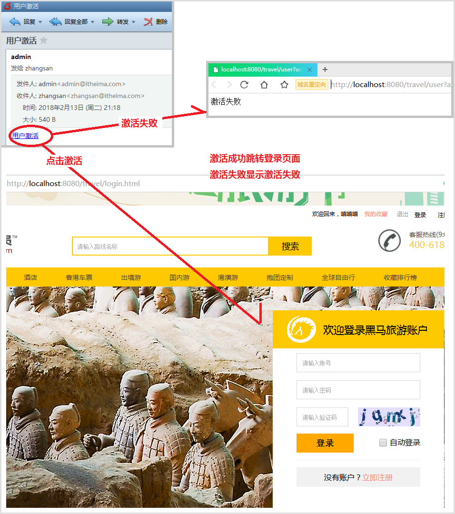

效果2——张三激活成功数据库表激活状态更新为“Y”效果

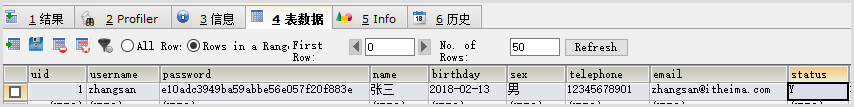

### 3.2.3 实现分析

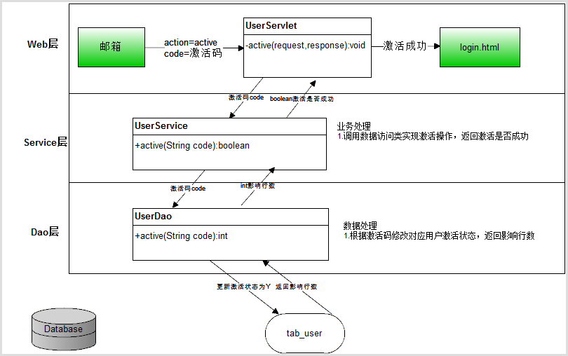

### 3.2.4 实现步骤

1. UserServlet类处理激活active请求，获取激活码code，调用UserService业务类进行激活业务操作
2. UserService业务类调用UserDao处理数据激活操作
3. UserDao根据激活码进行激活，将对应用户的激活状态更新为“Y”

### 3.2.5 实现代码

#### 3.2.5.1 UserServlet处理激活请求代码

```java
 /**
     * 处理get请求
     * @param request
     * @param response
     * @throws ServletException
     * @throws IOException
     */
    @Override
    protected void doGet(HttpServletRequest request, HttpServletResponse response) throws ServletException, IOException {
        //获得请求的标识符
        String action = request.getParameter("action");
        //处理注册请求
        if("register".equals(action)){
            register(request,response);
        }else if("active".equals(action)){
            //处理激活请求
            active(request,response);
        }
    }

    /**
     *  处理激活请求
     * @param request
     * @param response
     * @throws ServletException
     * @throws IOException
     */
    private void active(HttpServletRequest request, HttpServletResponse response) throws ServletException, IOException {
        try {
            //获取激活码
            String code = request.getParameter("code");
            //调用业务逻辑类UserService进行激活
            boolean flag = userService.active(code);
            //判断结果
            if(flag){
                //激活成功，跳转到登录页面
                response.sendRedirect(request.getContextPath()+"/login.html");
            }else{
                //激活失败，显示激活失败
                response.getWriter().write("激活失败");
            }
        }catch (Exception e){
            e.printStackTrace();
            //系统异常，用户处理不了，跳转到友好页面
            throw new RuntimeException(e);
        }
    }
```

#### 3.2.5.1 UserService处理激活业务代码

```java
/**
     *  激活账号方法
     * @param code
     * @return true激活成功，false激活失败
     */
    public boolean active(String code)throws Exception {
        //调用数据访问层进行激活，返回影响行数
        int rows= userDao.active(code);
        //返回激活结果，影响行数>0说明激活成功，否则激活失败
        return rows>0;
    }
```

#### 3.2.5.1 UserDao处理激活数据更新代码

```java
/**
     * 激活状态数据访问方法
     * @param code
     * @return int,影响行数
     */
    public int active(String code)throws SQLException {
        //定义需要激活的sql语句
        String sql="UPDATE tab_user SET STATUS ='Y' WHERE CODE=? AND STATUS='N'";
        //执行sql语句
        return jdbcTemplate.update(sql,code);
    }
```

# 第4章 案例-用户登录

## 4.1 实现登录成功跳转到首页功能

### 4.1.1 案例需求

用户到达登录页面，输入未激活的用户名与密码进行登录提示账号未激活（注意登录请求是ajax异步登录请求），用户输入已激活正确的用户名与密码进入网站首页。如果用户名与密码是错误的要有提示信息。

### 4.1.2 实现效果

效果1——用户名不存在的提示

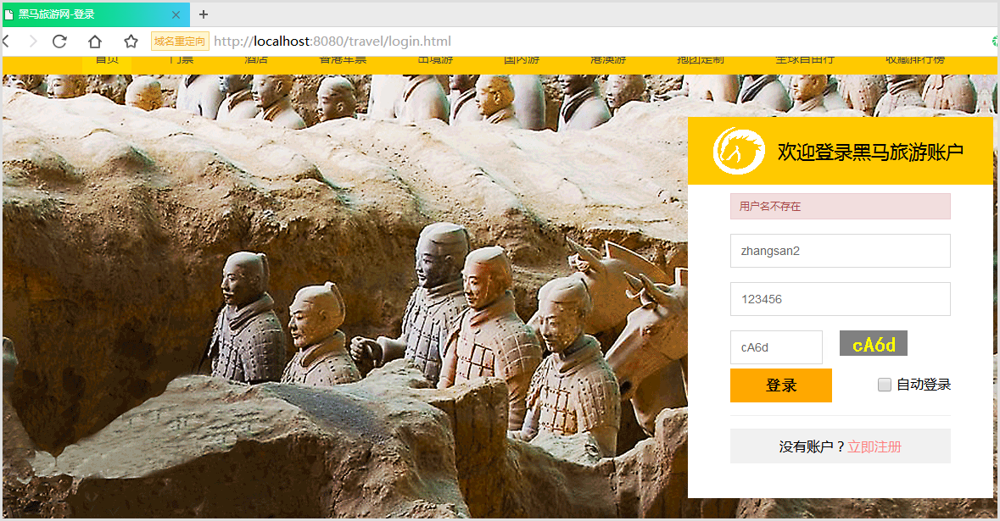

效果2——密码错误

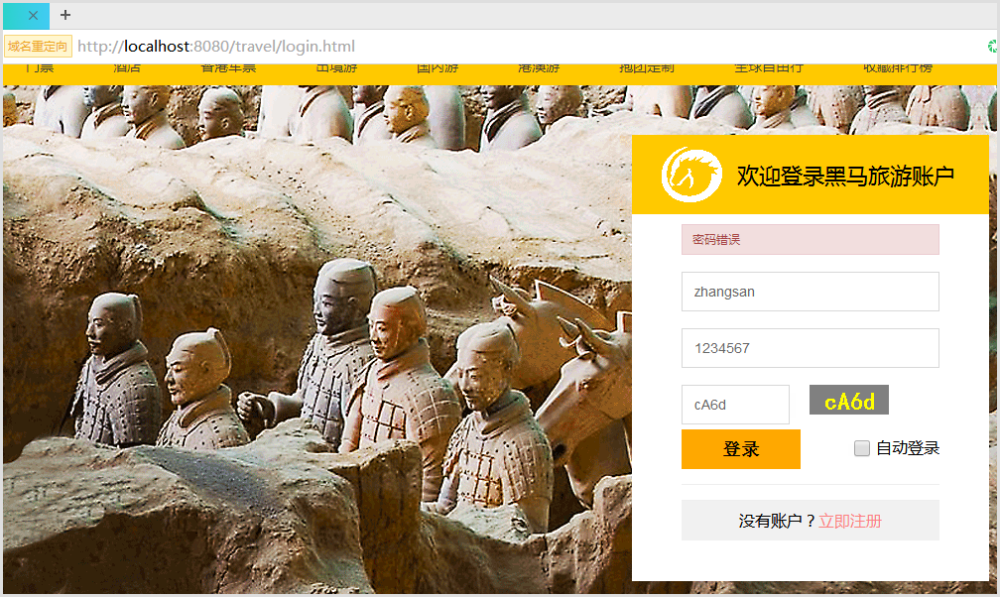

效果3——登录成功

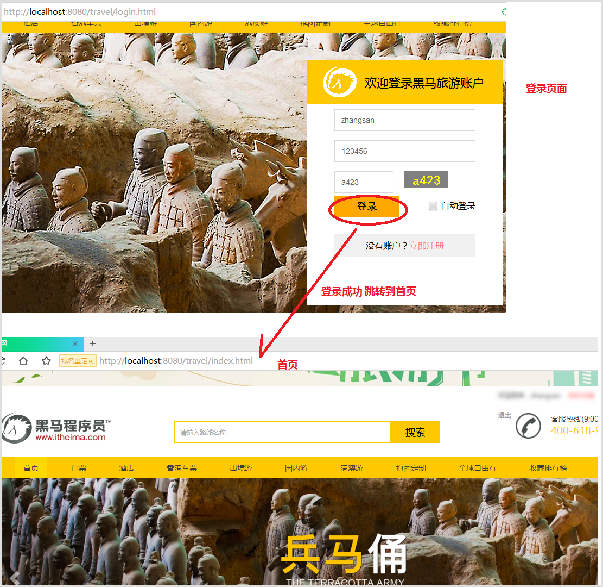

### 4.1.3 实现分析

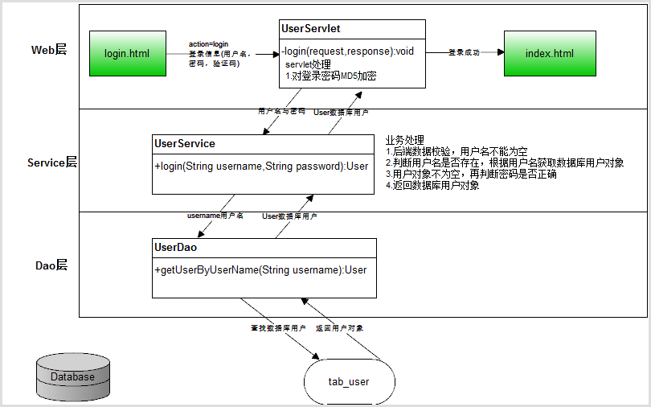

### 4.1.4 实现步骤

1. 登录提交异步的登录请求UserServlet
2. UserServlet处理登录请求，获取数据，对密码进行MD5加密，调用业务UserService的login业务方法
3. UserService处理登录业务首先数据校验，之后检查用户名是否存在，密码是否错误，最后返回对应数据库用户
4. 返回结果给客户端

### 4.1.5 实现代码

4.1.5.1 login.html提交异步登录请求代码

```java
<!DOCTYPE html>
<html>

<head>
    <meta charset="utf-8">
    <meta http-equiv="X-UA-Compatible" content="IE=edge">
    <meta name="viewport" content="width=device-width, initial-scale=1">
    <title>黑马旅游网-登录</title>  
    <link rel="stylesheet" type="text/css" href="css/common.css">
    <link rel="stylesheet" type="text/css" href="css/login.css">
    <!-- HTML5 shim and Respond.js for IE8 support of HTML5 elements and media queries -->
    <!-- WARNING: Respond.js doesn't work if you view the page via file:// -->
    <!--[if lt IE 9]>
      <script src="https://cdn.bootcss.com/html5shiv/3.7.3/html5shiv.min.js"></script>
      <script src="https://cdn.bootcss.com/respond.js/1.4.2/respond.min.js"></script>
    <![endif]-->
</head>

<body>
<!--引入头部-->
<div id="header"></div>
    <!-- 头部 end -->
    <section id="login_wrap">
        <div class="fullscreen-bg" style="background: url(images/login_bg.png);height: 532px;">
        	
        </div>
        <div class="login-box">
        	<div class="title">
        		
        		<span>欢迎登录黑马旅游账户</span>
        	</div>
        	<div class="login_inner">

				<!--登录错误提示消息-->
        		<div id="errorMsg" class="alert alert-danger" style="display: none"></div>
				<form id="loginForm">
        			<input type="hidden" name="action" value="login"/>
					<input name="username" type="text" placeholder="请输入账号" autocomplete="off">
        			<input name="password" type="text" placeholder="请输入密码" autocomplete="off">
        			<div class="verify">
					<input name="check" type="text" placeholder="请输入验证码" autocomplete="off">
					<span></span>
					<script type="text/javascript">
                        //图片点击事件
                        function changeCheckCode(img) {
                            img.src="checkCode?"+new Date().getTime();
                        }
					</script>
			</div>
			<div class="submit_btn">
				<button type="submit">登录</button>
        				<div class="auto_login">
        					<input type="checkbox" name="" class="checkbox">
        					<span>自动登录</span>
        				</div>        				
        			</div>        			       		
        		</form>
        		<div class="reg">没有账户？<a href="javascript:;">立即注册</a></div>
        	</div>

        </div>
    </section>
    <!--引入尾部-->
    <div id="footer"></div>
    <!-- jQuery (necessary for Bootstrap's JavaScript plugins) -->
    <script src="js/jquery-3.3.1.js"></script>
    <!-- Include all compiled plugins (below), or include individual files as needed -->
    <script src="js/bootstrap.min.js"></script>
    <!--导入布局js，共享header和footer-->
  	<script type="text/javascript" src="js/include.js"></script>
	<script>
		$(function(){
			$("#loginForm").submit(function(){
				//数据校验忽略
				//发送ajax异步登录请求
				var url="user";//UserServlet
				var data = $("#loginForm").serialize();//获取表单所有表单项拼接的数据
				var callback = function (resultInfo) {
					//判断返回数据有效性
					if(resultInfo.flag){
						//登录成功，跳转到首页
						location.href="index.html";
					}else{
						//登录失败，显示错误消息
						$("#errorMsg").show();
						$("#errorMsg").html(resultInfo.errorMsg);
					}
				};
				var type="json";
				$.post(url,data,callback,type);
				return false;//不提交表单
			});
		});

	</script>
</body>

</html>
```

4.1.5.2 UserServlet处理登录请求代码

自定义异常代码——UserNameNotExistsException

```java
package com.itheima.travel.exception;

/**
 * 用户名不存在异常
 */
public class UserNameNotExistsException extends Exception {
    public UserNameNotExistsException(){}
    public UserNameNotExistsException(String msg){
        super(msg);
    }

}
```

UserServlet代码

```java
 /**
     * 处理get请求
     * @param request
     * @param response
     * @throws ServletException
     * @throws IOException
     */
    @Override
    protected void doGet(HttpServletRequest request, HttpServletResponse response) throws ServletException, IOException {
        //获得请求的标识符
        String action = request.getParameter("action");
        //处理注册请求
        if("register".equals(action)){
            register(request,response);
        }else if("active".equals(action)){
            //处理激活请求
            active(request,response);
        }else if("login".equals(action)){
            //处理登录请求
            login(request, response);
        }

    }
    /**
     *  处理登录请求
     * @param request
     * @param response
     * @throws ServletException
     * @throws IOException
     */
    private void login(HttpServletRequest request, HttpServletResponse response)
            throws ServletException, IOException {
        //定义返回客户端数据对象
        ResultInfo resultInfo = null;
        try {
            //获取用户名与密码
            String username = request.getParameter("username");
            String password = request.getParameter("password");//123456
            //对密码加密码(由于数据库存的是加密密码，所以登录时也要加密)
            password = Md5Util.encodeByMd5(password);

            //验证登录验证码
            //获得servlet生成的验证码
            String sysCheckCode = (String) request.getSession().getAttribute("CHECKCODE_SERVER");
            //获取用户输入的验证码
            String userCheckCode = request.getParameter("check");
            //比较验证码
            if (sysCheckCode != null && !userCheckCode.equalsIgnoreCase(sysCheckCode)) {
                //实例返回数据对象，说明验证码验证失败
                resultInfo = new ResultInfo(false, "验证码错误");
            } else {

                //调用业务逻辑登录方法
                User dbUser = userService.login(username, password);
                //判断登录是否成功
                if (dbUser != null) {
                    //登录成功，将用户信息写入session
                    request.getSession().setAttribute("loginUser", dbUser);
                    //实例返回数据对象
                    resultInfo = new ResultInfo(true);
                }
            }

        } catch (UserNameNotNullException e) {
            //用户名为空
            resultInfo = new ResultInfo(false, e.getMessage());
        } catch (UserNameNotExistsException e) {
            //用户名不存在或错误
            resultInfo = new ResultInfo(false, e.getMessage());
        } catch (PasswordErrorException e) {
            //密码错误
            resultInfo = new ResultInfo(false, e.getMessage());
        } catch (Exception e) {
            e.printStackTrace();
            throw new RuntimeException(e);//系统异常，抛到友好页面
        }
        //获取返回浏览器的json数据
        String jsonData =  new ObjectMapper().writeValueAsString(resultInfo);
        //输出到浏览器
        response.getWriter().write(jsonData);
    }
```

4.1.5.3 UserService处理登录业务代码

```java
/**
     *  登录的业务方法
     * @param username
     * @param password
     * @return User,返回登录的数据库用户对象
     * @throws Exception
     */
    public User login(String username, String password)throws Exception {
        if(username==null || "".equals(username.trim())){
            throw new UserNameNotNullException("用户名不能为空");
        }
        //根据用户名查找数据库用户对象
        User dbUser = userDao.getUserByUserName(username);
        if(dbUser==null){
            throw new UserNameNotNullException("用户名不存在");
        }

        //验证密码
        if(password!=null && !password.equals(dbUser.getPassword())){
            throw new PasswordErrorException("密码错误");
        }

        //返回登陆成功的数据库用户
        return dbUser;

    }
```

## 4.2 实现header位置显示登录数据功能

### 4.2.1 案例需求

用户登录成功后跳转到首页，首页显示对应登录数据。

### 4.2.2 实现效果

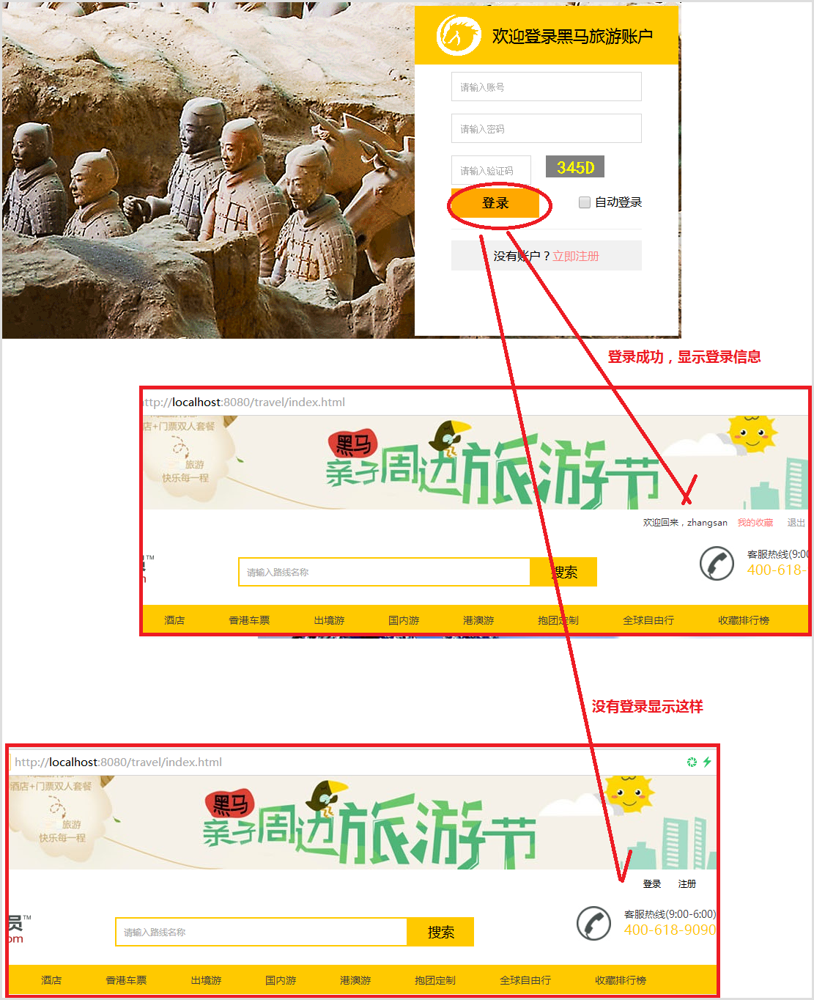

### 4.2.3 实现分析

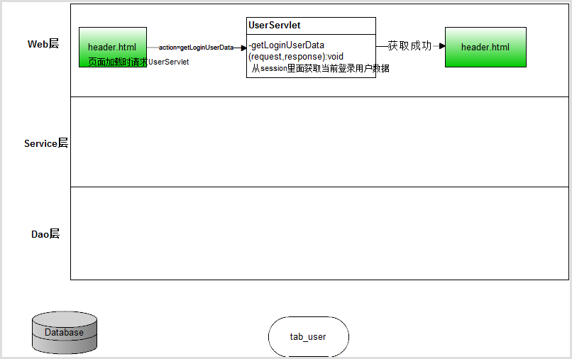

### 4.2.4 实现步骤

1. header.html加载时提交异步请求UserServlet获取当前用户对象
2. UserServlet从session里面获取登录用户数据，将数据封装到返回结果对象中，返回json数据
3. header.html获取到返回的数据拼接字符串更新显示登录信息

### 4.2.5 实现代码

4.2.5.1 header.html提交异步请求代码

```html
<!-- 头部 start -->
    <header id="header">
        <div class="top_banner">
            
        </div>
        <div class="shortcut">
            <!-- 未登录状态  -->
            <div class="login_out">
                <a href="login.html">登录</a>
                <a href="register.html">注册</a>
            </div>
            <!-- 登录状态  -->
            <div class="login">
                <span>欢迎回来，嘻嘻哈哈</span>
                <a href="myfavorite.html" class="collection">我的收藏</a>
                <a href="javascript:;">退出</a>
            </div>
        </div>
        <script>
            $(function () {
                //页面加载隐藏登录信息
                $(".login").hide();
                //获取用户登录数据异步请求
                var url="user";//UserServlet
                var data={action:"getLoginUserData"};
                var callback = function (resultInfo) {
                    //判断返回数据有效性
                    if(resultInfo.flag){
                        //成功返回登录数据,先隐藏非登录信息
                        $(".login_out").hide();
                        //拼接登录数据
                        var html="<span>欢迎回来，"+resultInfo.data.username+"</span>\n" +
                            "<a href=\"myfavorite.html\" class=\"collection\">我的收藏</a>\n" +
                            "<a href=\"javascript:;\">退出</a>";
                        //将拼接好的登录数据设置到登录信息内
                        $(".login").html(html);
                        //显示登录信息
                        $(".login").show();
                    }
                };
                var type="json";
                $.post(url,data,callback,type);
            });
        </script>
        <div class="header_wrap">
            <div class="topbar">
                <div class="logo">
                    <a href="/"></a>
                </div>
                <div class="search">
                    <input name="" type="text" placeholder="请输入路线名称" class="search_input" autocomplete="off">
                    <a href="javascript:;" class="search-button">搜索</a>
                </div>
                <div class="hottel">
                    <div class="hot_pic">
                        
                    </div>
                    <div class="hot_tel">
                        <p class="hot_time">客服热线(9:00-6:00)</p>
                        <p class="hot_num">400-618-9090</p>
                    </div>
                </div>
            </div>
        </div>
    </header>
    <!-- 头部 end -->
     <!-- 首页导航 -->
    <div class="navitem">
        <ul class="nav">
            <li class="nav-active"><a href="index.html">首页</a></li>
            <li><a href="route_list.html">门票</a></li>
            <li><a href="route_list.html">酒店</a></li>
            <li><a href="route_list.html">香港车票</a></li>
            <li><a href="route_list.html">出境游</a></li>
            <li><a href="route_list.html">国内游</a></li>
            <li><a href="route_list.html">港澳游</a></li>
            <li><a href="route_list.html">抱团定制</a></li>
            <li><a href="route_list.html">全球自由行</a></li>
            <li><a href="favoriterank.html">收藏排行榜</a></li>
        </ul>
    </div>
    
```

4.2.5.2 UserServlet处理获取登录用户数据请求代码

```java
/**
     * 处理get请求
     * @param request
     * @param response
     * @throws ServletException
     * @throws IOException
     */
    @Override
    protected void doGet(HttpServletRequest request, HttpServletResponse response) throws ServletException, IOException {
        //获得请求的标识符
        String action = request.getParameter("action");
        //处理注册请求
        if("register".equals(action)){
            register(request,response);
        }else if("active".equals(action)){
            //处理激活请求
            active(request,response);
        }else if("login".equals(action)){
            //处理登录请求
            login(request, response);
        }else if("getLoginUserData".equals(action)){
            //处理获取登录用户数据请求
            getLoginUserData(request,response);
        }

    }

    /**
     * 处理获取登录用户数据请求
     * @param request
     * @param response
     * @throws ServletException
     * @throws IOException
     */
    private void getLoginUserData(HttpServletRequest request, HttpServletResponse response)
            throws ServletException, IOException {
        //定义返回数据对象
        ResultInfo resultInfo = null;
        //获取用户登录数据
        User user =(User) request.getSession().getAttribute("loginUser");
        //判断登录数据有效性
        if(user==null){
            //用户没有登录，直接存储false状态，代表获取数据失败
            resultInfo = new ResultInfo(false);
        }else{
            //用户有登录数据，状态为true，并且存储登录的数据进行返还
            resultInfo = new ResultInfo(true,user,null);
        }
        //将返回数据转换为json
        String jsonData =  new ObjectMapper().writeValueAsString(resultInfo);
        System.out.println(jsonData);
        //返回给浏览器
        response.getWriter().write(jsonData);
    }
```

# 第5章 案例-用户退出

## 5.1 案例需求

用户如果登录了，可以通过header.html的“退出”进行注销登录

## 5.2 实现效果

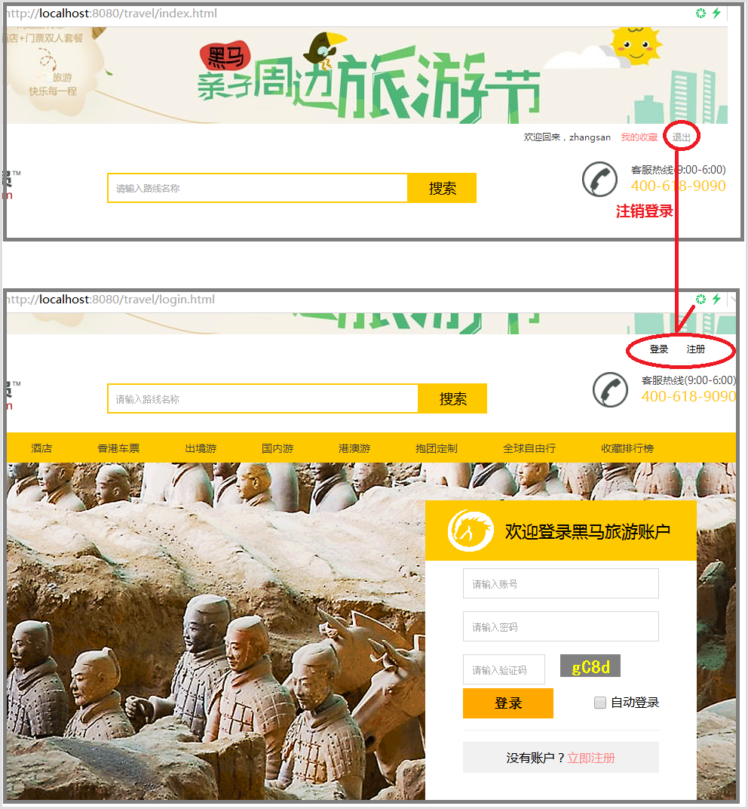

## 5.3 实现分析

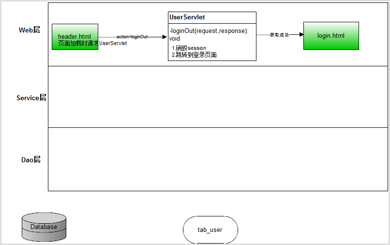

## 5.4 实现步骤

1. 在header.jsp的登录信息“退出”连接位置设置注销请求loginOut
2. 在UserServlet处理LoginOut注销请求，销毁session并跳转到登录页面

## 5.3 实现代码

5.3.1 header.html页面提交请求代码

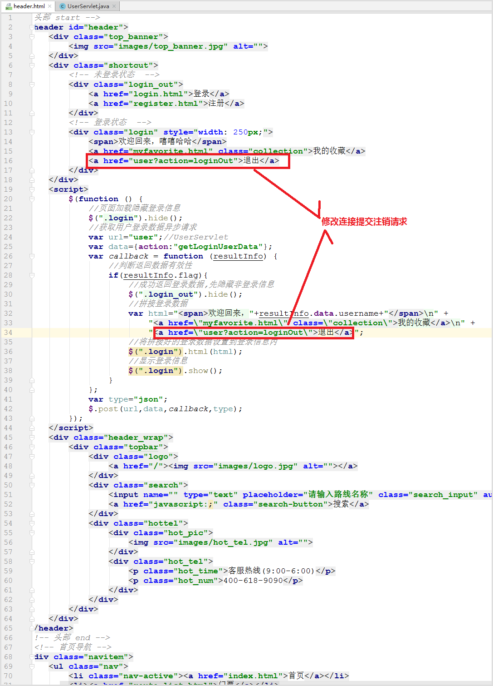

5.3.2 UserServlet处理注销请求代码

```java
/**
     * 处理get请求
     * @param request
     * @param response
     * @throws ServletException
     * @throws IOException
     */
    @Override
    protected void doGet(HttpServletRequest request, HttpServletResponse response) throws ServletException, IOException {
        //获得请求的标识符
        String action = request.getParameter("action");
        //处理注册请求
        if("register".equals(action)){
            register(request,response);
        }else if("active".equals(action)){
            //处理激活请求
            active(request,response);
        }else if("login".equals(action)){
            //处理登录请求
            login(request, response);
        }else if("getLoginUserData".equals(action)){
            //处理获取登录用户数据请求
            getLoginUserData(request,response);
        }else if("loginOut".equals(action)){
            //处理用户退出请求
            loginOut(request,response);
        }

    }

    /**
     * 处理用户退出请求
     * @param request
     * @param response
     * @throws ServletException
     * @throws IOException
     */
    private void loginOut(HttpServletRequest request, HttpServletResponse response)
            throws ServletException, IOException {
        //销毁当前session
        request.getSession().invalidate();
        //跳转页面到登录页面
        response.sendRedirect(request.getContextPath()+"/login.html");
    }
```

# 第6章 案例-优化BaseServlet

## 6.1 思考问题

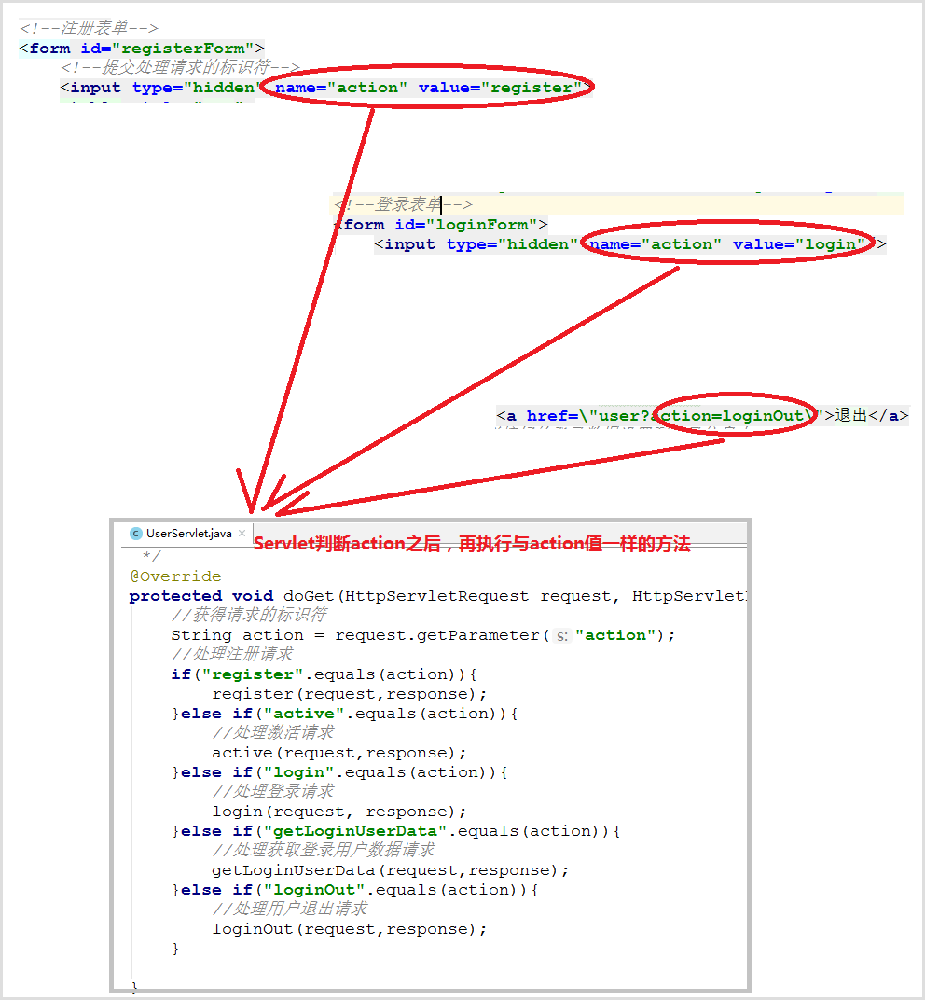

前端提交请求action=methodName，后端处理请求也是mehodName方法，我们可不可以根据前端传来的方法名字自动执行与传过来action值一样的方法呢？

答案：可以。利用前端传过来的字符串自动执行一样的方法，我们会想到反射。还有就是今天我们只开发用户模块UserServlet，后面还要开发其他模块的Servlet的处理，所以我们要抽取出一个父类BaseServlet，由BaseServlet通过反射统一处理UserServlet等子类的方法。

## 6.2 抽取父类BaseServlet观察运行

创建BaseServlet代码如下

```java
package com.itheima.travel.web.servlet;

import javax.servlet.ServletException;
import javax.servlet.ServletRequest;
import javax.servlet.ServletResponse;
import javax.servlet.http.HttpServlet;
import java.io.IOException;

public class BaseServlet extends HttpServlet{
    /**
     * 重写处理请求方法
     * @param request
     * @param response
     * @throws ServletException
     * @throws IOException
     */
    @Override
    public void service(ServletRequest request, ServletResponse response) throws ServletException, IOException {
        //获取action
        String action = request.getParameter("action");
        //输出
        System.out.println("action="+action);
        System.out.println(this);
    }
}

```

修改UserServlet代码

```java
@WebServlet("/user")
public class UserServlet extends BaseServlet {...}
```

直接运行http://localhost:8080/travel/user?action=login输出信息如下：

```
action=login
com.itheima.travel.web.servlet.UserServlet@3f3bef87
```


## 6.3 分析问题解决方法

- 问题1：访问UserServlet结果运行了BaseServlet的处理请求service方法，为什么？

  答：因为UserServlet继承BaseServlet，BaseServlet继承HttpServlet并重写了处理请求代码，所以执行的是BaseSe:vlet的处理请求代码


- 问题2：BaseServlet的service方法里面这句代码System.out.println(this);为什么打印的是“com.itheima.travel.web.servlet.UserServlet@3f3bef87”说明是this的实例对象时Userservlet,为什么不是BaseServlet实例对象呢？

  答：因为用户访问的是“user?action=login”，UserServlet配置映射路径就是“/user”,所以用户访问的时候服务器创建的是UserServlet对象实例，子类继承了父类的service方法，最后运行的也是父类的service方法。但是this对象实例是UserServlet。


- 问题3：可以获取action的方法名字，又有了UserServlet对象实例，可以通过反射自动执行当前实例的对应方法吗？

  答：可以

  ​

## 6.4 实现反射调用子类具体处理请求的私有方法代码

```java
package com.itheima.travel.web.servlet;

import javax.servlet.ServletException;
import javax.servlet.ServletRequest;
import javax.servlet.ServletResponse;
import javax.servlet.http.HttpServlet;
import javax.servlet.http.HttpServletRequest;
import javax.servlet.http.HttpServletResponse;
import java.io.IOException;
import java.lang.reflect.Method;

public class BaseServlet extends HttpServlet{
    /**
     * 重写处理请求方法
     * @param request
     * @param response
     * @throws ServletException
     * @throws IOException
     */
    @Override
    public void service(ServletRequest request, ServletResponse response) throws ServletException, IOException {
        try {
            //this,当前实例的UserServlet实例对象
            String action = request.getParameter("action");
            //要调用的方法名和对象都有了，可以通过反射方式执行该方法名的方法
            //System.out.println(this);
            //获取当前对象的类文件对象
            Class clazz = this.getClass();
            //获取当前私有方法名的方法对象
            Method method = clazz.getDeclaredMethod(action, HttpServletRequest.class,HttpServletResponse.class);
            //设置当前私有方法可以访问
            method.setAccessible(true);
            //执行当前的方法
            method.invoke(this, request,response);
        } catch (Exception e) {
            e.printStackTrace();
            throw new RuntimeException(e);
        }

    }
}
```

