# day52-项目第二天

# 学习目标

1. 能够完成首页类别显示案例

2. 能够完成首页旅游线路精选案例
3. 能够完成分页获取国内游导航菜单旅游线路列表显示案例
4. 能够完成头部搜索旅游线路分页展现数据案例

# 第1章 内容回顾

# 第2章 首页类别显示

## 2.1 案例需求

从数据库表tab_category中获取所有类别数据显示在网页导航位置上。类别信息如下图，由于用户访问网站任何页面都要显示菜单导航类别，所以类别信息访问量会比较大，并且类别信息不会经常发生改变，类似这样的类别数据最好放到缓存redis中。页面显示数据就从redis中获取数据。


## 2.2 实现效果

从数据库表tab_category读取类别数据显示在页面导航类别位置

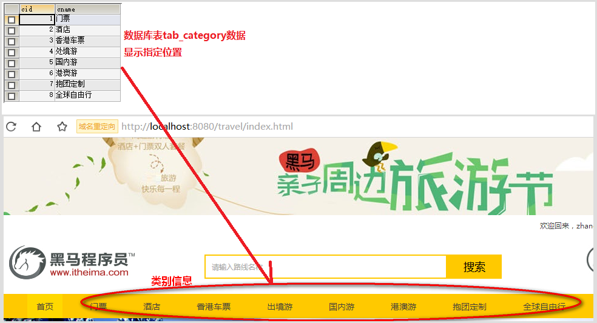

## 2.3 实现分析

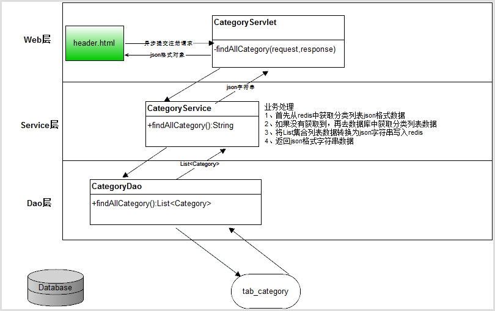

## 2.4 实现步骤

1. 在header.html页面加载完成事件提交查询分类列表数据的异步请求到Web后端CategoryServlet类
2. CategoryServlet类处理前端请求，调用业务逻辑类CategoryService处理获取分类列表数据业务方法
3. CategoryService处理首先从redis获取分类列表数据，如果获取不到再调用数据访问类CategoryDao访问数据库获取，然后将从数据库获取的列表数据转换为json格式字符串数据并将json格式数据存储到redis里面。最后将json格式数据返回。
4. CategoryServlet获取到业务方法返回的json格式数据通过response输出给浏览器。
5. 浏览器header.html通过ajax回调函数获取到后端返回的json数据，解析json数据进行遍历将数据更新到页面导航栏位置。

## 2.5 实现代码

### 2.5.1 header.html提交异步获取分类列表请求代码

```html
  <!-- 首页导航 -->
    <div class="navitem">
        <ul class="nav">
            <!--注释分类导航数据，使用js获取后端列表数据更新到这个位置
            <li class="nav-active"><a href="index.html">首页</a></li>
            <li><a href="route_list.html">门票</a></li>
            <li><a href="route_list.html">酒店</a></li>
            <li><a href="route_list.html">香港车票</a></li>
            <li><a href="route_list.html">出境游</a></li>
            <li><a href="route_list.html">国内游</a></li>
            <li><a href="route_list.html">港澳游</a></li>
            <li><a href="route_list.html">抱团定制</a></li>
            <li><a href="route_list.html">全球自由行</a></li>
            <li><a href="favoriterank.html">收藏排行榜</a></li>-->
        </ul>
        <script type="text/javascript">
            //页面加载事件
            $(function () {
                /////////////使用js发送异步请求分类列表数据更新到导航位置
                //提交请求后端地址
                var url="category";//请求CategoryServlet
                //请求参数
                var data={action:"findAllCategory"};
                //回调函数
                var callback=function(resultInfo){
                    //判断返回数据有效性
                    if(resultInfo.flag){
                        //处理返回对象数组
                        //resultInfo是返回的json对象，resultInfo.data返回的是字符串的json格式数据
                        //将resultInfo.data字符串转换为json对象，使用eval函数
                        var categoryList = eval("("+resultInfo.data+")");
                        //定义拼接html的分类导航数据
                        var html="<li class='nav-active'><a href='index.html'>首页</a></li>";
                        //遍历categoryList拼接html
                        for(var i=0;i<categoryList.length;i++){
                            //获取当前分类对象数据
                            var category = categoryList[i];
                            //分类id
                            var cid = category.cid;
                            //分类名称
                            var cname = category.cname;
                            //拼接当前分类数据
                            html+="<li><a href='route_list.html'>"+cname+"</a></li>";
                        }
                        html+="<li><a href='favoriterank.html'>收藏排行榜</a></li>";
                        //将拼接好的更新到导航栏位置
                        $(".nav").html(html);
                    }
                };
                //设置回调函数接收数据为json格式
                var type = "json";
                //提交异步获取分类列表数据
                $.post(url,data,callback,type);
            });
        </script>
    </div>
```

### 2.5.2 CategoryServlet处理前端请求代码

```java
package com.itheima.travel.web.servlet;

import com.fasterxml.jackson.databind.ObjectMapper;
import com.itheima.travel.model.ResultInfo;
import com.itheima.travel.service.CategoryService;

import javax.servlet.ServletException;
import javax.servlet.annotation.WebServlet;
import javax.servlet.http.HttpServletRequest;
import javax.servlet.http.HttpServletResponse;
import java.io.IOException;

@WebServlet("/category")
public class CategoryServlet extends BaseServlet {

    private CategoryService categoryService = new CategoryService();

    /**
     * 处理前后异步获取分类列表数据
     * @param request
     * @param response
     * @throws ServletException
     * @throws IOException
     */
    private void findAllCategory(HttpServletRequest request,
                                 HttpServletResponse response) throws ServletException, IOException {
        //定义返回数据对象
        ResultInfo resultInfo = null;
        try {
            //调用业务逻辑层获取分类列表json格式数据
            String jsonData = categoryService.findAllCategory();
            //构造返回数据对象
            resultInfo = new ResultInfo(true,jsonData,null);
        }catch (Exception e){
            e.printStackTrace();
            resultInfo = new ResultInfo(false);
        }
        //将resultInfo对象转换为json格式数据
        String jsonData = new ObjectMapper().writeValueAsString(resultInfo);
        System.out.println(jsonData);
        //输出jsonData
        response.getWriter().write(jsonData);
    }
}

```

### 2.5.3 CategoryService处理获取分类列表json格式数据业务代码

```java
package com.itheima.travel.service;

import com.fasterxml.jackson.databind.ObjectMapper;
import com.itheima.travel.dao.CategoryDao;
import com.itheima.travel.model.Category;
import com.itheima.travel.util.JedisUtil;
import redis.clients.jedis.Jedis;

import java.util.List;

/**
 * 分类业务类
 */
public class CategoryService {

    /**
     * 实例分类数据访问类
     */
    private CategoryDao categoryDao = new CategoryDao();

    /**
     * 获取分类列表json格式数据业务方法
     * @return jsong格式String
     */
    public String findAllCategory() throws Exception {
        //1.从jedis中获取分类列表数据
        //1.1实例jedis对象
        Jedis jedis = JedisUtil.getJedis();
        //1.2获取jedis中的key为"categoryList"的value数据
        String jsonData = jedis.get("categoryList");
        //2.判读获取数据有效性
        if(jsonData==null || "".equals(jsonData.trim())){
            //2.1如果jsonDate为空，说明redis中没有分类列表数据
            //3.调用数据访问类从数据库获取分类列表数据
            List<Category> categoryList = categoryDao.findAllCategory();
            //4.将categoryList转换为json格式数据
            jsonData = new ObjectMapper().writeValueAsString(categoryList);
            //5.将从数据库获取的jsonData分类列表数据存储到redis中，为下一次获取做准备
            jedis.set("categoryList",jsonData);
        }
        //6.返回数据
        return jsonData;
    }
}
```

### 2.5.4 CategoryDao获取数据库中分类列表数据

```java
package com.itheima.travel.dao;

import com.itheima.travel.model.Category;
import com.itheima.travel.util.JdbcUtils;
import org.springframework.jdbc.core.BeanPropertyRowMapper;
import org.springframework.jdbc.core.JdbcTemplate;

import java.sql.SQLException;
import java.util.List;

/**
 * 分类数据访问类
 */
public class CategoryDao {
    //jdbcTemplate核心类
    private JdbcTemplate jdbcTemplate = new JdbcTemplate(JdbcUtils.getDataSource());


    /**
     * 从数据库获取分类列表数据
     * @return List<Category>
     */
    public List<Category> findAllCategory()throws SQLException {
        String sql="SELECT * FROM tab_category ORDER BY cid ";
        return jdbcTemplate.query(sql,new BeanPropertyRowMapper<>(Category.class));
    }
}
```

# 第3章 首页旅游线路精选

## 3.1 案例需求

在首页index.html里面黑马精选位置，点击不同的人气旅游、最新旅游和主题旅游无刷新显示对应的信息

人气旅游，是每个旅游线路收藏数量的降序获取前4条数据进行显示；

最新旅游，是每个旅游线路上架时间的降序获取前4条数据进行显示；

主题旅游，是每个旅游线路过滤为主题旅游的获取前4条数据进行显示；

## 3.2 实现效果


## 3.3 实现分析

浏览首页发现，目前已经实现了点击不同的选项（人气旅游、最新旅游和主题旅游）显示不同的内容，但是这里不同的内容是静态的，需要前端发起ajax异步请求后端这些数据。这里点击不同选项显示不同内容是使用了bootstrap里面的组件完成的，观察静态选取切换数据代码发现如下：

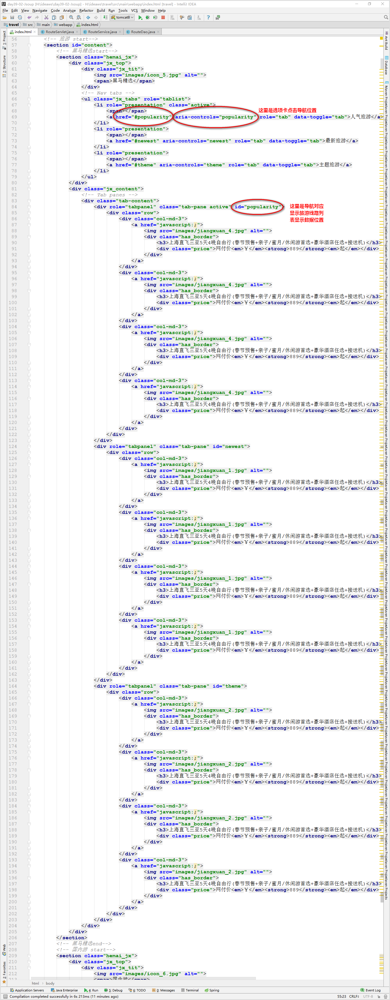

通过观察图发现，用户点击popularity选项卡，会自动显示id为popularity里面的数据，所以只需要将数据库里面对应的数据更新到id为popularity元素的体里面，其他选项卡实现原理一样。所以需要前端提交异步获取黑马精选相关数据，具体操作分析如下：


## 3.4 实现步骤

1. index.html页面加载完成事件提交获取黑马精选旅游线路的异步请求给RouteServlet
2. RouteServlet处理请求，调用业务逻辑类RouteService实现获取黑马精选旅游线路业务方法
3. RouteService业务类调用数据访问类RouteDao分别获取人气旅游线路列表、最新旅游线路列表和主题旅游线路列表数据，并将这些列表数据存储到Map\<String,List\<Route>>对象中并返回
4. RouteDao实现获取获取人气旅游线路列表、最新旅游线路列表和主题旅游线路列表数据。
5. RouteServlet获取到黑马精选数据后，使用ResultInfo封装数据并返回json格式数据

## 3.5 实现代码

### 3.5.1 index.html提交异步请求代码

```java
    <div id="footer"></div>
    <!-- jQuery (necessary for Bootstrap's JavaScript plugins) -->
    <script src="js/jquery-3.3.1.js"></script>
    <!-- Include all compiled plugins (below), or include individual files as needed -->
    <script src="js/bootstrap.min.js"></script>
    <script type="text/javascript" src="js/include.js"></script>
    <!--实现加载线路精选数据js代码 -->
    <script type="text/javascript">
        //加载事件
        $(function () {
            //页面完成加载时请求异步web后端，获取到人气旅游、最新旅游和主题旅游列表数据更新到具体位置
            var url="route";//访问RouteServlet
            var data={action:"routeCareChoose"};//web后端处理请求的方法
            //回调函数
            var callback=function(resultInfo){
                //判断返回数据的有效性
                if(resultInfo.flag){
                    //获取到正确返回结果,定义变量接收数据
                    var routeData = resultInfo.data;
                    //获取人气旅游列表
                    var popularityList =routeData.popularity;
                    //获取最新旅游列表
                    var newestList = routeData.newest;
                    //获取主题旅游列表
                    var themeList = routeData.theme;
                    //遍历人气旅游列表数据对象，循环拼接字符串列表中每一条数据
                    var populartityHtml = "";
                    for(var i=0;i<popularityList.length;i++){
                        var popularityRoute = popularityList[i];
                        populartityHtml+="<div class=\"col-md-3\">\n" +
                            "                                <a href=\"javascript:;\">\n" +
                            "                                    \n" +
                            "                                    <div class=\"has_border\">\n" +
                            "                                        <h3>"+popularityRoute.rname+"</h3>\n" +
                            "                                        <div class=\"price\">网付价<em>￥</em><strong>"+popularityRoute.price+"</strong><em>起</em></div>\n" +
                            "                                    </div>\n" +
                            "                                </a>\n" +
                            "                            </div>";
                    }
                    //将拼接好的人气旅游列表html代码数据更新到到对应位置
                    $("#popularity>.row").html(populartityHtml);

                    //遍历最新旅游列表数据对象，循环拼接字符串列表中每一条数据
                    var newestHtml = "";
                    for(var i=0;i<newestList.length;i++){
                        var newestRoute = newestList[i];
                        newestHtml+="<div class=\"col-md-3\">\n" +
                            "                                <a href=\"javascript:;\">\n" +
                            "                                    \n" +
                            "                                    <div class=\"has_border\">\n" +
                            "                                        <h3>"+newestRoute.rname+"</h3>\n" +
                            "                                        <div class=\"price\">网付价<em>￥</em><strong>"+newestRoute.price+"</strong><em>起</em></div>\n" +
                            "                                    </div>\n" +
                            "                                </a>\n" +
                            "                            </div>";
                    }
                    //将拼接好的人气旅游列表html代码数据更新到到对应位置
                    $("#newest>.row").html(newestHtml);

                    //遍历主题旅游列表数据对象，循环拼接字符串列表中每一条数据
                    var themeHtml = "";
                    for(var i=0;i<themeList.length;i++){
                        var themeRoute = themeList[i];
                        themeHtml+="<div class=\"col-md-3\">\n" +
                            "                                <a href=\"javascript:;\">\n" +
                            "                                    \n" +
                            "                                    <div class=\"has_border\">\n" +
                            "                                        <h3>"+themeRoute.rname+"</h3>\n" +
                            "                                        <div class=\"price\">网付价<em>￥</em><strong>"+themeRoute.price+"</strong><em>起</em></div>\n" +
                            "                                    </div>\n" +
                            "                                </a>\n" +
                            "                            </div>";
                    }
                    //将拼接好的人气旅游列表html代码数据更新到到对应位置
                    $("#theme>.row").html(themeHtml);

                }else{
                    //发生错误，跳转到友好页面
                    location.href="error/500.html";
                }
            };
            //返回数据格式
            var type="json";
            //发送异步请求黑马精选（人气旅游、最新旅游和主题旅游）商品列表
            $.post(url,data,callback,type);
        });
    </script>
```

### 3.5.2 RouteServlet处理请求代码

```java
package com.itheima.travel.web.servlet;

import com.fasterxml.jackson.databind.ObjectMapper;
import com.itheima.travel.model.ResultInfo;
import com.itheima.travel.model.Route;
import com.itheima.travel.service.RouteService;

import javax.servlet.ServletException;
import javax.servlet.annotation.WebServlet;
import javax.servlet.http.HttpServletRequest;
import javax.servlet.http.HttpServletResponse;
import java.io.IOException;
import java.util.List;
import java.util.Map;

@WebServlet("/route")
public class RouteServlet extends BaseServlet {

    /**
     * 实例线路业务类
     */
    private RouteService routeService = new RouteService();

    /**
     * 处理前端黑马精选异步请求
     * @param request
     * @param response
     * @throws ServletException
     * @throws IOException
     */
    private void routeCareChoose(HttpServletRequest request,
                                 HttpServletResponse response) throws ServletException, IOException {
        //定义返回数据对象
        ResultInfo resultInfo = null;
        try {
            //调用业务逻辑层获取人气旅游、最新旅游、主题旅游等列表数据
            Map<String, List<Route>> map = routeService.routeCareChoose();
            //实例返回数据对象
            resultInfo = new ResultInfo(true,map,null);
        }catch (Exception e){
            e.printStackTrace();
            //实例错误消息
            resultInfo = new ResultInfo(false);
        }
        //将resultInfo转换为JsonData字符串
        String jsonData = new ObjectMapper().writeValueAsString(resultInfo);
        System.out.println(jsonData);
        //输出到前端
        response.getWriter().write(jsonData);
    }
}
```

### 3.5.3 RouteService获取黑马精选旅游线路代码

```java
package com.itheima.travel.service;

import com.itheima.travel.dao.RouteDao;
import com.itheima.travel.model.Route;

import java.util.HashMap;
import java.util.List;
import java.util.Map;

/**
 * 线路业务类
 */
public class RouteService {

    /**
     * 实例旅游线路数据访问类实例
     */
    private RouteDao routeDao = new RouteDao();

    /**
     * 获取黑马精选业务方法（人气旅游，最新旅游，主题旅游）
     * @return Map<String,List<Route>>
     */
    public Map<String,List<Route>> routeCareChoose()throws Exception {
        //定义Map<String,List<Route>>对象用于接收结果
        Map<String,List<Route>> map = new HashMap<String,List<Route>>();
        //调用数据方法类RouteDao方法获取人气旅游前4个产品
        List<Route> popularityList = routeDao.getPopularityRouteList();
        map.put("popularity",popularityList);
        //调用数据方法类RouteDao方法获取最新旅游前4个产品
        List<Route> newestList = routeDao.getNewestRouteList();
        map.put("newest",newestList);
        //调用数据方法类RouteDao方法获取主题旅游前4个产品
        List<Route> themeList = routeDao.getThemeRouteList();
        map.put("theme",themeList);
        return map;
    }
}
```

### 3.5.4 RouteDao分别获取旅游线路列表数据代码

```java
package com.itheima.travel.dao;

import com.itheima.travel.model.Route;
import com.itheima.travel.util.JdbcUtils;
import org.springframework.jdbc.core.BeanPropertyRowMapper;
import org.springframework.jdbc.core.JdbcTemplate;
import org.springframework.jdbc.support.nativejdbc.Jdbc4NativeJdbcExtractor;

import java.sql.SQLException;
import java.util.List;

/**
 * 旅游线路数据访问类
 */
public class RouteDao {
    /**
     * jdbcTemplate
     */
    private JdbcTemplate jdbcTemplate = new JdbcTemplate(JdbcUtils.getDataSource());

    /**
     * 获取人气旅游列表4条数据，人气旅游就是收藏数量降序前4条数据
     * @return List<Route>
     */
    public List<Route> getPopularityRouteList(){
        //sql语句，rflag='1'筛选上架旅游线路，人气按照收藏数量降序
        String sql="SELECT * FROM tab_route WHERE rflag='1' ORDER BY COUNT DESC LIMIT 0,4";
        List<Route> routeList = jdbcTemplate.query(sql,new BeanPropertyRowMapper<Route>(Route.class));
        return routeList;
    }
    /**
     * 获取最新旅游列表4条数据，根据上架时间降序获取前4条数据
     * @return List<Route>
     */
    public List<Route> getNewestRouteList() {
        //sql语句，最新旅游线路根据上架时间降序获取前4条数据
        String sql="SELECT * FROM tab_route WHERE rflag='1' ORDER BY rdate DESC LIMIT 0,4";
        List<Route> routeList = jdbcTemplate.query(sql,new BeanPropertyRowMapper<Route>(Route.class));
        return routeList;
    }

    /**
     * 获取主题旅游列表4条数据
     * @return List<Route>
     */
    public List<Route> getThemeRouteList() {
        //sql语句，isThemeTour='1'为主题旅游线路
        String sql="SELECT * FROM tab_route WHERE rflag='1' AND isThemeTour='1' ORDER BY rdate DESC LIMIT 0,4";
        List<Route> routeList = jdbcTemplate.query(sql,new BeanPropertyRowMapper<Route>(Route.class));
        return routeList;
    }
}
```


# 第4章 分页获取国内游导航菜单旅游线路列表显示

## 4.1 案例需求

点击页面导航栏位置“国内游”后，分页显示符合数据的数据列表

## 4.2 实现效果

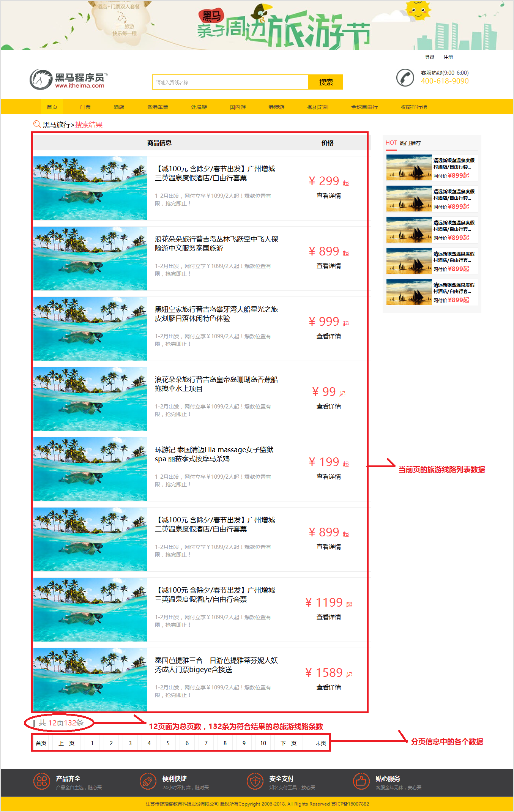

## 4.3 实现分析

根据实现效果可以看出，当前页面上画红色区域的数据都是来自于web后端查询数据库才能获取到，为了页面上方便显示数据，建议创建一个新类PageBean，将前端页面上所有数据封装到PageBean对象中便于前端获取数据并显示。

分页实现流程分析：

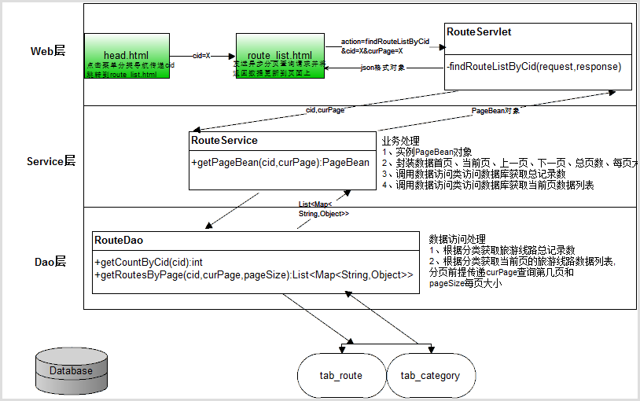

## 4.4 实现步骤

### 4.4.1 设计PageBean类代码

```java
package com.itheima.travel.model;

import java.io.Serializable;
import java.util.List;

/**
 * 分页类
 */
public class PageBean implements Serializable {
    private List<Route> data;//当前页数据列表
    private int firstPage;//首页
    private int prePage;//上一页
    private int curPage;//当前页
    private int nextPage;//下一页
    private int totalPage;//总页数，或末页
    private int count;//总记录数
    private int pageSize;//每页大小，用于设置每页显示多少条数据

    /**
     * 无参构造方法
     */
    public PageBean() {}

    /**
     * 有参构造方法
     * @param data
     * @param firstPage
     * @param prePage
     * @param curPage
     * @param nextPage
     * @param totalPage
     * @param count
     * @param pageSize
     */
    public PageBean(List<Route> data, int firstPage, int prePage, int curPage, int nextPage, int totalPage, int count, int pageSize) {
        this.data = data;
        this.firstPage = firstPage;
        this.prePage = prePage;
        this.curPage = curPage;
        this.nextPage = nextPage;
        this.totalPage = totalPage;
        this.count = count;
        this.pageSize = pageSize;
    }

    public List<Route> getData() {
        return data;
    }

    public void setData(List<Route> data) {
        this.data = data;
    }

    public int getFirstPage() {
        return firstPage;
    }

    public void setFirstPage(int firstPage) {
        this.firstPage = firstPage;
    }

    public int getPrePage() {
        return prePage;
    }

    public void setPrePage(int prePage) {
        this.prePage = prePage;
    }

    public int getCurPage() {
        return curPage;
    }

    public void setCurPage(int curPage) {
        this.curPage = curPage;
    }

    public int getNextPage() {
        return nextPage;
    }

    public void setNextPage(int nextPage) {
        this.nextPage = nextPage;
    }

    public int getTotalPage() {
        return totalPage;
    }

    public void setTotalPage(int totalPage) {
        this.totalPage = totalPage;
    }

    public int getCount() {
        return count;
    }

    public void setCount(int count) {
        this.count = count;
    }

    public int getPageSize() {
        return pageSize;
    }

    public void setPageSize(int pageSize) {
        this.pageSize = pageSize;
    }
}
```

### 4.4.2 实现静态分页功能

#### 4.4.2.1 需求说明

由于分页功能实现结构比较复杂，我们学习需要分成静态分页实现、动态分页实现、优化PageBean工个步骤来实现。首先我们实现静态分页，所谓静态分页就是数据都是模拟的，并不是来自于数据库实现的分页效果模拟。

#### 4.4.2.2 静态分页效果

假如每页3条数据，一共30条记录共10页：

点击菜单栏导航“国内游”，访问第1页的效果如下：第1页不显示“上一页”

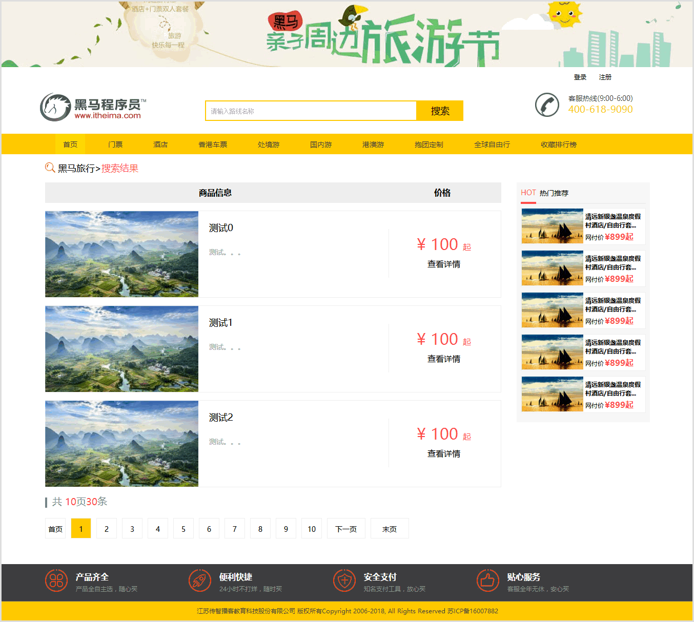

点击第2页或下一页效果如下：


点击第10页或末页效果如下：末页不显示“下一页”


#### 4.4.2.3 静态分页实现步骤

1. header.html代码，在header.html页面加载分类列表时设置，点击每个分类的超链接到route_list.html并传递cid当前分类id
2. route_list.html代码，在旅游线路搜索列表页面route_list.html的加载完成事件时获取请求参数cid数据与用户访问当前第几页数据curPage。提交异步请求给web后端RouteServlet并获取异步返回数据，将数据(当前页数据列表、分页信息)更新到页面上。
3. RouteServlet.java代码，RouteServlet获取到当前分类cid和当前查询页数curPage，调用业务逻辑类RouteSerice实现封装的PageBean业务方法，传递cid和curPage。
4. RouteService.java代码，RouteService业务类实现封装PageBean，封装首页、上一页、下一页、总页数、每页大小、当前页数据列表、总记录数等信息到PageBean并返回当前对象。

#### 4.4.2.4 实现代码

##### 步骤1： header.html代码

在header.html页面加载分类列表时设置，点击每个分类的超链接到route_list.html并传递cid当前分类id

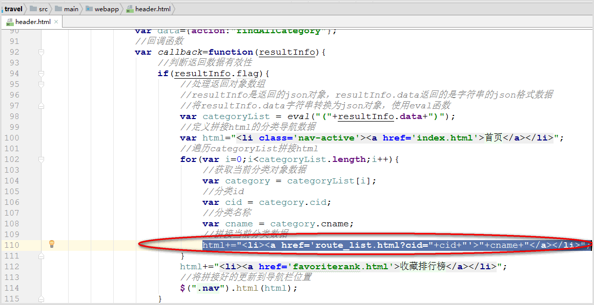

3.4.2.4.2 route_list.html获取参数数据代码并提交请求给RouteServlet获取当前页所有数据

```java

```

##### 步骤2：route_list.html代码

在旅游线路搜索列表页面route_list.html的加载完成事件时获取请求参数cid数据与用户访问当前第几页数据curPage。提交异步请求给web后端RouteServlet并获取异步返回数据，将数据(当前页数据列表、分页信息)更新到页面上。

```html
 <script type="text/javascript" src="js/jquery-3.3.1.js"></script>
    <!--导入根据参数名字获取参数值js文件-->
    <script type="text/javascript" src="js/getParameter.js"></script>
    <script type="text/javascript">
        //加载完成事件
        $(function () {
            //实现点击导航栏分类加载对应分类数据功能
            //1.获取点击导航分类的cid参数数据
            var cid= getParameter("cid");
            var curPage = getParameter("curPage");
            //2.定义请求后端地址
            var url="route";//RouteServlet
            //3.定义请求后端的参数,传递请求类型与cid数据
            var data = {action:"findRouteListByCid",cid:cid,curPage:curPage};
            //4.设置回调函数
            var callback = function(resultInfo){
                //判断有效性
                if(resultInfo.flag){
                    //获取pageBean对象数据
                    var pageBean = resultInfo.data;
                    //遍历当前页数据列表添加到列表位置
                    var html = "";
                    for(var i=0;i<pageBean.data.length;i++){
                        var route = pageBean.data[i];
                        html+="<li>\n" +
                            "<div class=\"img\"></div>\n" +
                            "<div class=\"text1\">\n" +
                            "<p>"+route.rname+"</p>\n" +
                            "<br/>\n" +
                            "<p>"+route.routeIntroduce+"</p>\n" +
                            "</div>\n" +
                            "<div class=\"price\">\n" +
                            "<p class=\"price_num\">\n" +
                            "<span>&yen;</span>\n" +
                            "<span>"+route.price+"</span>\n" +
                            "<span>起</span>\n" +
                            "</p>\n" +
                            "<p><a href=\"route_detail.html\">查看详情</a></p>\n" +
                            "</div>\n" +
                            "</li>";
                    }
                    //将生成的html设置到具体位置
                    $(".xinxi .left ul").html(html);
                    //更新分页信息
                    //首页
                    html = "<li><a href=\"route_list.html?cid="+cid+"&curPage="+pageBean.firstPage+"\">首页</a></li>";
                    //上一页,如果用户访问页数>1才显示上一页
                    if(pageBean.curPage>1){
                        html+="<li class=\"threeword\"><a href=\"route_list.html?cid="+cid+"&curPage="+pageBean.prePage+"\">上一页</a></li>";
                    }
                    //遍历分页数字数据
                    for(var i=1;i<=pageBean.totalPage;i++){
                        //如果遍历数字与当前访问页相等，那么当前页应用类样式curPage
                        if(pageBean.curPage==i){
                            html+=" <li class='curPage'><a href=\"route_list.html?cid="+cid+"&curPage="+i+"\">"+i+"</a></li>";
                        }else{
                            html+=" <li><a href=\"route_list.html?cid="+cid+"&curPage="+i+"\">"+i+"</a></li>";
                        }
                    }
                    //下一页 ，如果当前页<总页数才显示下一页
                    if(pageBean.curPage<pageBean.totalPage){
                        html+="<li class=\"threeword\"><a href=\"route_list.html?cid="+cid+"&curPage="+pageBean.nextPage+"\">下一页</a></li>";
                    }
                    //拼接尾部
                    html+="<li class=\"threeword\"><a href=\"route_list.html?cid="+cid+"&curPage="+pageBean.totalPage+"\">末页</a></li>"
                    //更新到分页信息位置
                    $(".pageNum ul").html(html);
                    //更新总页数
                    $(".page_num_inf span:eq(0)").html(pageBean.totalPage);
                    //更新总计录数显示
                    $(".page_num_inf span:eq(1)").html(pageBean.count);
                }
            };
            //5.设置返回数据格式
            var type="json";
            //6.发送异步请求获取当前分类旅游线路列表数据
            $.post(url,data,callback,type);
        });

    </script>
```

##### 步骤3：RouteServlet.java代码

RouteServlet获取到当前分类cid和当前查询页数curPage，调用业务逻辑类RouteSerice实现封装的PageBean业务方法，传递cid和curPage。

```java
 package com.itheima.travel.web.servlet;

import com.fasterxml.jackson.databind.ObjectMapper;
import com.itheima.travel.model.PageBean;
import com.itheima.travel.model.ResultInfo;
import com.itheima.travel.model.Route;
import com.itheima.travel.service.RouteService;

import javax.servlet.ServletException;
import javax.servlet.annotation.WebServlet;
import javax.servlet.http.HttpServletRequest;
import javax.servlet.http.HttpServletResponse;
import java.io.IOException;
import java.util.List;
import java.util.Map;

@WebServlet("/route")
public class RouteServlet extends BaseServlet {

    /**
     * 实例线路业务类
     */
    private RouteService routeService = new RouteService();

    /**
     * 根据cid获取旅游线路列表
     * @param request
     * @param response
     * @throws ServletException
     * @throws IOException
     */
    private void findRouteListByCid(HttpServletRequest request,
                                 HttpServletResponse response) throws ServletException, IOException {
        //定义返回结果对象
        ResultInfo resultInfo = null;
        try {
            int curPage = 1;//定义当前页，默认用户访问当前页为1
            //获取用户当前请求第几页
            String curPageStr = request.getParameter("curPage");
            //获取当前要查询指定的分类导航id
            String cid = request.getParameter("cid");
            //判断用户请求第几页有效性
            if (curPageStr != null && !curPageStr.equals("")) {
                //获取到了有效的用户请求第几页，将字符串转换为整型数字
                curPage = Integer.parseInt(curPageStr);
            }
            //调用业务逻辑层根据当前页数据获取页面上所有数据PageBean对象
            PageBean pageBean = routeService.getPageBean(cid,curPage);
            //将数据封装到resultInfo中
            resultInfo = new ResultInfo(true,pageBean,null);
        }catch (Exception e){
            e.printStackTrace();
            resultInfo = new ResultInfo(false);
        }
        //将ResultInfo转换为json
        String jsonData = new ObjectMapper().writeValueAsString(resultInfo);
        //输出给浏览器
        response.getWriter().write(jsonData);
    }
}
```

##### 步骤4：RouteService.java代码

RouteService业务类实现封装PageBean，封装首页、上一页、下一页、总页数、每页大小、当前页数据列表、总记录数等信息到PageBean并返回当前对象。

```java
/**
     * 获取当前页所有页面数据PageBean对象
     * @param cid,当前导航分类id
     * @param curPage,当前查询第几页
     * @return PageBean
     */
    public PageBean getPageBean(String cid,int curPage)throws Exception {
        //定义PageBean对象
        PageBean pageBean = new PageBean();
        //首页
        pageBean.setFirstPage(1);
        //当前页
        pageBean.setCurPage(curPage);
        //上一页
        pageBean.setPrePage(curPage-1);
        //下一页
        pageBean.setNextPage(curPage+1);
        //当前分类当前页数据列表
        List<Route> routeList = new ArrayList<Route>();
        for (int i=0;i<3;i++){
            routeList.add(new Route(i,"测试"+i, 100,"测试。。。","1",
                    "2018-02-19", "0", 100,5, "img/product/small/m35c17b5b73d618bbdd2abe231f1307838.jpg",
                    1, "2702"));
        }
        pageBean.setData(routeList);//这里routeList是静态模拟的，并没有获取数据库数据
        //每页大小,每页3条数据
        int pageSize = 3;
        pageBean.setPageSize(pageSize);
        //当前分类总记录数
        int count = 30;
        pageBean.setCount(count);//这里静态模拟数据
        //总页数
        int totalPage = count%pageSize==0?count/pageSize:count/pageSize+1;
        pageBean.setTotalPage(totalPage);
        //返回静态封装好的pageBean
        return pageBean;
    }
```

### 4.4.2.3 实现动态分页功能

##### 4.4.2.3.1 需求说明

将静态分页中获取当前页数据列表与总记录数据更换为查询数据库，实现动态分页。

##### 4.4.2.3.2 实现效果

实现第一步动态分页效果如下：


优化分页数字信息效果1——查询第1页效果：

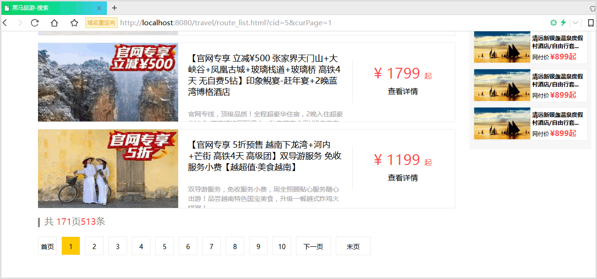

优化分页数字信息效果2——查询第10页效果：

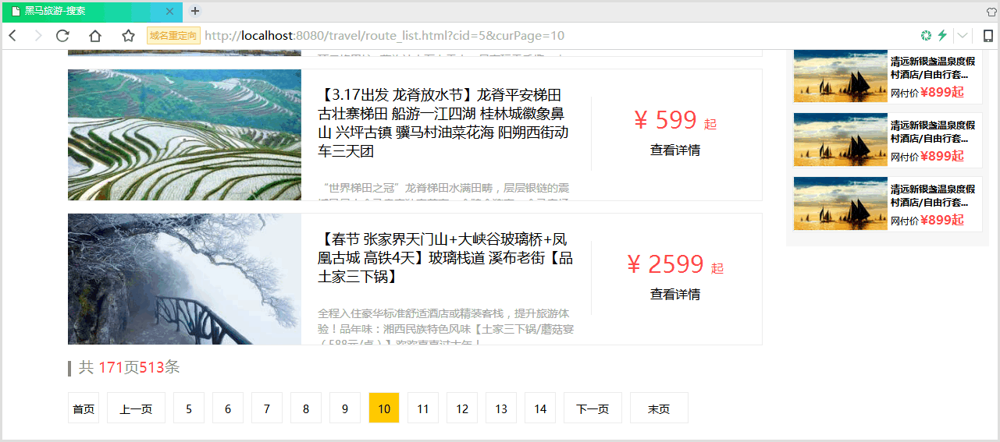

优化分页数字信息效果3——查询末页效果：

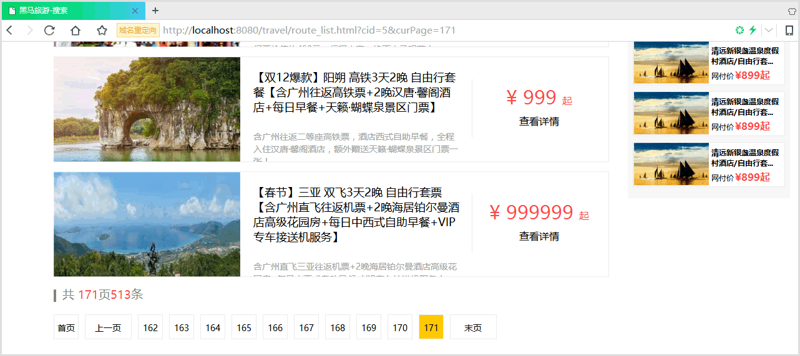

##### 4.4.2.3.3 动态分页实现步骤

1. RouteService.java代码，将RouteService业务类对象getPageBean方法中获取总记录数（符合导航分类旅游线路的数据条数）的静态模拟修改为调用RouteDao数据访问对象查询数据库获取，将RouteService业务类对象getPageBean方法中获取当前页数据列表（符合导航分类的当前一页旅游线路列表集合数据）的静态模拟修改为调用RouteDao数据访问对象查询数据库获取。
2. RouteDao.java代码，RouteDao实现数据库查询当前分类旅游线路的总记录数和实现当前分类当前页数的旅游线路数据列表方法。
3. route_list.html代码，优化分页数字信息。

##### 4.4.2.3.4 实现代码

###### 步骤1：RouteService.java代码

```java
/**
     * 获取当前页所有页面数据PageBean对象
     * @param cid,当前导航分类id
     * @param curPage,当前查询第几页
     * @return PageBean
     */
    public PageBean getPageBean(String cid,int curPage)throws Exception {
        //定义PageBean对象
        PageBean pageBean = new PageBean();
        //首页
        pageBean.setFirstPage(1);
        //当前页
        pageBean.setCurPage(curPage);
        //上一页
        pageBean.setPrePage(curPage-1);
        //下一页
        pageBean.setNextPage(curPage+1);
        //每页大小,每页3条数据
        int pageSize = 3;
        pageBean.setPageSize(pageSize);
        //根据分类查询当前页数据列表---转换为动态获取数据库数据
        List<Map<String,Object>> mapList = routeDao.getRoutesByPage(cid,curPage,pageSize);
        //将List<Map<String,Object>>类型转换为List<Route>数据
        List<Route> routeList = convertMapListToList(mapList);
        pageBean.setData(routeList);
        //获取当前分类总记录数---转换为动态获取数据库数据
        int count = routeDao.getCountByCid(cid);
        pageBean.setCount(count);
        //总页数
        int totalPage = count%pageSize==0?count/pageSize:count/pageSize+1;
        pageBean.setTotalPage(totalPage);
        //返回静态封装好的pageBean
        return pageBean;
    }

 /**
     * 将List<Map<String,Object>>类型转换为List<Route>数据
     * @param mapList
     * @return List<Route>
     * @throws Exception
     */
    private List<Route> convertMapListToList(List<Map<String,Object>> mapList)throws Exception{
        List<Route> routeList = null;
        if(mapList!=null && mapList.size()>0){
            //实例routeList
            routeList = new ArrayList<Route>();
            for (Map<String,Object> map:mapList) {
                //实例Route,Category
                Route route = new Route();
                Category category = new Category();
                //封装数据
                BeanUtils.populate(route,map);
                BeanUtils.populate(category,map);
                //将category封装到route中
                route.setCategory(category);

                //将封装完成的route追加到routeList中
                routeList.add(route);
            }
        }
        return routeList;
    }
```

###### 步骤2：RouteDao.java代码

- 获取总记录数代码

  ```java
   /**
       * 根据分类获取旅游线路总记录数
       * @param cid，分类id
       * @return int,总记录数
       */
      public int getCountByCid(String cid) {
          //查找上架当前分类旅游线路的总记录数
          String sql="SELECT COUNT(*) FROM tab_route WHERE cid=? AND rflag='1'";
          int count = jdbcTemplate.queryForObject(sql,new Object[]{cid},Integer.class);
          return count;
      }
  ```


- 获取当前分类当前页数旅游线路数据列表

  分页查询数据列表需要使用sql语句实现分页查询数据，sql语句分页分析

  ```sql
  -- 分页的sql语句格式：
  -- 	SELECT * FROM 表名 c WHERE 条件  LIMIT start,length
  --     	start,查询数据的开始索引，索引从0开始,就是从查询结果集中从第几条数据开始截取
  --     	length,截取多少条，就是每一页多少条数据，就是pageSize每页大小
  -- sql分页实例1:每页3条数据，查询第1页sql语句
  SELECT * FROM tab_route r,tab_category c WHERE c.cid=r.cid AND r.rflag='1'  LIMIT 0,3
  -- sql分页实例2:每页3条数据，查询第2页sql语句
  SELECT * FROM tab_route r,tab_category c WHERE c.cid=r.cid AND r.rflag='1'  LIMIT 3,3
  -- sql分页实例3:每页3条数据，查询第3页sql语句
  SELECT * FROM tab_route r,tab_category c WHERE c.cid=r.cid AND r.rflag='1'  LIMIT 6,3
  -- 疑问：start的值分别为0,3,6，我们可以口算出来，那有没有什么公式计算出来呢？
  -- 答：0,3,6是等差数列，start=(curPage-1)*pageSize
  -- sql分页实例4:每页3条数据，查询第curPage页sql语句
  SELECT * FROM tab_route r,tab_category c WHERE c.cid=r.cid AND r.rflag='1'  
  LIMIT (curPage-1)*pageSize,pageSize
  ```

  **总结：**

  ​	**SELECT * FROM tab_route r,tab_category c WHERE c.cid=r.cid AND r.rflag='1'  LIMIT ?,?**

  ​	**第1个占位符问号=(curPage-1)*pageSize；第2个占位符问号=pageSize**

  ​	**所以，分页前提需要知道curPage查询第几页，pageSize每页大小**

  最终代码实现

  ```java
  /**
       * 根据分类获取当前页的旅游线路数据列表
       * @param cid
       * @param curPage
       * @return List<Map<String,Object>>，由于需要返回旅游线路与分类数据，所以返回这个类型
       */
      public List<Map<String,Object>> getRoutesByPage(String cid, int curPage,int pageSize) {
          //分页sql语句
          String sql="SELECT * FROM tab_route r,tab_category c WHERE c.cid=r.cid AND r.cid=? AND r.rflag='1'  LIMIT ?,?";
          int start = (curPage-1)*pageSize;//查询开始索引
          int length=pageSize;//每页多少条记录
          //执行sql语句返回结果
          List<Map<String,Object>> mapList = jdbcTemplate.queryForList(sql,cid,start,length);
          return  mapList;
      }
  ```

###### 步骤3：route_list.html代码

优化数字分页信息

- 疑问：如下显示所有分页数字效果好吗？

  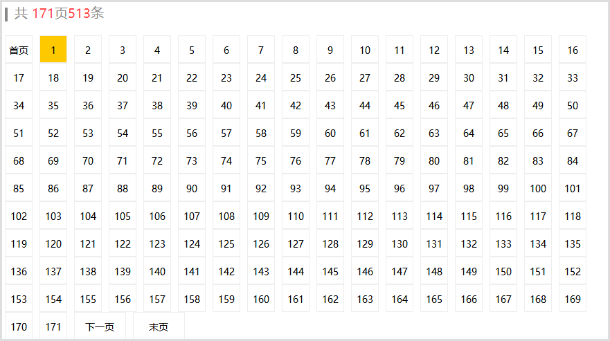

  答案：效果不好，我们可以观察百度搜索引擎查询数据分页效果：

  打开百度搜索“传智播客”默认百度查询数据第1页，数字分页效果如下：

  

  浏览第10页，数字分页效果如下：

  

  浏览第14页，数字分页效果如下：

  

  观察数字分页进行分析

  显示的数字只要计算出起始页和结束页就可以显示出来，假如begin为起始页和end为结束也

  1. 如果总页数<=10，那么

     ​	begin=1

     ​	end=totalPage

  2. 如果总页数>10，那么

     ​	begin=curPage-5;

     ​	end=curPage+4;

     ​	由于有加减计算，begin和end计算出来的结果就有可能越界，所以我们需要判断边界

     ​	如果，begin<1

     ​		begin=1;

     ​		end=10;

     ​	如果，end>totalPage总页数

     ​		end=totalPage;

     ​		begin=totalPage-9;

- 所有优化数字分页信息route_list.html代码

  将原来的遍历分页数字数据代码注释，在其下面添加如下代码

  ```javascript
  //遍历分页数字数据
  // for(var i=1;i<=pageBean.totalPage;i++){
  //     //如果遍历数字与当前访问页相等，那么当前页应用类样式curPage
  //     if(pageBean.curPage==i){
  //         html+=" <li class='curPage'><a href=\"route_list.html?cid="+cid+"&curPage="+i+"\">"+i+"</a></li>";
  //     }else{
  //         html+=" <li><a href=\"route_list.html?cid="+cid+"&curPage="+i+"\">"+i+"</a></li>";
  //     }
  // }
  var begin;//起始页
  var end;//结束页
  //总页数<=10的情况
  if(pageBean.totalPage<=10){
      begin = 1;
      end = pageBean.totalPage;
  }else{
      //pageBean.totalPage总页数>10情况
      begin=pageBean.curPage-5;
      end=pageBean.curPage+4;
      //由于有加减计算，begin和end计算出来的结果就有可能越界，所以我们需要判断边界
      if(begin<1){
          begin=1;
          end=10;
      }
      if(end>pageBean.totalPage){
          end=pageBean.totalPage;
          begin=pageBean.totalPage-9;
      }
  }
  //遍历分页数字数据
  for(var i=begin;i<=end;i++){
      //如果遍历数字与当前访问页相等，那么当前页应用类样式curPage
      if(pageBean.curPage==i){
          html+=" <li class='curPage'><a href=\"route_list.html?cid="+cid+"&curPage="+i+"\">"+i+"</a></li>";
      }else{
          html+=" <li><a href=\"route_list.html?cid="+cid+"&curPage="+i+"\">"+i+"</a></li>";
      }
  }
  ```

### 4.4.4 优化PageBean与业务方法

- 优化1：优化封装首页

  RouteService代码如下代码

  ```java
  //首页
  pageBean.setFirstPage(1);
  ```

  优化到PageBean中封装，直接默认初始化为1

  ```
  private int firstPage=1;//首页
  ```

- 优化2：优化封装上一页、下一页

  RouteService代码如下代码

  ```java
  //上一页
  pageBean.setPrePage(curPage-1);
  //下一页
  pageBean.setNextPage(curPage+1);
  ```

  优化到PageBean中封装，上一页与下一页依赖当前页curPage，所以封装到如下代码位置

  ```java
  //封装当前页数据
  public void setCurPage(int curPage) {
      this.curPage = curPage;
      this.prePage = this.curPage-1;
      this.nextPage = this.curPage+1;
  }
  ```

- 优化3：优化总页数

  RouteService代码如下代码

  ```java
  //总页数
  int totalPage = count%pageSize==0?count/pageSize:count/pageSize+1;
  pageBean.setTotalPage(totalPage);
  ```

  优化到PageBean中封装，总页数依赖总记录数，所以封装到如下代码位置

  ```java
  //封装总记录数
  public void setCount(int count) {
      this.count = count;
      totalPage = count%pageSize==0?count/pageSize:count/pageSize+1;
  }
  ```

- 优化4：优化PageBean为泛型类

  ```
  private List<Route> data;//当前页数据列表
  ```

  这里定义类型为Route类型是不好的，因为我们不仅要对Route旅游线路分页，还要对其他类型的数据进行分页，所以这里不可以设置为固定类型，可以使用泛型，这样PageBean就可以对任何传进来的类型分页了

  最后使用泛型类优化PageBean的代码

  ```java
  package com.itheima.travel.model;

  import java.io.Serializable;
  import java.util.List;

  /**
   * 分页类
   */
  public class PageBean<T> implements Serializable {
      private List<T> data;//当前页数据列表
      private int firstPage=1;//首页
      private int prePage;//上一页
      private int curPage;//当前页
      private int nextPage;//下一页
      private int totalPage;//总页数，或末页
      private int count;//总记录数
      private int pageSize;//每页大小，用于设置每页显示多少条数据

      /**
       * 无参构造方法
       */
      public PageBean() {}

      /**
       * 有参构造方法
       * @param data
       * @param firstPage
       * @param prePage
       * @param curPage
       * @param nextPage
       * @param totalPage
       * @param count
       * @param pageSize
       */
      public PageBean(List<T> data, int firstPage, int prePage, int curPage, int nextPage, int totalPage, int count, int pageSize) {
          this.data = data;
          this.firstPage = firstPage;
          this.prePage = prePage;
          this.curPage = curPage;
          this.nextPage = nextPage;
          this.totalPage = totalPage;
          this.count = count;
          this.pageSize = pageSize;
      }

      public List<T> getData() {
          return data;
      }

      public void setData(List<T> data) {
          this.data = data;
      }

      public int getFirstPage() {
          return firstPage;
      }

      public void setFirstPage(int firstPage) {
          this.firstPage = firstPage;
      }

      public int getPrePage() {
          return prePage;
      }

      public void setPrePage(int prePage) {
          this.prePage = prePage;
      }

      public int getCurPage() {
          return curPage;
      }

      //封装当前页数据
      public void setCurPage(int curPage) {
          this.curPage = curPage;
          this.prePage = this.curPage-1;
          this.nextPage = this.curPage+1;
      }
      public int getNextPage() {
          this.nextPage = this.curPage+1;
          return nextPage;
      }

      public void setNextPage(int nextPage) {
          this.nextPage = nextPage;
      }
      public int getTotalPage() {
          return totalPage;
      }

      public void setTotalPage(int totalPage) {
          this.totalPage = totalPage;
      }

      public int getCount() {
          return count;
      }

      //封装总记录数
      public void setCount(int count) {
          this.count = count;
          totalPage = count%pageSize==0?count/pageSize:count/pageSize+1;
      }

      public int getPageSize() {
          return pageSize;
      }

      public void setPageSize(int pageSize) {
          this.pageSize = pageSize;
      }
  }
  ```

  RouteService封装PageBean代码

  ```java
   public PageBean getPageBean(String cid,int curPage)throws Exception {
          //定义PageBean对象
          PageBean pageBean = new PageBean();
          //当前页
          pageBean.setCurPage(curPage);
          //每页大小,每页3条数据
          int pageSize = 3;
          pageBean.setPageSize(pageSize);
          //根据分类查询当前页数据列表---转换为动态获取数据库数据
          List<Map<String,Object>> mapList = routeDao.getRoutesByPage(cid,curPage,pageSize);
          //将List<Map<String,Object>>类型转换为List<Route>数据
          List<Route> routeList = convertMapListToList(mapList);
          pageBean.setData(routeList);
          //获取当前分类总记录数---转换为动态获取数据库数据
          int count = routeDao.getCountByCid(cid);
          pageBean.setCount(count);

          //返回静态封装好的pageBean
          return pageBean;
      }
  ```

# 第5章 头部搜索旅游线路分页展现数据

## 5.1 案例需求

点击网页头部搜索框输入旅游线路名称，点击搜索安全进行模糊搜索，符合条件的结果进行分页展现数据列表

## 5.2 实现效果


## 5.3 实现分析

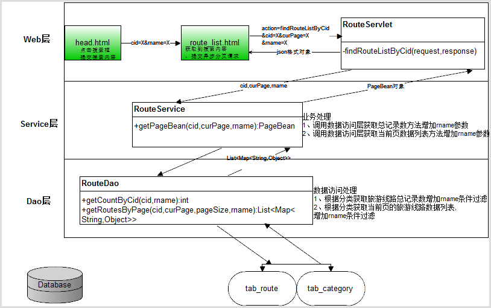

## 5.4 实现步骤

1. header.html代码，点击搜索框提交搜索内容跳转到rout_list.html并传递cid和搜索内容
2. route_list.html代码，获取搜索内容数据，并提交到分页查询数据请求中，保证每个分页请求都要增加搜索内容提交请求参数。
3. RouteServlet.java代码，获取到搜索内容数据，并查询分页数据方法增加搜索内容参数传递。
4. RouteService.java代码，获取总记录数据和当前页数据列表方法中增加搜索内容参数传递。
5. RouteDao.java代码，获取总记录数增加搜索内容数据条件过滤，获取当前页数据列表增加搜索内容数据条件过滤。

## 5.5 实现代码

### 5.5.1 步骤1：header.html代码

点击搜索框提交搜索内容跳转到rout_list.html并传递cid和搜索内容

```html
<div class="search">
                    <input name="rname" id="rname" type="text" placeholder="请输入路线名称" class="search_input" autocomplete="off">
                    <a href="javascript:commitSearch();" class="search-button">搜索</a>
                </div>
                <script type="text/javascript" src="js/getParameter.js"></script>
                <script type="text/javascript">
                    //搜索点击事件
                    function commitSearch() {
                        //获取url上cid值
                        var cid = getParameter("cid");
                        //跳转页面显示数据
                        location.href="route_list.html?rname="+$("#rname").val()+"&cid="+cid;
                    }
                    $(function () {
                       //如果地址栏有rname参数
                       var rname= getParameter("rname");
                       //如果rname非空则重新写入搜索框
                       if(rname){
                            $("#rname").val(decodeURI(rname));//保留上一次搜索的值
                       }
                    });
                </script>
```

### 5.5.2 步骤2：route_list.html代码

获取搜索内容数据，并提交到分页查询数据请求中，保证每个分页请求都要增加搜索内容提交请求参数。

```html
<script type="text/javascript" src="js/jquery-3.3.1.js"></script>
    <!--导入根据参数名字获取参数值js文件-->
    <script type="text/javascript" src="js/getParameter.js"></script>
    <script type="text/javascript">
        //加载完成事件
        $(function () {
            //实现点击导航栏分类加载对应分类数据功能
            //1.获取点击导航分类的cid参数数据
            var cid= getParameter("cid");
            var curPage = getParameter("curPage");
            var rname = getParameter("rname");//获取搜索框提交的搜索条件
            //2.定义请求后端地址
            var url="route";//RouteServlet
            //3.定义请求后端的参数,传递请求类型与cid数据和搜索的线路名称
            var data = {action:"findRouteListByCid",cid:cid,curPage:curPage,rname:rname};
            //4.设置回调函数
            var callback = function(resultInfo){
                //判断有效性
                if(resultInfo.flag){
                    //获取pageBean对象数据
                    var pageBean = resultInfo.data;
                    //遍历当前页数据列表添加到列表位置
                    var html = "";
                    for(var i=0;i<pageBean.data.length;i++){
                        var route = pageBean.data[i];
                        html+="<li>\n" +
                            "<div class=\"img\"></div>\n" +
                            "<div class=\"text1\">\n" +
                            "<p>"+route.rname+"</p>\n" +
                            "<br/>\n" +
                            "<p>"+route.routeIntroduce+"</p>\n" +
                            "</div>\n" +
                            "<div class=\"price\">\n" +
                            "<p class=\"price_num\">\n" +
                            "<span>&yen;</span>\n" +
                            "<span>"+route.price+"</span>\n" +
                            "<span>起</span>\n" +
                            "</p>\n" +
                            "<p><a href=\"route_detail.html\">查看详情</a></p>\n" +
                            "</div>\n" +
                            "</li>";
                    }
                    //将生成的html设置到具体位置
                    $(".xinxi .left ul").html(html);
                    //更新分页信息
                    //首页
                    html = "<li><a href=\"route_list.html?cid="+cid+"&curPage="+pageBean.firstPage+"&rname="+rname+"\">首页</a></li>";
                    //上一页,如果用户访问页数>1才显示上一页
                    if(pageBean.curPage>1){
                        html+="<li class=\"threeword\"><a href=\"route_list.html?cid="+cid+"&curPage="+pageBean.prePage+"&rname="+rname+"\">上一页</a></li>";
                    }
                    //遍历分页数字数据
                    // for(var i=1;i<=pageBean.totalPage;i++){
                    //     //如果遍历数字与当前访问页相等，那么当前页应用类样式curPage
                    //     if(pageBean.curPage==i){
                    //         html+=" <li class='curPage'><a href=\"route_list.html?cid="+cid+"&curPage="+i+"\">"+i+"</a></li>";
                    //     }else{
                    //         html+=" <li><a href=\"route_list.html?cid="+cid+"&curPage="+i+"\">"+i+"</a></li>";
                    //     }
                    // }
                    var begin;//起始页
                    var end;//结束页
                    //总页数<=10的情况
                    if(pageBean.totalPage<=10){
                        begin = 1;
                        end = pageBean.totalPage;
                    }else{
                        //pageBean.totalPage总页数>10情况
                        begin=pageBean.curPage-5;
                        end=pageBean.curPage+4;
                        //由于有加减计算，begin和end计算出来的结果就有可能越界，所以我们需要判断边界
                        if(begin<1){
                            begin=1;
                            end=10;
                        }
                        if(end>pageBean.totalPage){
                            end=pageBean.totalPage;
                            begin=pageBean.totalPage-9;
                        }
                    }
                    //遍历分页数字数据
                    for(var i=begin;i<=end;i++){
                        //如果遍历数字与当前访问页相等，那么当前页应用类样式curPage
                        if(pageBean.curPage==i){
                            html+=" <li class='curPage'><a href=\"route_list.html?cid="+cid+"&curPage="+i+"&rname="+rname+"\">"+i+"</a></li>";
                        }else{
                            html+=" <li><a href=\"route_list.html?cid="+cid+"&curPage="+i+"&rname="+rname+"\">"+i+"</a></li>";
                        }
                    }
                    //下一页 ，如果当前页<总页数才显示下一页
                    if(pageBean.curPage<pageBean.totalPage){
                        html+="<li class=\"threeword\"><a href=\"route_list.html?cid="+cid+"&curPage="+pageBean.nextPage+"&rname="+rname+"\">下一页</a></li>";
                    }
                    //拼接尾部
                    html+="<li class=\"threeword\"><a href=\"route_list.html?cid="+cid+"&curPage="+pageBean.totalPage+"&rname="+rname+"\">末页</a></li>"
                    //更新到分页信息位置
                    $(".pageNum ul").html(html);
                    //更新总页数
                    $(".page_num_inf span:eq(0)").html(pageBean.totalPage);
                    //更新总计录数显示
                    $(".page_num_inf span:eq(1)").html(pageBean.count);

                }
            };
            //5.设置返回数据格式
            var type="json";
            //6.发送异步请求获取当前分类旅游线路列表数据
            $.post(url,data,callback,type);
        });

    </script>
```

### 5.5.3 步骤3：RouteServlet.java代码

获取到搜索内容数据，并查询分页数据方法增加搜索内容参数传递

```java
/**
     * 根据cid获取旅游线路列表
     * @param request
     * @param response
     * @throws ServletException
     * @throws IOException
     */
    private void findRouteListByCid(HttpServletRequest request,
                                 HttpServletResponse response) throws ServletException, IOException {
        //定义返回结果对象
        ResultInfo resultInfo = null;
        try {
            int curPage = 1;//定义当前页，默认用户访问当前页为1
            //获取用户当前请求第几页
            String curPageStr = request.getParameter("curPage");
            //获取当前要查询指定的分类导航id
            String cid = request.getParameter("cid");
            //获取当前要搜索的线路名称
            String rname = request.getParameter("rname");
            //判断用户请求第几页有效性
            if (curPageStr != null && !curPageStr.equals("")) {
                //获取到了有效的用户请求第几页，将字符串转换为整型数字
                curPage = Integer.parseInt(curPageStr);
            }
            //调用业务逻辑层根据当前页数据获取页面上所有数据PageBean对象
            PageBean pageBean = routeService.getPageBean(cid,curPage,rname);
            //将数据封装到resultInfo中
            resultInfo = new ResultInfo(true,pageBean,null);
        }catch (Exception e){
            e.printStackTrace();
            resultInfo = new ResultInfo(false);
        }
        //将ResultInfo转换为json
        String jsonData = new ObjectMapper().writeValueAsString(resultInfo);
        System.out.println(jsonData);
        //输出给浏览器
        response.getWriter().write(jsonData);
    }
```

### 5.5.4 步骤4：RouteService.java代码

获取总记录数据和当前页数据列表方法中增加搜索内容参数传递

```java
/**
     * 获取当前页所有页面数据PageBean对象
     * @param cid,当前导航分类id
     * @param curPage,当前查询第几页
     * @return PageBean
     */
    public PageBean getPageBean(String cid,int curPage,String rname)throws Exception {
        //定义PageBean对象
        PageBean pageBean = new PageBean();
        //当前页
        pageBean.setCurPage(curPage);
        //每页大小,每页3条数据
        int pageSize = 3;
        pageBean.setPageSize(pageSize);
        //根据分类查询当前页数据列表---转换为动态获取数据库数据
        List<Map<String,Object>> mapList = routeDao.getRoutesByPage(cid,curPage,pageSize,rname);
        //将List<Map<String,Object>>类型转换为List<Route>数据
        List<Route> routeList = convertMapListToList(mapList);
        pageBean.setData(routeList);
        //获取当前分类总记录数---转换为动态获取数据库数据
        int count = routeDao.getCountByCid(cid,rname);
        pageBean.setCount(count);

        //返回静态封装好的pageBean
        return pageBean;
    }
```

### 5.5.5 步骤5：RouteDao.java代码

获取总记录数增加搜索内容数据条件过滤，获取当前页数据列表增加搜索内容数据条件过滤。

```java

    /**
     * 根据分类获取旅游线路总记录数
     * @param cid，分类id
     * @return int,总记录数
     */
    public int getCountByCid(String cid,String rname)throws SQLException {
        //查找上架当前分类旅游线路的总记录数
        //分页sql语句
        StringBuilder sqlBuilder= new StringBuilder("SELECT COUNT(*) FROM tab_route WHERE rflag='1'");
        //定义存储sql参数占位符对应值的动态集合
        List<Object> paramList = new ArrayList<Object>();
        //当前cid条件有效是进行sql语句拼接过滤
        if(cid!=null && !cid.trim().equals("")){
            sqlBuilder.append(" AND cid=?");
            paramList.add(cid);
        }
        //当前rname条件有效是进行sql语句拼接过滤
        if(rname!=null && !rname.trim().equals("")){
            sqlBuilder.append(" AND rname like ?");
            try {
                paramList.add("%" + URLDecoder.decode(rname, "utf-8") + "%");
            }catch (Exception e){
                e.printStackTrace();//不需要别的地方处理异常，所以此处直接处理
            }
        }
        //将List<Object>转换为执行时需要Object[]
        Object[] params = paramList.toArray();
        int count = jdbcTemplate.queryForObject(sqlBuilder.toString(),params,Integer.class);
        return count;
    }

    /**
     * 根据分类获取当前页的旅游线路数据列表
     * @param cid
     * @param curPage
     * @return List<Map<String,Object>>，由于需要返回旅游线路与分类数据，所以返回这个类型
     */
    public List<Map<String,Object>> getRoutesByPage(String cid, int curPage,int pageSize,String rname)throws SQLException {
        //分页sql语句
        StringBuilder sqlBuilder= new StringBuilder("SELECT * FROM tab_route r,tab_category c WHERE c.cid=r.cid");
        //定义存储sql参数占位符对应值的动态集合
        List<Object> paramList = new ArrayList<Object>();
        //当前cid条件有效是进行sql语句拼接过滤
        if(cid!=null && !cid.trim().equals("")){
            sqlBuilder.append(" AND r.cid=?");
            paramList.add(cid);
        }
        //当前rname条件有效是进行sql语句拼接过滤
        if(rname!=null && !rname.trim().equals("")){
            sqlBuilder.append(" AND r.rname like ?");
            try {
                paramList.add("%" + URLDecoder.decode(rname, "utf-8") + "%");
            }catch (Exception e){
                e.printStackTrace();//不需要别的地方处理异常，所以此处直接处理
            }
        }
        sqlBuilder.append(" LIMIT ?,?");
        int start = (curPage-1)*pageSize;//查询开始索引
        int length=pageSize;//每页多少条记录
        paramList.add(start);
        paramList.add(length);
        //将List<Object>转换为执行时需要Object[]
        Object[] params = paramList.toArray();
        //执行sql语句返回结果
        List<Map<String,Object>> mapList = jdbcTemplate.queryForList(sqlBuilder.toString(),params);
        return  mapList;
    }
```

