# day53-项目第三天

# 学习目标

1. 能够完成查看旅游线路详情案例

2. 能够进行面向接口编程
3. 能够完成添加收藏案例
4. 能够完成查看我的收藏案例

# 第1章 内容回顾

# 第2章 案例：查看旅游线路详情

## 2.1 案例需求

点击route_list.html搜索列表中旅游线路的“查看详情”进入route_detail.html旅游线路详情页面并显示相关数据

## 2.2 实现效果

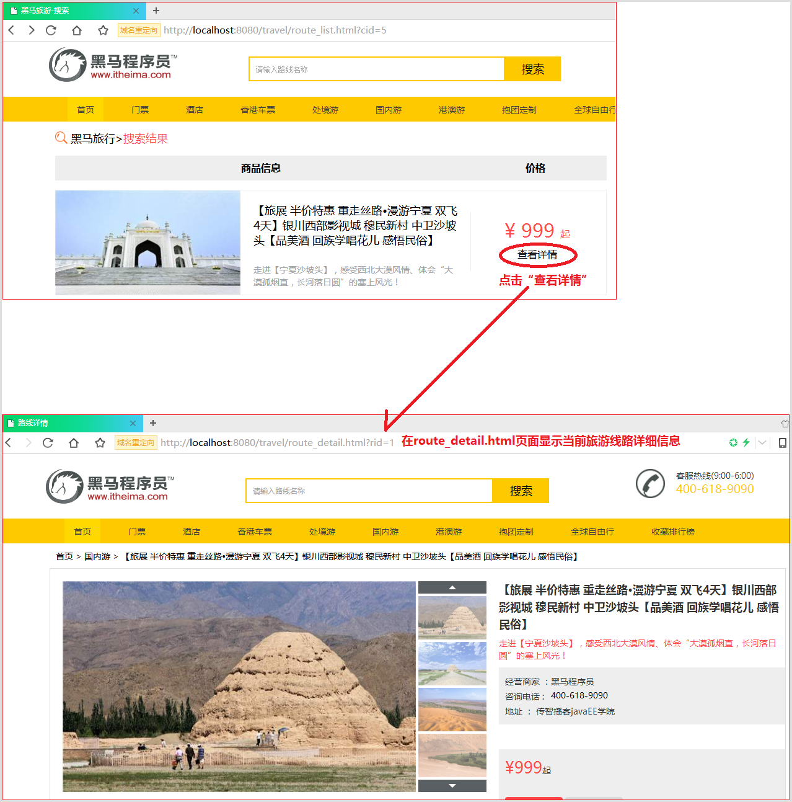

## 2.3 实现分析

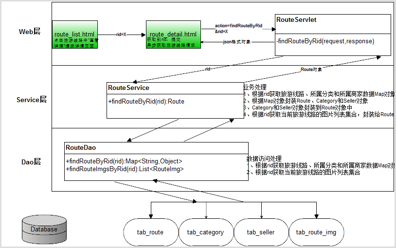

## 2.4 实现步骤

1. route_list.html代码，route_list.html旅游线路列表页面中每个旅游线路的“查看详情”，点击请求跳转到route_detail.html旅游线路详情页面，并传递旅游线路标识符rid=X;
2. route_detail.html代码，route_detail.html旅游线路详情页面获取传过来的rid数据，并提交异步请求到RouteServlet获取当前旅游线路对象数据，并传递action请求类型和rid线路的标识符数据。获取到web后端servlet返回的数据之后，进行解析将返回的数据更新数据到详情页面上指定的位置。
3. RouteServlet.java代码，RouteServlet是后端处理根据rid获的旅游线路对象数据的请求，首先获取rid数据，并调用业务类RouteService的相关方法实现获取旅游线路数据业务。
4. RouteService.java代码，RouteService业务类根据传递过来的rid数据调用数据访问类RouteDao相关方法实现数据库获取Route旅游线路对象数据，之后根据rid还要获取当前旅游线路的图片列表数据封装到Route对象中。最后返回Route对象给业务类RouteService。
5. RouteDao.java代码，RouteDao数据访问类根据rid获取tab_route表当前旅游线路数据、tab_category表当前旅游线路所属分类数据和tab_route_img表当前旅游线路所属图片列表数据。

## 2.5 实现代码

### 步骤1：route_list.html代码

route_list.html旅游线路列表页面中每个旅游线路的“查看详情”，点击请求跳转到route_detail.html旅游线路详情页面，并传递旅游线路标识符rid=X;

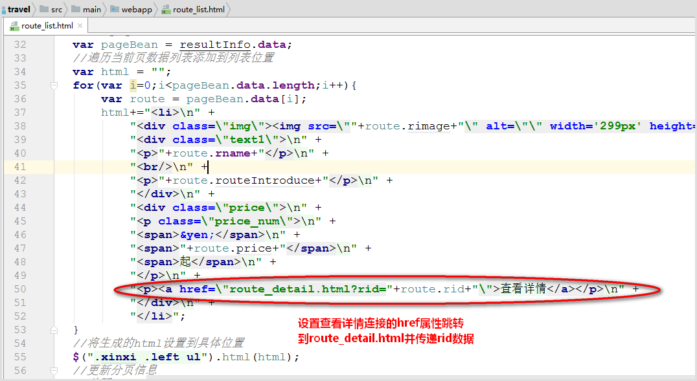

### 步骤2：route_detail.html代码

route_detail.html旅游线路详情页面获取传过来的rid数据，并提交异步请求到RouteServlet获取当前旅游线路对象数据，并传递action请求类型和rid线路的标识符数据。获取到web后端servlet返回的数据之后，进行解析将返回的数据更新数据到详情页面上指定的位置。

```html
<!--导入布局js，共享header和footer-->
<script type="text/javascript" src="js/include.js"></script>
<!--导入解析传递参数js代码-->
<script type="text/javascript" src="js/getParameter.js"></script>
<script type="text/javascript">
    $(function () {
        //获取传递过来的rid
        var rid = getParameter("rid");
        //根据rid发送异步请求获取对应旅游线路数据对象
        var url="route";//访问RouteServlet
        var data = {action:"findRouteByRid",rid:rid};//请求数据
        var callback = function (resultInfo) {
            //判断返回数据有效性
            if(resultInfo.flag){
                //正确获取旅游线路对象数据结果
                var route = resultInfo.data;
                //更新顶部层级导航html代码
                $(".bread_box").html("<a href=\"index.html\">首页</a>\n" +
                    "            <span> &gt;</span>\n" +
                    "            <a href=\"route_list.html?cid="+route.category.cid+"\">"+route.category.cname+"</a><span> &gt;</span>\n" +
                    "            <a href=\"#\">"+route.rname+"</a>");
                //更新旅游线路名称标题位置数据
                $(".prosum_right .pros_title").html(route.rname);
                //更新线路介绍位置数据
                $(".prosum_right .hot").html(route.routeIntroduce);
                //更新商家信息名称、电话、地址
                $(".prosum_right .pros_other").html("<p>经营商家  ："+route.seller.sname+"</p>\n" +
                    "                    <p>咨询电话 : "+route.seller.consphone+"</p>\n" +
                    "                    <p>地址 ： "+route.seller.address+"</p>");
                //更新价格
                $(".prosum_right .price strong").html("&yen;"+route.price);
                //更新收藏数量
                $(".prosum_right .collect span").html("已收藏"+route.count+"次");
                //更新大小图片列表
                if(route.routeImgList!=null && route.routeImgList.length>0){
                    var html = "<dt>\n" +
                        "                    \n" +
                        "                </dt>\n" +
                        "                <dd>\n" +
                        "                    <a class=\"up_img\"></a>";
                    for(var i=0;i<route.routeImgList.length;i++){
                        if(i<4){
                            html+="<a title=\"\" class=\"little_img\" data-bigpic=\""+route.routeImgList[i].bigPic+"\" style=\"display: block;\">\n" +
                                "                        \n" +
                                "                    </a>";
                        }else{
                            html+="<a title=\"\" class=\"little_img\" data-bigpic=\""+route.routeImgList[i].bigPic+"\" style=\"display: none;\">\n" +
                                "                        \n" +
                                "                    </a>";
                        }
                    }
                    html+="<a class=\"down_img\" style=\"margin-bottom: 0;\"></a>\n" +
                        "                </dd>\n" +
                        "            </dl>";
                    $("dl.prosum_left").html(html);

                    //给图片列表加动画操作
                    imgGo();
                }
            }
        };//回调函数
        var type = "json";
        $.post(url,data,callback,type);
    });
//页面上已有的代码（UI提供的），实现切换图片效果
function imgGo() {
    //焦点图效果
    //点击图片切换图片
    $('.little_img').on('mousemove', function() {
        $('.little_img').removeClass('cur_img');
        var big_pic = $(this).data('bigpic');
        $('.big_img').attr('src', big_pic);
        $(this).addClass('cur_img');
    });
       //上下切换
    var picindex = 0;
    var nextindex = 4;
    $('.down_img').on('click',function(){
        var num = $('.little_img').length;
        if((nextindex + 1) <= num){
            $('.little_img:eq('+picindex+')').hide();
            $('.little_img:eq('+nextindex+')').show();
            picindex = picindex + 1;
            nextindex = nextindex + 1;
        }
    });
    $('.up_img').on('click',function(){
        var num = $('.little_img').length;
        if(picindex > 0){
            $('.little_img:eq('+(nextindex-1)+')').hide();
            $('.little_img:eq('+(picindex-1)+')').show();
            picindex = picindex - 1;
            nextindex = nextindex - 1;
        }
    });
    //自动播放
    // var timer = setInterval("auto_play()", 5000);
}

//自动轮播方法(页面上已有的代码，UI提供)
function auto_play() {
    var cur_index = $('.prosum_left dd').find('a.cur_img').index();
    cur_index = cur_index - 1;
    var num = $('.little_img').length;
    var max_index = 3;
    if ((num - 1) < 3) {
        max_index = num - 1;
    }
    if (cur_index < max_index) {
        var next_index = cur_index + 1;
        var big_pic = $('.little_img:eq(' + next_index + ')').data('bigpic');
        $('.little_img').removeClass('cur_img');
        $('.little_img:eq(' + next_index + ')').addClass('cur_img');
        $('.big_img').attr('src', big_pic);
    } else {
        var big_pic = $('.little_img:eq(0)').data('bigpic');
        $('.little_img').removeClass('cur_img');
        $('.little_img:eq(0)').addClass('cur_img');
        $('.big_img').attr('src', big_pic);
    }
}
</script>
```

### 步骤3：RouteServlet.java代码

RouteServlet是后端处理根据rid获的旅游线路对象数据的请求，首先获取rid数据，并调用业务类RouteService的相关方法实现获取旅游线路数据业务。

```java
 /**
     * 处理获取旅游线路详情信息数据请求
     * @param request
     * @param response
     * @throws ServletException
     * @throws IOException
     */
    private void findRouteByRid(HttpServletRequest request,
                                    HttpServletResponse response) throws ServletException, IOException {
        //定义返回结果对象
        ResultInfo resultInfo = null;
        try{
            //获取传递过来的rid旅游线路id
            String rid = request.getParameter("rid");
            Route route = routeService.findRouteByRid(rid);
            //实例返回数据
            resultInfo = new ResultInfo(true,route,null);
        }catch (Exception e){
            e.printStackTrace();
            resultInfo = new ResultInfo(false);
        }
        //将ResultInfo转换为json
        String jsonData =  new ObjectMapper().writeValueAsString(resultInfo);
        System.out.println(jsonData);
        //输出给浏览器
        response.getWriter().write(jsonData);
    }
```

### 步骤4：RouteService.java代码

RouteService业务类根据传递过来的rid数据调用数据访问类RouteDao相关方法实现数据库获取Route旅游线路对象数据，之后根据rid还要获取当前旅游线路的图片列表数据封装到Route对象中。最后返回Route对象给业务类RouteService。

```java
 /**
     * 根据rid获取对应旅游线路对象
     * @param rid
     * @return Route，旅游线路对象
     * @throws Exception
     */
    public Route findRouteByRid(String rid)throws Exception {
        //根据rid获取旅游线路和分类数据的Map对象
        Map<String,Object> map =  routeDao.findRouteByRid(rid);
        //实例Route、Category和seller对象
        Route route = new Route();//旅游线路对象
        Category category = new Category();//所属分类对象
        Seller seller = new Seller();//所属商家对象
        //封装数据
        BeanUtils.populate(route,map);
        BeanUtils.populate(category,map);
        BeanUtils.populate(seller,map);
        //封装旅游线路的所属分类数据
        route.setCategory(category);
        //封装旅游线路的所属商家数据
        route.setSeller(seller);
        //获取当前旅游线路的关联图片列表集合对象
        List<RouteImg> routeImgs = routeDao.findRouteImgsByRid(rid);
        //封装旅游线路对象中图片列表
        route.setRouteImgList(routeImgs);
        return route;
    }
```

### 步骤5：RouteDao.java代码

RouteDao数据访问类根据rid获取tab_route表当前旅游线路数据、tab_category表当前旅游线路所属分类数据和tab_route_img表当前旅游线路所属图片列表数据。

```java
/**
     * 根据rid查找数据库旅游线路、所属分类和商家的一条数据的Map对象
     * @param rid，旅游线路id
     * @return Map<String,Object>，旅游线路和分类数据
     */
    public Map<String,Object> findRouteByRid(String rid) {
        String sql="SELECT * FROM tab_route r,tab_category c,tab_seller s WHERE r.cid = c.cid AND r.sid=s.sid AND r.rflag='1' AND r.rid=?";
        return jdbcTemplate.queryForMap(sql,new Object[]{rid});
    }

    /**
     * 根据旅游线路id获取当前旅游线路的图片列表
     * @param rid，旅游线路id
     * @return List<RouteImg>
     */
    public List<RouteImg> findRouteImgsByRid(String rid) {
        String sql="SELECT * FROM tab_route_img WHERE rid=?";
        return jdbcTemplate.query(sql,
                new BeanPropertyRowMapper<RouteImg>(RouteImg.class),rid);
    }
```

# 第3章 案例：添加收藏

## 3.1面向接口编程

### 3.1.1 介绍

面向接口编程是开发程序的功能先定义接口，接口中定义约定好的功能方法声明，通过实现该接口进行功能的实现，完成软件或项目的要求。软件或项目随着时间的不断变化，软件的功能要进行升级或完善，开发人员可以创建不同的新类重新实现该接口中所有方法的方式进行开发，从而达到系统升级和扩展的目的。

### 3.1.2 面向接口编程案例

#### 3.1.2.1 案例需求

在一个软件企业中开发的软件要求即可操作mySql数据库，也可以操作Oracle数据库实现数据的存储与查询。现要求开发一个软件添加用户的功能，可以通过配置文件灵活配置软件是使用mysql数据库还是oracle数据库实现功能。

#### 3.1.2.2 案例的架构图

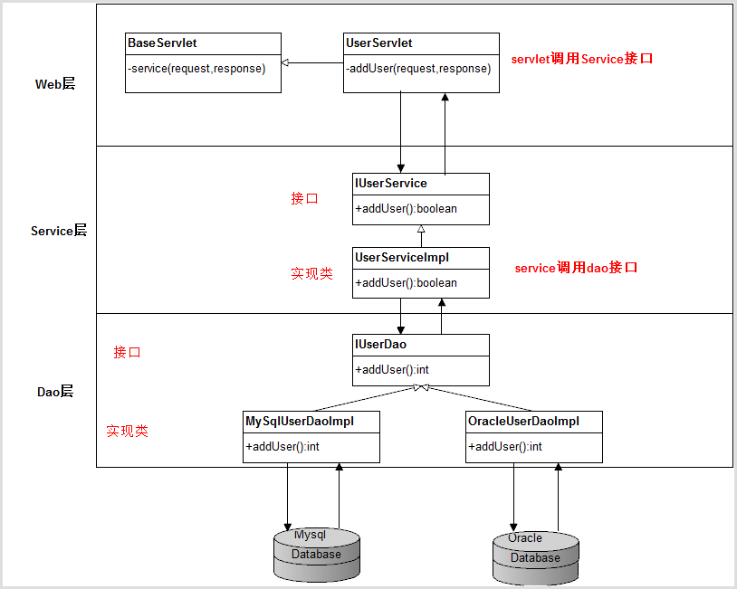

#### 3.1.2.3 面向接口编程的好处

1. 隐藏实现

   web层只调用service接口，service层只调用Dao接口，上一层只调用下一层接口，不需要知道具体实现类，从而隐藏了实现。

2. 易扩展

   系统功能升级扩展，我们知道程序设计的原则是对修改是关闭，对新增是开放。面向接口编程扩展功能只需要创建新实现类重写接口方法进行升级扩展就可以了，达到了可以不修改源程序代码的基础上达到扩展的目的。

#### 3.1.2.4 实现代码

- 步骤1：创建IUserService接口，定义addUser()接口方法

  ```java
  package com.itheima.travel.service;

  /**
   * 用户业务类接口
   */
  public interface IUserService {

      /**
       * 添加用户方法定义
       * @return boolean，true代表添加成功，false代表失败
       * @throws Exception
       */
      boolean addUser()throws Exception;
  }

  ```

- 步骤2：创建UserSerivceImpl实现类实现IUserService接口，实现addUser()方法

  ```java
  package com.itheima.travel.service.impl;

  import com.itheima.travel.service.IUserService;

  public class UserServiceImpl implements IUserService {

      /**
       * 添加用户方法定义
       *
       * @return boolean，true代表添加成功，false代表失败
       * @throws Exception
       */
      @Override
      public boolean addUser() throws Exception {
          System.out.println("UserServiceImpl执行添加用户业务方法。。。");
          return true;
      }
  }

  ```


- 步骤3：在web层的UserServlet里面创建实例IUserService接口对象定义,并调用addUser()业务方法

  ```java
  /**
       * 实例IUserService
       */
      private IUserService userServiceItf = new UserServiceImpl();

      /**
       *
       * @param request
       * @param response
       * @throws ServletException
       * @throws IOException
       */
      private void addUser(HttpServletRequest request, HttpServletResponse response)
              throws ServletException, IOException {
          try {
              userServiceItf.addUser();//调用业务方法
          }catch (Exception e){
              e.printStackTrace();
          }
      }
  ```

  这里在UserServlet实例接口实现类是错误的，面向接口编程的目的是隐藏实现类，而这里是明确使用了UserServiceImpl实现类对象。那么如何实现灵活配置实现类达到动态创建实例实现类对象呢？

  首先，定义配置文件impl.properties配置文件，存放在“src/main/resources”目录下

  impl.properties文件内容：通过配置文件配置实现类优点非常多，可以灵活配置扩展的实现类

  ```properties
  #配置用户业务接口实现类
  IUserService=com.itheima.travel.service.impl.UserServiceImpl
  ```

  其次，创建工厂类FactoryUtil.java，代码如下

  ```java
  package com.itheima.travel.util;

          import java.util.ResourceBundle;

  /**
   * 工程工具类
   */
  public class FactoryUtil {

      //定义读取properties配置文件对象
      private static ResourceBundle resourceBundle;
      static{
          //读取类路径下面的impl.properties文件
          resourceBundle = ResourceBundle.getBundle("impl");
      }

      /**
       *
       * @param itfName，配置文件中key
       * @return Object，返回类完整名的实例对象
       */
      public static Object getImplObject(String itfName){

          try {
              //根据itfName接口名字获取这个key的value，也就是获取类完整名（包名+类名）
              String className = resourceBundle.getString(itfName);
              //根据类完整名实例对象,调用无参构造函数
              return Class.forName(className).getConstructor().newInstance();
          } catch (Exception e) {
              e.printStackTrace();
              throw new RuntimeException(e);
          }
      }
  }
  ```

  优化web层的UserServlet里面创建实例IUserService接口对象定义，达到隐藏实现类的目的

  ```java
  /**
       * 实例IUserService
       */
      private IUserService userServiceItf = (IUserService)FactoryUtil.getImplObject("IUserService");

      /**
       *
       * @param request
       * @param response
       * @throws ServletException
       * @throws IOException
       */
      private void addUser(HttpServletRequest request, HttpServletResponse response)
              throws ServletException, IOException {
          try {
              userServiceItf.addUser();//调用业务方法
          }catch (Exception e){
              e.printStackTrace();
          }
      }
  ```


- 步骤4：创建IUserDao接口，定义添加用户AddUser()接口方法

  ```java
  package com.itheima.travel.dao;

  import java.sql.SQLException;

  /**
   * 用户数据访问接口
   */
  public interface IUserDao {
      /**
       * 添加用户方法定义
       * @return int,数据库影响行数
       * @throws SQLException
       */
      int addUser() throws SQLException;
  }
  ```

- 步骤5：创建MySqlUserDaoImpl接口实现类，实现添加用户数据库方法

  ```java
  package com.itheima.travel.dao.impl;

  import com.itheima.travel.dao.IUserDao;

  import java.sql.SQLException;

  /**
   * 实现用户数据访问接口类
   */
  public class MySqlUserDaoImpl implements IUserDao {
      /**
       * 添加用户方法定义
       *
       * @return int, 数据库影响行数
       * @throws SQLException
       */
      @Override
      public int addUser() throws SQLException {
          System.out.println("MySqlUserDaoImpl执行mysql数据用户添加方法。。。");
          return 1;
      }
  }
  ```

- 步骤6：创建OracleUserDaoImpl接口实现类，实现添加用户数据库方法

  ```java
  package com.itheima.travel.dao.impl;

  import com.itheima.travel.dao.IUserDao;

  import java.sql.SQLException;

  /**
   * 实现用户数据访问接口类
   */
  public class OracleUserDaoImpl implements IUserDao {
      /**
       * 添加用户方法定义
       *
       * @return int, 数据库影响行数
       * @throws SQLException
       */
      @Override
      public int addUser() throws SQLException {
          System.out.println("OracleUserDaoImpl执行oracle数据用户添加方法。。。");
          return 1;
      }
  }
  ```

- 步骤7：配置文件impl.properties文件内容如下

  ```properties
  #配置用户业务接口实现类
  IUserService=com.itheima.travel.service.impl.UserServiceImpl
  #配置用户数据访问接口实现类
  #IUserDao=com.itheima.travel.dao.impl.OracleUserDaoImpl
  IUserDao=com.itheima.travel.dao.impl.MySqlUserDaoImpl
  ```

- 步骤8：修改UserServiceImpl.java代码，调用IUserDao数据访问接口的addUser()方法实现添加用户

  ```java
  package com.itheima.travel.service.impl;

  import com.itheima.travel.dao.IUserDao;
  import com.itheima.travel.service.IUserService;
  import com.itheima.travel.util.FactoryUtil;

  public class UserServiceImpl implements IUserService {
  ```


      /**
       * 实例用户数据访问接口对象
       */
      private IUserDao userDao = (IUserDao)FactoryUtil.getImplObject("IUserDao");
    
      /**
       * 添加用户方法定义
       *
       * @return boolean，true代表添加成功，false代表失败
       * @throws Exception
       */
      @Override
      public boolean addUser() throws Exception {
          System.out.println("UserServiceImpl执行添加用户业务方法。。。");
          //调用数据访问类添加用户方法
          int row= userDao.addUser();//返回影响行数
          //如果影响行数>0说明，添加用户成功
          return row>0;
      }
  }

  ```

- 步骤8：运行项目，打开浏览器运行"http://localhost:8080/travel/user?action=addUser",控制台输出信息：

  

- 步骤9：修改impl.properties配置文件信息启动oracle数据访问实现如下，保存文件

  ```properties
  #配置用户业务接口实现类
  IUserService=com.itheima.travel.service.impl.UserServiceImpl
  #配置用户数据访问接口实现类
  IUserDao=com.itheima.travel.dao.impl.OracleUserDaoImpl
  #IUserDao=com.itheima.travel.dao.impl.MySqlUserDaoImpl
  ```

  运行项目，打开浏览器运行"http://localhost:8080/travel/user?action=addUser",控制台输出信息：

  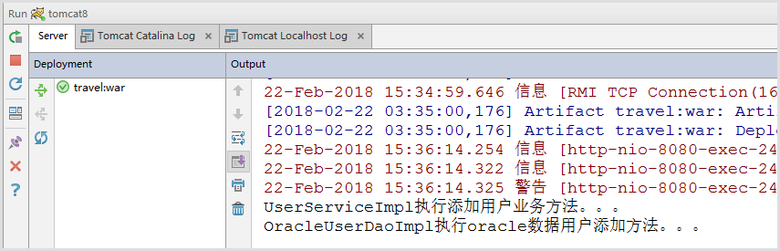

## 3.2 案例需求

用户在旅游线路详情页面点击“添加收藏”可以进行收藏该旅游线路，注意只有已经登录的用户才可以收藏当前旅游线路。此功能需要实现2个效果，第1个效果在旅游详情页面加载时根据是否已被收藏显示“点击收藏”是否可编辑；第2个效果是登录用户收藏当前旅游线路成功后的效果。

## 3.3 实现效果

### 3.3.1 详情页面“点击收藏”显示是否可编辑效果

没有登录，显示可编辑“点击收藏”效果

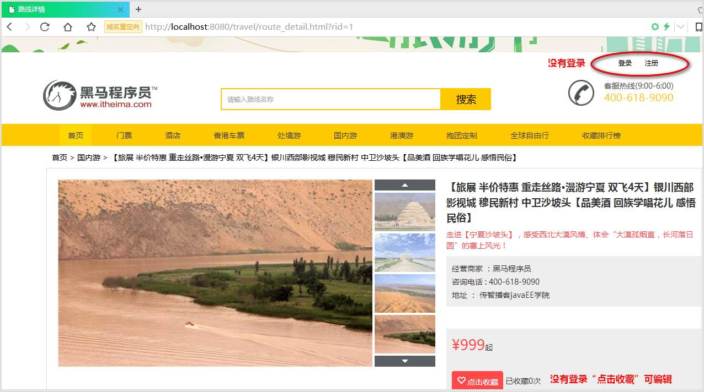

已登录，没有收藏当前旅游线路的“点击收藏”效果


已登录，点击“点击收藏”实现成功收藏，并更新收藏次数效果

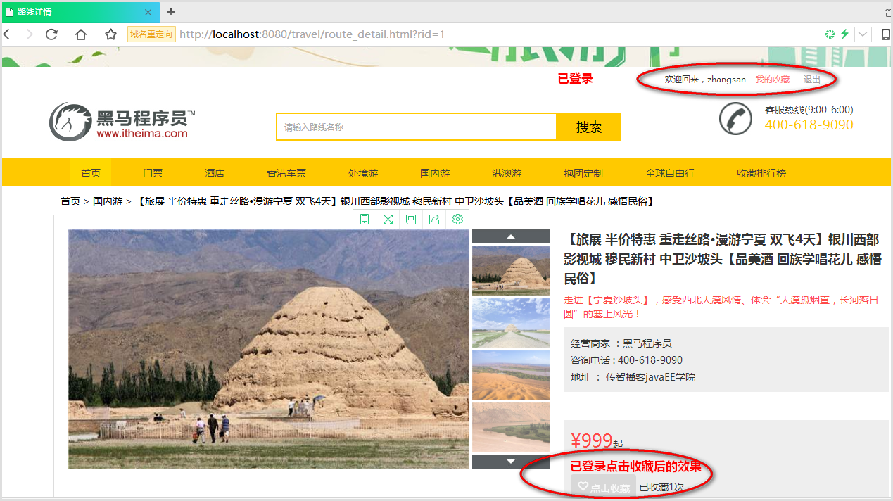

### 3.3.2 点击“点击收藏”没有登录跳转到登录页面效果

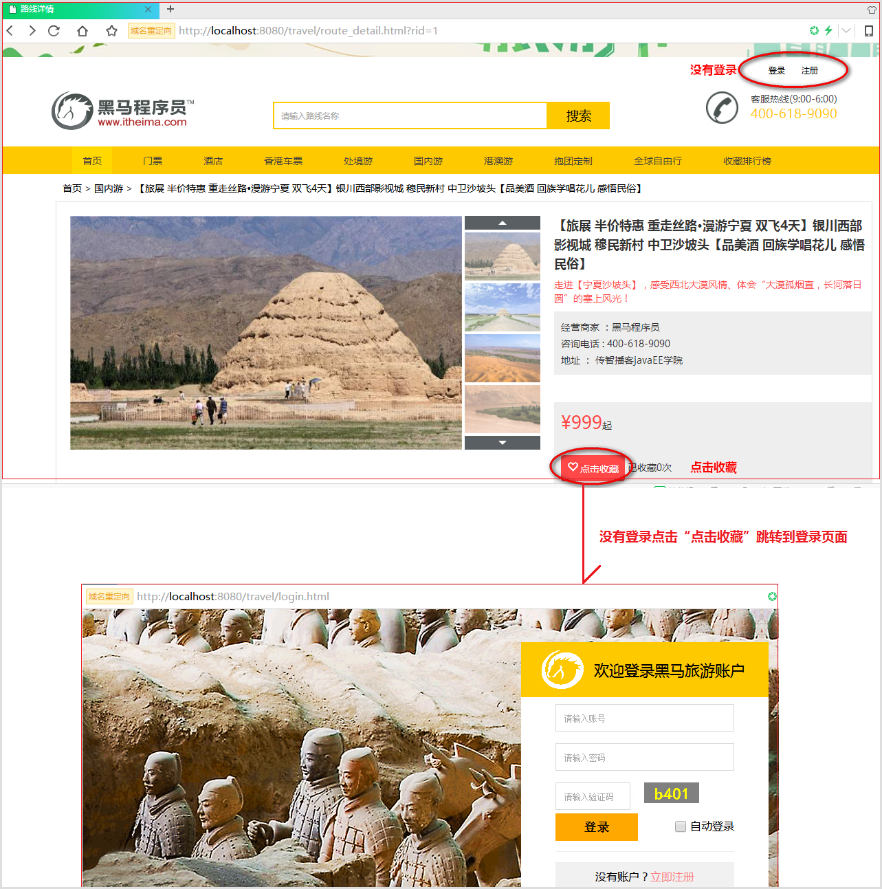

## 3.4 实现分析

### 3.4.1 详情页面“点击收藏”显示是否可编辑分析

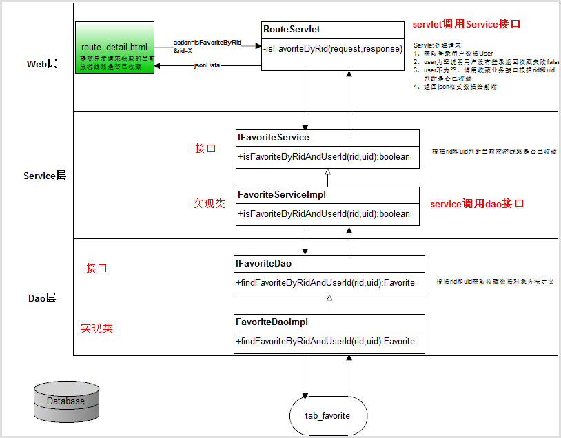

### 3.4.2 点击“点击收藏”实现增加收藏数据分析

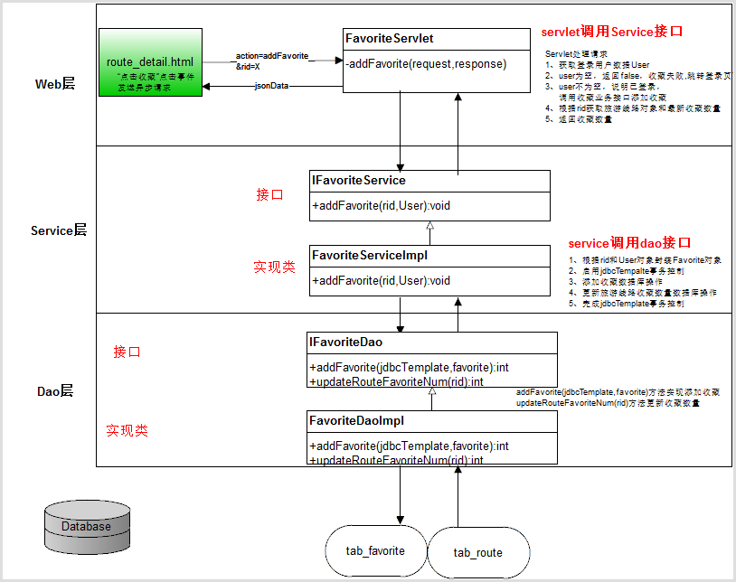

## 3.5 实现步骤

### 3.5.1 详情页面“点击收藏”显示是否可编辑步骤

1. route_detail.html代码，route_detail.html旅游线路详情页面加载时提交异步请求RouteServlet判断当前旅游线路是否被收藏，如果收藏了显示“点击收藏”不可编辑，如果没有收藏显示“点击收藏”可编辑。
2. RouteServlet.java代码，RouteServlet通过isFavoriteByRid(request,response)方法处理当前旅游线路是否被收藏请求，如果当前用户没有登录直接返回false没有收藏，如果当前用户登录了则调用收藏业务接口IFavoriteService的业务方法获取当前旅游线路id和登录用户id是否已收藏。
3. IFavoriteService.java代码，IFavoriteService接口中定义根据旅游线路rid和用户uid判断是否已收藏方法。
4. FavoriteServiceImpl.java代码，FavoriteServiceImpl实现IFavoriteService中的方法，调用数据访问接口IFavoriteDao类根据uid、rid收藏数据对象。
5. IFavoriteDao.java代码，IFavoriteDao数据访问接口根据uid、rid获取数据库的收藏数据对象方法的定义。
6. FavoriteDaoImpl.java代码，FavoriteDaoImpl实现IFavoriteDao中的方法，实现根据uid、rid获取数据库的收藏数据对象方法。

### 3.5.2 点击“点击收藏”实现增加收藏数据步骤

1. route_detail.html代码，旅游线路详情页面“点击收藏”实现点击事件，提交异步请求到FavoriteServlet实现添加收藏并返回添加收藏结果，失败返回false并跳转到登录页面，成功返回最新的收藏数量更新到页面上。
2. FavoriteServlet.java代码，收藏Servlet通过addFavorite方法处理前端请求，判断当前用户是否登录，如果没有登录返回false，如果登录了调用IFavoriteService收藏业务接口添加收藏方法，并调用RouteService获取当前旅游线路对象中最新的收藏数量返回。
3. IFavoriteService.java代码，收藏业务接口定义添加收藏业务方法，
4. FavoriteServiceImpl.java代码，收藏业务接口实现类实现添加收藏方法，调用IFavoriteDao收藏数据访问接口数据库收藏数据添加方法和当前旅游线路的收藏数量更新操作方法，所以改业务实现方法对数据库是多条sql语句操作需要使用jdbcTemplate事务控制。
5. IFavoriteDao.java代码，收藏数据访问接口，分别定义收藏数据添加方法和当前旅游线路的收藏数量更新操作方法
6. FavoriteDaoImpl.java，收藏数据访问接口实现类分别实现添加收藏数据库操作和更新当前旅游线路收藏数据数据库操作。

## 3.6 实现代码

### 3.6.1 详情页面“点击收藏”显示是否可编辑代码

#### 步骤1：route_detail.html代码

```html
<!--判断点击收藏是否可编辑：如果登录用户已收藏了则不可点击，否则可点击-->
<script type="text/javascript">
//获取传递过来的rid
var rid = getParameter("rid");

$(function () {
    //提交异步请求当前旅游线路是否可以点击收藏
    var url="route";//访问RouteServlet
    var data = {action:"isFavoriteByRid",rid:rid};//提交数据
    var callback=function (resultInfo) {
        //判断返回结果有效性
        if(resultInfo.flag){
            //判断是否已收藏,resultInfo.data为true代表已收藏，否则未收藏
            if(!resultInfo.data){
                //未收藏，设置页面点击收藏可编辑
                $(".prosum_right .collect a").removeClass("already");
                $(".prosum_right .collect a").removeAttr("disabled");
            }else{
                //已收藏，去掉点击事件
                $(".prosum_right .collect a").removeAttr("onclick");
            }
        }
    };
    var type="json";
    //发送请求
    $.post(url,data,callback,type);
});
</script>
```

#### 步骤2：RouteServlet.java代码

impl.properties配置文件

```properties
#配置收藏业务接口实现类
IFavoriteService=com.itheima.travel.service.impl.FavoriteServiceImpl
#配置收藏数据访问接口实现类
IFavoriteDao=com.itheima.travel.dao.impl.FavoriteDaoImpl
```

RouteServlet代码

```java
 /**
     * 实例收藏业务接口
     */
    private IFavoriteService favoriteService = (IFavoriteService)FactoryUtil.getImplObject("IFavoriteService");

    /**
     * 处理根据rid当前旅游线路是否已收藏
     * @param request
     * @param response
     * @throws ServletException
     * @throws IOException
     */
    private void isFavoriteByRid(HttpServletRequest request,
                                HttpServletResponse response) throws ServletException, IOException {
        //定义返回结果对象
        ResultInfo resultInfo = null;
        try {
            //获取当前登录的用户对象
            User user = (User) request.getSession().getAttribute("loginUser");
            if(user==null){
                //如果用户未登录，认为当前前旅游线路未收藏
                //实例返回结果对象ResultInfo
                //第一个参数：true,代表正确返回结果
                //第二个参数：false,代表当前旅游线路未收藏
                //第一个参数：null，代表没有错误消息
                resultInfo = new ResultInfo(true,false,null);
            }else{
                //来到这里，说明用户已登录
                //获取传递过来的rid
                String rid = request.getParameter("rid");
                //调用业务类业务方法判断当前用户、旅游线路id是否已被收藏
                // isFavorite为true代表已收藏，否则未收藏
                boolean isFavorite =favoriteService.isFavoriteByRidAndUserId(rid,user.getUid());
                //实例返回结果对象
                resultInfo = new ResultInfo(true,isFavorite,null);
            }
        }catch (Exception e){
            e.printStackTrace();
            resultInfo = new ResultInfo(false);//false代表发送了错误
        }
        //将ResultInfo转换为json
        String jsonData =  new ObjectMapper().writeValueAsString(resultInfo);
        //输出给浏览器
        response.getWriter().write(jsonData);
    }
```

#### 步骤3：IFavoriteService.java代码

```java
package com.itheima.travel.service;

/**
 * 收藏业务接口
 */
public interface IFavoriteService {
    /**
     * 根据rid，uid判断当前用户是否已收藏了当前旅游线路
     * @param rid,旅游线路id
     * @param uid,登录用户id
     * @return boolean，true代表已收藏，false代表未收藏
     */
    boolean isFavoriteByRidAndUserId(String rid, int uid)throws Exception;
}
```

#### 步骤4：FavoriteServiceImpl.java代码

```java
package com.itheima.travel.service.impl;

import com.itheima.travel.dao.IFavoriteDao;
import com.itheima.travel.model.Favorite;
import com.itheima.travel.service.IFavoriteService;
import com.itheima.travel.util.FactoryUtil;

public class FavoriteServiceImpl implements IFavoriteService {

    //实例收藏数据访问接口
    private IFavoriteDao favoriteDao = (IFavoriteDao)FactoryUtil.getImplObject("IFavoriteDao");
    /**
     * 根据rid，uid判断当前用户是否已收藏了当前旅游线路
     * @param rid，旅游线路id
     * @param uid，当前登录用户id
     * @return boolean，true代表已收藏，false代表未收藏
     * @throws Exception
     */
    @Override
    public boolean isFavoriteByRidAndUserId(String rid, int uid) throws Exception {
        //根据rid，uid调用数据访问方法获取收藏数据对象
        Favorite favorite =  favoriteDao.findFavoriteByRidAndUserId(rid,uid);
        //收藏对象不为空，说明已收藏返回true,否则返回false
        if(favorite!=null){
            return true;
        }else{
            return false;
        }
    }
}
```

#### 步骤5：IFavoriteDao.java代码

```java
package com.itheima.travel.dao;

import com.itheima.travel.model.Favorite;

import java.sql.SQLException;

/**
 * 收藏数据访问接口
 */
public interface IFavoriteDao {
        /**
     * 根据rid，uid获取指定的收藏对象数据
     * @param rid,旅游线路id
     * @param uid,登录用户id
     * @return boolean，true代表已收藏，false代表未收藏
     * @throws SQLException
     */
    Favorite findFavoriteByRidAndUserId(String rid, int uid)throws SQLException;
}
```

#### 步骤6：FavoriteDaoImpl.java代码

```java
package com.itheima.travel.dao.impl;

import com.itheima.travel.dao.IFavoriteDao;
import com.itheima.travel.model.Favorite;
import com.itheima.travel.util.JdbcUtils;
import org.springframework.jdbc.core.BeanPropertyRowMapper;
import org.springframework.jdbc.core.JdbcTemplate;

import java.sql.SQLException;

public class FavoriteDaoImpl implements IFavoriteDao {
    //jdbcTemplate
    private JdbcTemplate jdbcTemplate = new JdbcTemplate(JdbcUtils.getDataSource());

    /**
     * 根据rid，uid获取指定的收藏对象数据
     * @param rid，旅游线路id
     * @param uid，当前登录用户id
     * @return boolean，true代表已收藏，false代表未收藏
     * @throws SQLException
     */
    @Override
    public Favorite findFavoriteByRidAndUserId(String rid, int uid) throws SQLException {
        String sql="SELECT * FROM tab_favorite WHERE rid=? AND uid=?";
        try {
            return jdbcTemplate.queryForObject(
                    sql, new BeanPropertyRowMapper<Favorite>(Favorite.class),
                    rid, uid);
        }catch (Exception e){
            return null;//没有查找到数据会发生异常，所以这里没有查找到数据返回null
        }
    }
}
```

### 3.6.2 点击“点击收藏”实现增加收藏数据代码

#### 步骤1：route_detail.html代码

注释可编辑的“点击收藏”html代码，给不可编辑“点击收藏”增加onclick事件

```html
<p class="collect">
                        <!--注释可编辑的"点击收藏"<a class="btn"><i class="glyphicon glyphicon-heart-empty"></i>点击收藏</a>-->

                        <a onclick="addFavorite();" class="btn already" disabled="disabled"><i class="glyphicon glyphicon-heart-empty"></i>点击收藏</a>
                        <span>已收藏100次</span>
                    </p>
```

onclick事件代码

```javascript
//获取传递过来的rid
var rid = getParameter("rid");
//点击收藏点击事件
function addFavorite() {
    //发送异步请求到FavoriteServlet实现添加收藏
    var url="favorite";//请求FavoriteServlet
    var data = {action:"addFavorite",rid:rid};//提交数据
    var callback = function (resultInfo) {
        //判断返回结果有效性,resultInfo.flag为true代表正确获得了结果
        if(resultInfo.flag){
            //判断添加收藏结果
            if(resultInfo.data==false){
                //没有登录，跳转到登录页面
                location.href="login.html";
            }else if(resultInfo.data>0){
                //添加收藏成功,设置"点击收藏"不可编辑
                $(".prosum_right .collect a").addClass("already");
                $(".prosum_right .collect a").attr("disabled","disabled");
                $(".prosum_right .collect a").removeAttr("onclick");
                //resultInfo.data为返回的收藏数量，更新收藏数量
                $(".prosum_right .collect span").html("已收藏"+resultInfo.data+"次");
            }
        }
    };
    var type="json";
    //发送请求
    $.post(url,data,callback,type);
}
```

#### 步骤2：FavoriteServlet.java代码

```java
package com.itheima.travel.web.servlet;

import com.fasterxml.jackson.databind.ObjectMapper;
import com.itheima.travel.model.ResultInfo;
import com.itheima.travel.model.Route;
import com.itheima.travel.model.User;
import com.itheima.travel.service.IFavoriteService;
import com.itheima.travel.service.RouteService;
import com.itheima.travel.util.FactoryUtil;

import javax.servlet.ServletException;
import javax.servlet.annotation.WebServlet;
import javax.servlet.http.HttpServletRequest;
import javax.servlet.http.HttpServletResponse;
import java.io.IOException;

/**
 * 收藏Servlet
 */
@WebServlet("/favorite")
public class FavoriteServlet extends BaseServlet {

    /**
     * 收藏业务接口
     */
    private IFavoriteService favoriteService =
            (IFavoriteService)FactoryUtil.getImplObject("IFavoriteService");
    /**
     * 实例旅游线路业务类
     */
    private RouteService routeService = new RouteService();

    /**
     * 处理前端添加收藏请求
     * @param request
     * @param response
     * @throws ServletException
     * @throws IOException
     */
    private void addFavorite(HttpServletRequest request, HttpServletResponse response)
            throws ServletException, IOException {
        //定义返回结果对象
        ResultInfo resultInfo = null;
        try {
            //1.判断用户是否登录，如果没有登录
            User user = (User) request.getSession().getAttribute("loginUser");
            //1.1 user为null说明没有登录
            if (user == null) {
                //第一个参数：true,代表正常返回数据
                //第二个参数：false,代表没有登录，添加收藏失败
                //第三个参数：错误消息
                resultInfo = new ResultInfo(true,false,null);
            }else{
                //获取rid
                String rid = request.getParameter("rid");
                //根据rid获取Route对象
                Route route = new Route();
                route.setRid(Integer.parseInt(rid));
                //如果用户登录，调用业务接口进行添加收藏
                favoriteService.addFavorite(route,user);
                //根据rid重新获取最新Route对象
                route = routeService.findRouteByRid(rid);
                //根据Route对象获取收藏数量
                int count = route.getCount();
                //实例结果对象
                //第一个参数：true,代表正常返回数据
                //第二个参数：count,收藏成功后返回收藏数量
                //第三个参数：错误消息
                resultInfo = new ResultInfo(true,count,null);
            }
        }catch (Exception e){
            e.printStackTrace();
            resultInfo = new ResultInfo(false);
        }
        //将ResultInfo转换为json
        String jsonData =  new ObjectMapper().writeValueAsString(resultInfo);
        //输出给浏览器
        response.getWriter().write(jsonData);
    }
}
```

#### 步骤3：IFavoriteService.java代码

```java
    /**
     * 根据route和user添加收藏
     * @param route，旅游线路id
     * @param user，用户对象
     * @throws Exception
     */
    void addFavorite(Route route, User user)throws Exception;
```

#### 步骤4：FavoriteServiceImpl.java代码

```java
 /**
     * 根据route和user添加收藏
     *
     * @param route ，旅游线路对象
     * @param user ，用户对象
     * @throws Exception
     */
    @Override
    public void addFavorite(Route route, User user) throws Exception {
        //实例Favorite对象
        Favorite favorite = new Favorite();
        //封装rid
        favorite.setRoute(route);
        //封装User对象
        favorite.setUser(user);
        //封装收藏时间
        SimpleDateFormat sdf = new SimpleDateFormat("yyyy-MM-dd HH:mm:ss");
        favorite.setDate(sdf.format(new Date()));
        //同时操作sql语句，需要使用事务
        //获取数据源
        DataSource dataSource = JdbcUtils.getDataSource();
        //实例jdbcTemplate
        JdbcTemplate jdbcTemplate = new JdbcTemplate(dataSource);
        //启动事务管理器（获取datasource操作数据库连接对象并绑定到当前线程中）
        TransactionSynchronizationManager.initSynchronization();
        //从数据源中获取jdbcTemplate操作的当前连接对象
        Connection connection = DataSourceUtils.getConnection(dataSource);
        try {
            //设置连接不自动提交事务
            connection.setAutoCommit(false);
            //调用数据访问接口添加收藏
            favoriteDao.addFavorite(jdbcTemplate,favorite);
            //更新旅游线路收藏数量+1
            favoriteDao.updateRouteFavoriteNum(jdbcTemplate,route.getRid());
            //手动提交事务
            connection.commit();
        } catch (Exception e) {
            //事务回滚
            connection.rollback();
            System.out.println("回滾了");
            throw e;//抛出异常，说明执行失败
        } finally {
            try {
                //释放当前线程与连接对象的绑定
                TransactionSynchronizationManager.clearSynchronization();
                //重置当前连接为自动提交事务
                connection.setAutoCommit(true);
            } catch (Exception e) {
                e.printStackTrace();
            }
        }

    }
```

#### 步骤5：IFavoriteDao.java代码

```java
/**
     * 添加收藏
     * @param jdbcTemplate
     * @param favorite,收藏对象
     * @return int，影响行数
     * @throws SQLException
     */
    int addFavorite(JdbcTemplate jdbcTemplate, Favorite favorite)throws SQLException;

    /**
     * 更新旅游线路收藏数量
     * @param jdbcTemplate
     * @param rid，旅游线路id
     * @return int,影响行数
     * @throws SQLException
     */
    int updateRouteFavoriteNum(JdbcTemplate jdbcTemplate, int rid)throws SQLException;
```

#### 步骤6：FavoriteDaoImpl.java代码

```java

    /**
     * 添加收藏
     * @param favorite,收藏对象
     * @return int，影响行数
     * @throws SQLException
     */
    @Override
    public int addFavorite(JdbcTemplate jdbcTemplate,Favorite favorite) throws SQLException {
        String sql="INSERT INTO tab_favorite VALUES(?,?,?)";
        return jdbcTemplate.update(sql,
                    favorite.getRoute().getRid(),
                    favorite.getDate(),
                    favorite.getUser().getUid()
                );
    }

    /**
     * 更新旅游线路收藏数量
     * @param jdbcTemplate
     * @param rid,旅游线路id
     * @return int,影响行数
     * @throws SQLException
     */
    @Override
    public int updateRouteFavoriteNum(JdbcTemplate jdbcTemplate, int rid) throws SQLException {
        String sql="UPDATE tab_route SET COUNT=COUNT+1 WHERE rid=?";
        return jdbcTemplate.update(sql,rid);
    }
```

配置impl.properties文件新增内容：

```properties
#配置收藏业务接口实现类
IFavoriteService=com.itheima.travel.service.impl.FavoriteServiceImpl
#配置收藏数据访问接口实现类
IFavoriteDao=com.itheima.travel.dao.impl.FavoriteDaoImpl
```

# 第4章 案例：查看我的收藏

## 4.1 案例需求

用户登录后，点击顶部登录信息位置“我的收藏”，进入myfavorite.html我的收藏列表页面，显示登录用户所有收藏数据列表，列表实现分页查看效果。

## 4.2 实现效果


## 4.3 实现分析

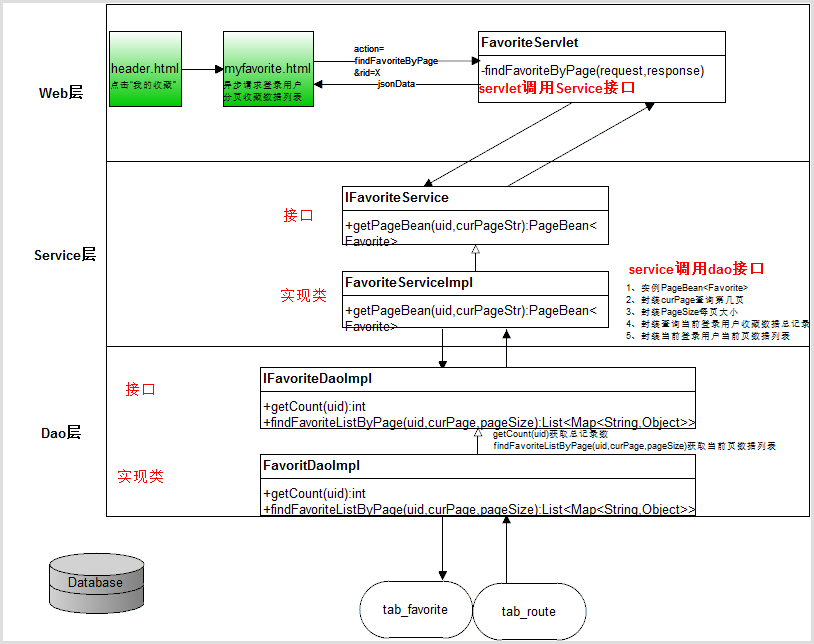

## 4.4 实现步骤

1. header.html代码，头部页面登录信息位置“我的收藏”跳转到myfavorite.html页面
2. myfavorite.html代码，我的收藏页面，页面加载时提交异步获取当前登录用户收藏分页数据列表请求到FavoriteServlet，并获取返回的PageBean数据更新到页面上。
3. FavoriteServlet.java代码，收藏Servlet处理前端请求，调用IFavoriteService业务接口获取PageBean数据分页对象业务方法。
4. IFavoriteService.java代码，收藏业务接口定义获取PageBean数据分页对象业务方法。
5. FavoriteServiceImpl.java代码，收藏业务接口实现类实现获取PageBean数据分页对象业务方法。调用IFavoriteDao数据访问接口获取当前登录用户收藏数据列表总记录数和当前页收藏数据列表。
6. IFavoriteDao.java代码，收藏数据访问接口定义获取当前登录用户收藏数据列表总记录数和当前页收藏数据列表方法。
7. FavoriteDaoImpl.java代码，收藏数据访问接口实现类实现获取当前登录用户收藏数据列表总记录数和当前页收藏数据列表方法。

## 4.5 实现代码

### 步骤1：header.html代码

我的收藏链接跳转到myfavorite.htmld页面

```javascript
var html="<span>欢迎回来，"+resultInfo.data.username+"</span>\n" +
                            "<a href=\"myfavorite.html\" class=\"collection\">我的收藏</a>\n" +
                            "<a href=\"user?action=loginOut\">退出</a>";
```

### 步骤2：myfavorite.html代码

我的收藏页面，页面加载时提交异步获取当前登录用户收藏分页数据列表请求到FavoriteServlet，并获取返回的PageBean数据更新到页面上

```html
<script type="text/javascript" src="js/getParameter.js"></script>
<!--加载我的收藏列表数据js代码-->
<script type="text/javascript">
    $(function () {
        //发送异步请求FavoriteServlet获取分页的收藏列表数据
        var curPage = getParameter("curPage");//获取当前页
        var url="favorite";//FavoriteServlet地址
        var data={action:"findFavoriteByPage",curPage:curPage};//提交数据
        //回调函数
        var callback=function (resultInfo) {
            //判断有效性
            if (resultInfo.flag) {
                //获取pageBean对象数据
                var pageBean = resultInfo.data;
                //遍历当前页数据列表添加到列表位置
                var html = "";
                for (var i = 0; i < pageBean.data.length; i++) {
                    var favorite = pageBean.data[i];
                    html += "<div class=\"col-md-3\">\n" +
                        "       <a href=\"route_detail.html\">\n" +
                        "            \n" +
                        "            <div class=\"has_border\">\n" +
                        "                   <h3>" + favorite.route.rname + "</h3>\n" +
                        "                   <div class=\"price\">网付价<em>￥</em><strong>" + favorite.route.price + "</strong><em>起</em></div>\n" +
                        "            </div>\n" +
                        "       </a>\n" +
                        "  </div>";
                }
                //将生成的html设置到具体位置
                $(".tab-content .tab-pane .row").html(html);
                //更新分页信息
                //首页
                html = "<li><a href=\"myfavorite.html?curPage=" + pageBean.firstPage + "\">首页</a></li>";
                //上一页,如果用户访问页数>1才显示上一页
                if (pageBean.curPage > 1) {
                    html += "<li class=\"threeword\"><a href=\"myfavorite.html?curPage=" + pageBean.prePage + "\">上一页</a></li>";
                }
                var begin;//起始页
                var end;//结束页
                //总页数<=10的情况
                if (pageBean.totalPage <= 10) {
                    begin = 1;
                    end = pageBean.totalPage;
                } else {
                    //pageBean.totalPage总页数>10情况
                    begin = pageBean.curPage - 5;
                    end = pageBean.curPage + 4;
                    //由于有加减计算，begin和end计算出来的结果就有可能越界，所以我们需要判断边界
                    if (begin < 1) {
                        begin = 1;
                        end = 10;
                    }
                    if (end > pageBean.totalPage) {
                        end = pageBean.totalPage;
                        begin = pageBean.totalPage - 9;
                    }
                }
                //遍历分页数字数据
                for (var i = begin; i <= end; i++) {
                    //如果遍历数字与当前访问页相等，那么当前页应用类样式curPage
                    if (pageBean.curPage == i) {
                        html += " <li class='curPage'><a href=\"myfavorite.html?curPage=" + i + "\">" + i + "</a></li>";
                    } else {
                        html += " <li><a href=\"myfavorite.html?curPage=" + i + "\">" + i + "</a></li>";
                    }
                }
                //下一页 ，如果当前页<总页数才显示下一页
                if (pageBean.curPage < pageBean.totalPage) {
                    html += "<li class=\"threeword\"><a href=\"myfavorite.html?curPage=" + pageBean.nextPage + "\">下一页</a></li>";
                }
                //拼接尾部
                html += "<li class=\"threeword\"><a href=\"myfavorite.html?curPage=" + pageBean.totalPage + "\">末页</a></li>"
                //更新到分页信息位置
                $(".pageNum ul").html(html);

            }

        };
        var type="json";//返回数据类型
        //发送请求
        $.post(url,data,callback,type);
    });
</script>
```

### 步骤3：FavoriteServlet.java代码

收藏Servlet处理前端请求，调用IFavoriteService业务接口获取PageBean数据分页对象业务方法。

```java
/**
     * 处理前端获取登录用户的分页收藏列表数据
     * @param request
     * @param response
     * @throws ServletException
     * @throws IOException
     */
    private void findFavoriteByPage(HttpServletRequest request, HttpServletResponse response)
            throws ServletException, IOException {
        //定义返回结果对象
        ResultInfo resultInfo = null;
        try {
            //获取登录用户
            User user =(User) request.getSession().getAttribute("loginUser");
            //获取用户查看当前页curPage
            String curPageStr =request.getParameter("curPage");
            //调用收藏业务接口获取当前登录用户的收藏分页类对象
            PageBean<Favorite> pageBean = favoriteService.getPageBean(user.getUid(),curPageStr);
            //实例返回数据
            resultInfo = new ResultInfo(true,pageBean,null);
        }catch (Exception e){
            e.printStackTrace();
            resultInfo = new ResultInfo(false);
        }
        //将ResultInfo转换为json
        String jsonData =  new ObjectMapper().writeValueAsString(resultInfo);
        //输出给浏览器
        response.getWriter().write(jsonData);
    }
```

### 步骤4：IFavoriteService.java代码

收藏业务接口定义获取PageBean数据分页对象业务方法。

```java
    /**
     * 获取当前登录用户的收藏分页类对象
     * @param uid,当前登录用户id
     * @param curPageStr,当前页数
     * @return PageBean<Favorite>
     * @throws Exception
     */
    PageBean<Favorite> getPageBean(int uid,String curPageStr)throws Exception;
```

### 步骤5：FavoriteServiceImpl.java代码

收藏业务接口实现类实现获取PageBean数据分页对象业务方法。调用IFavoriteDao数据访问接口获取当前登录用户收藏数据列表总记录数和当前页收藏数据列表

```java
/**
     * 获取当前登录用户的收藏分页类对象
     *
     * @param uid
     * @param curPageStr
     * @return PageBean<Favorite>
     * @throws Exception
     */
    @Override
    public PageBean<Favorite> getPageBean(int uid, String curPageStr) throws Exception {
        //实例PageBean
        PageBean<Favorite> pageBean = new PageBean<Favorite>();
        //封装当前页
        int curPage = 1;
        if(curPageStr!=null && !curPageStr.trim().equals("")){
            curPage = Integer.parseInt(curPageStr);
        }
        pageBean.setCurPage(curPage);
        //封装每页大小
        int pageSize= 4;
        pageBean.setPageSize(pageSize);
        //封装总记录数
        int count= favoriteDao.getCount(uid);
        pageBean.setCount(count);
        //封装当前页数据列表
        List<Map<String,Object>> mapList = favoriteDao.findFavoriteListByPage(uid,curPage,pageSize);
        //将List<Map<String,Object>>转换为List<Favorite>
        List<Favorite> favoriteList = convertMapListToList(mapList);
        pageBean.setData(favoriteList);
        return pageBean;
    }

    /**
     * 将List<Map<String,Object>>转换为List<Favorite>
     * @param mapList
     * @return List<Favorite>
     * @throws Exception
     */
    private List<Favorite> convertMapListToList(List<Map<String,Object>> mapList)throws Exception{
        List<Favorite> favoriteList = null;
        if(mapList!=null && mapList.size()>0){
            favoriteList = new ArrayList<Favorite>();
            for (Map<String,Object> map:mapList) {
                //实例对象
                Favorite favorite = new Favorite();
                Route route = new Route();
                //封装数据
                BeanUtils.populate(favorite,map);
                BeanUtils.populate(route,map);
                //将route封装给favorite
                favorite.setRoute(route);

                favoriteList.add(favorite);
            }
        }
        return favoriteList;
    }
```

### 步骤6：IFavoriteDao.java代码

收藏数据访问接口定义获取当前登录用户收藏数据列表总记录数和当前页收藏数据列表方法。

```java
/**
     * 获取当前用户收藏数据的总记录数
     * @param uid，当前登录用户id
     * @return int,总记录数
     * @throws SQLException
     */
    int getCount(int uid)throws  SQLException;

    /**
     * 分页查询当前用户的收藏数据列表
     * @param uid,当前用户id
     * @param curPage,查看第几页
     * @param pageSize，每页大小
     * @return List<Map<String,Object>>,当前页的收藏数据列表
     * @throws SQLException
     */
    List<Map<String,Object>> findFavoriteListByPage(int uid,int curPage, int pageSize)throws SQLException;
```

### 步骤7：FavoriteDaoImpl.java代码

收藏数据访问接口实现类实现获取当前登录用户收藏数据列表总记录数和当前页收藏数据列表方法。

```java
/**
     * 获取当前用户收藏数据的总记录数
     *
     * @param uid ，当前登录用户id
     * @return int, 总记录数
     * @throws SQLException
     */
    @Override
    public int getCount(int uid) throws SQLException {
        String sql="SELECT COUNT(*) FROM tab_favorite WHERE uid=?";
        return jdbcTemplate.queryForObject(sql,Integer.class,uid);
    }

    /**
     * 分页查询当前用户的收藏数据列表
     * @param uid,当前登录用户id
     * @param curPage,当前查看第几页
     * @param pageSize ，每页大小
     * @return List<Map < String , Object>>,当前页的收藏数据列表
     * @throws SQLException
     */
    @Override
    public List<Map<String, Object>> findFavoriteListByPage(int uid,int curPage, int pageSize) throws SQLException {
        int start = (curPage-1)*pageSize;//分页查询开始索引位置
        int length = pageSize;//每页大小
        String sql="SELECT * FROM tab_favorite f,tab_route r WHERE f.rid=r.rid AND  f.uid=? LIMIT ?,?";
        return jdbcTemplate.queryForList(sql,uid,start,length);
    }
```

