# day54-项目第四天

# 学习目标

1. 能够在linux系统中安装jdk软件
2. 能够在linux系统中安装mysql软件
3. 能够在linux系统中安装tomcat软件
4. 能够配置nginx反向代理分发访问tomcat
5. 能够完成自动化部署项目的shell脚本编程案例

# 第1章 内容回顾

# 第2章 部署项目

## 2.1 介绍

在企业中，一般都采用linux系统作为Web应用服务器，所以我们需要在linux系统搭建项目运行环境。在linux系统上搭建运行环境需要安装jdk、myql、nginx和tomcat相关软件。大家根据将“软件”目录下的所有软件上传到虚拟机上“/soft”目录下

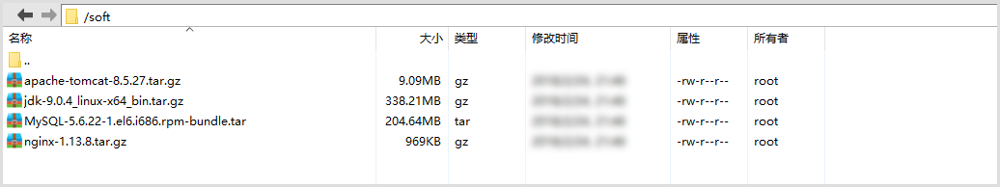

**注意**：安装这些软件前提，虚拟机安装centos7系统时，软件选择不能最小需要选择“基本网页服务器—开发工具”

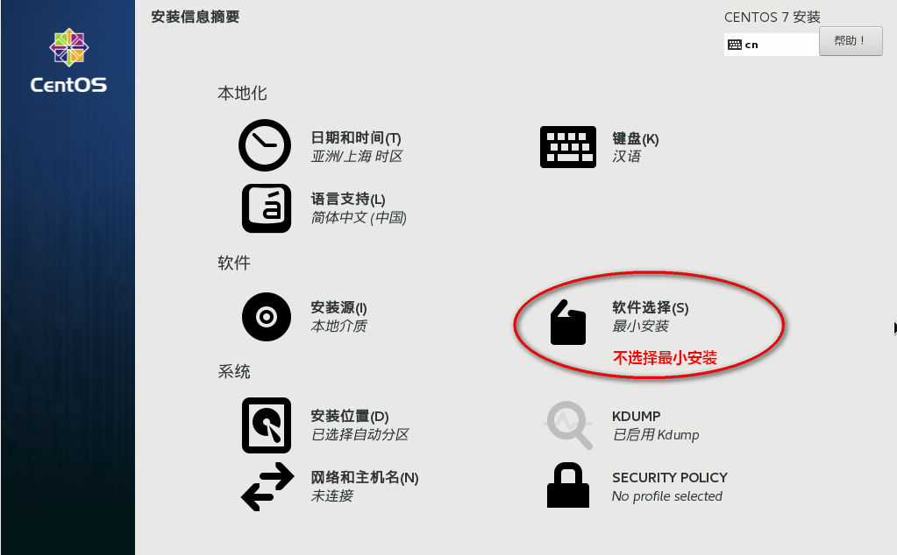

系统安装是，点击“软件选择”,进行如下选择，最后点击“完成”

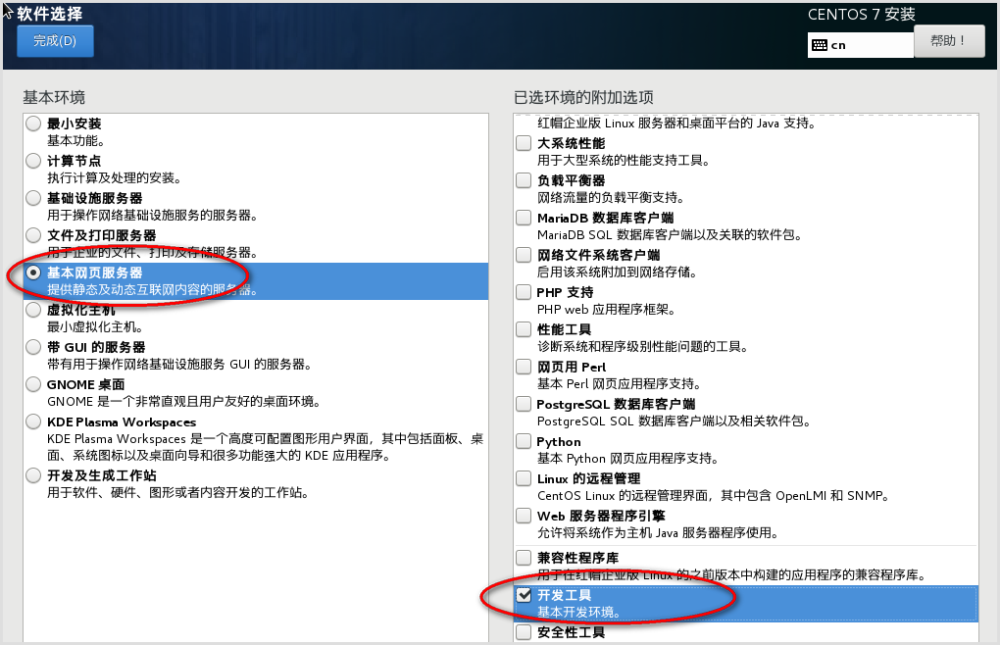

选择完成

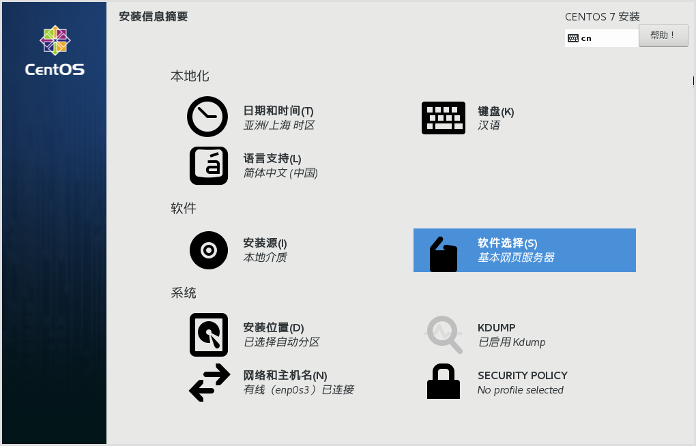

## 2.2 软件安装

### 2.2.1 软件安装命令rpm

- rpm的作用，相当于软件助手，可以查询已安装的软件、卸载软件和安装软件。


- 格式：rpm [参数][软件]

   -v　显示指令执行过程。

​       -h或--hash 　安装时列出标记。

​       -q 　query，查询。                                            

​       -a　all,所有安装的软件

​       -i   进行安装软件                                             

​       -Uupdate更新升级

​       -e卸载，删除指定的套件。

​       --nodeps　不验证软件的相互关联性

- 常用

  安装：rpm -ivh rpm文件【安装】

  升级：rpm -Uvh rpm文件【更新】

  删除或卸载：rpm -e --nodeps 软件名

  查看所有安装的软件：rpm -qa

###2.2.2 jdk安装

- 步骤1：查看当前Linux系统是否已经安装java

  输入 rpm -qa | grep java

  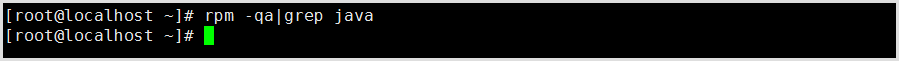

  如图，说明系统没有安装jdk步骤2：进入“/soft”目录，解压jdk到/usr/local下， tar -zxvf jdk-9.0.4_linux-x64_bin.tar.gz  -C /usr/local/


- 步骤2：进入“/soft”目录，解压jdk到/usr/local下， tar -zxvf jdk-9.0.4_linux-x64_bin.tar.gz  -C /usr/local/

  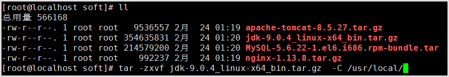

  查看解压后的目录,目录中有jdk-9.0.4为jdk解压的目录

  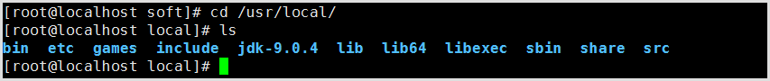

  ​


- 步骤3：配置jdk环境变量，打开/etc/profile配置文件，将下面配置拷贝进去

  ```properties
  #set java environment
  	JAVA_HOME=/usr/local/jdk-9.0.4
  	CLASSPATH=.:$JAVA_HOME/lib.tools.jar
  	PATH=$JAVA_HOME/bin:$PATH
  	export JAVA_HOME CLASSPATH PATH
  ```

  命令1：vim /etc/profile

  

  命令2：在文件末尾处，输入“o”，复制上面的环境变量配置粘贴如图位置，并写入保存

  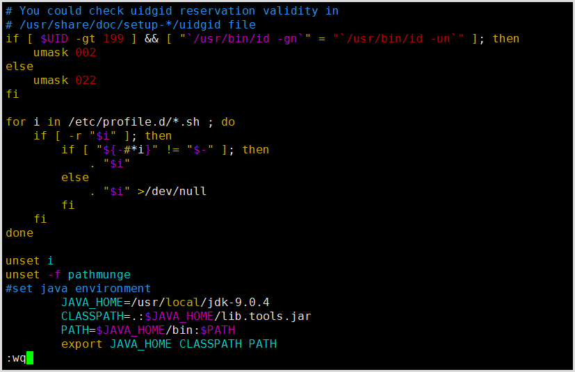


- 步骤4：重新加载/etc/profile配置文件，并测试

  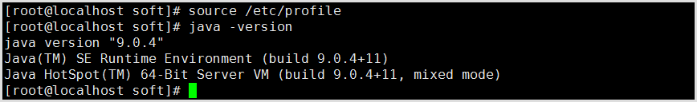

### 2.2.3 mysql安装

- 步骤1：查看CentOS是否自带的mysql

  ```shell
  rpm -qa | grep mysql
  ```

  

  说明没有自带mysql

- 步骤2：解压Mysql到/usr/local/下的mysql目录(mysql目录需要手动创建)内

  ```shell
  cd /usr/local
  mkdir mysql
  cd
  tar -xvf MySQL-5.6.22-1.el6.i686.rpm-bundle.tar -C /usr/local/mysql
  ```

  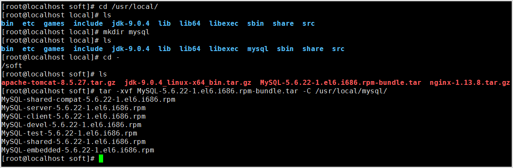

- 步骤3：在/usr/local/mysql下安装mysql
  安装服务器端：rpm -ivh MySQL-server-5.6.22-1.el6.i686.rpm

  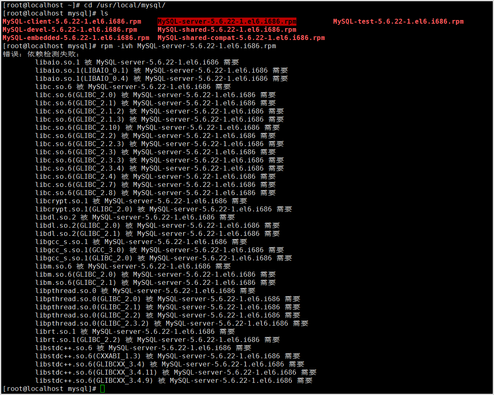

  从上图可以看出安装mysql服务器端软件需要依赖如下软件：

  ```
  卸载mariadb（系统自带的数据库，在安装mysql之前卸载这个软件）
  libaio.so.1
  libc.so.6
  libgcc_s.so.1(这个版本有冲突，需要先卸载再安装)
  libstdc++.so.6（这个版本有冲突，需要先卸载在安装）
  ```

  卸载mariadb数据库软件

  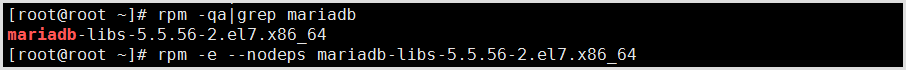

  需要逐个运行命令：yum install XXX软件，yum是去网络下载指定的软件进行安装

  ```
  yum install libaio.so.1
  yum install libc.so.6
  ```

  先卸载 libgcc 再安装 libgcc

  ```shell
  rpm -qa|grep libgcc
  rpm -e --nodeps libgcc-4.8.5-16.el7.x86_64
  yum install libgcc_s.so.1
  ```

  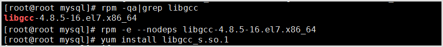

  卸载libstdc

  ```shell
  rpm -qa|grep libstdc
  rpm -e --nodeps libstdc++-4.8.5-16.el7.x86_64
  rpm -e --nodeps libstdc++-devel-4.8.5-16.el7.x86_64
  ```

  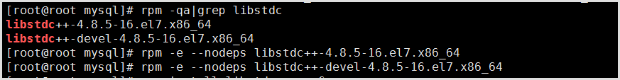

  再安装libstdc++.so.6

  ```
  yum install libstdc++.so.6
  ```

  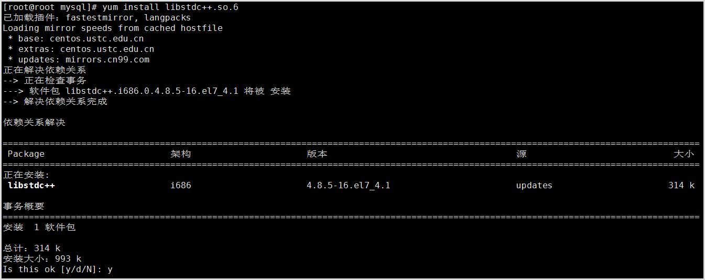

  重新执行：rpm -ivh MySQL-server-5.6.22-1.el6.i686.rpm

  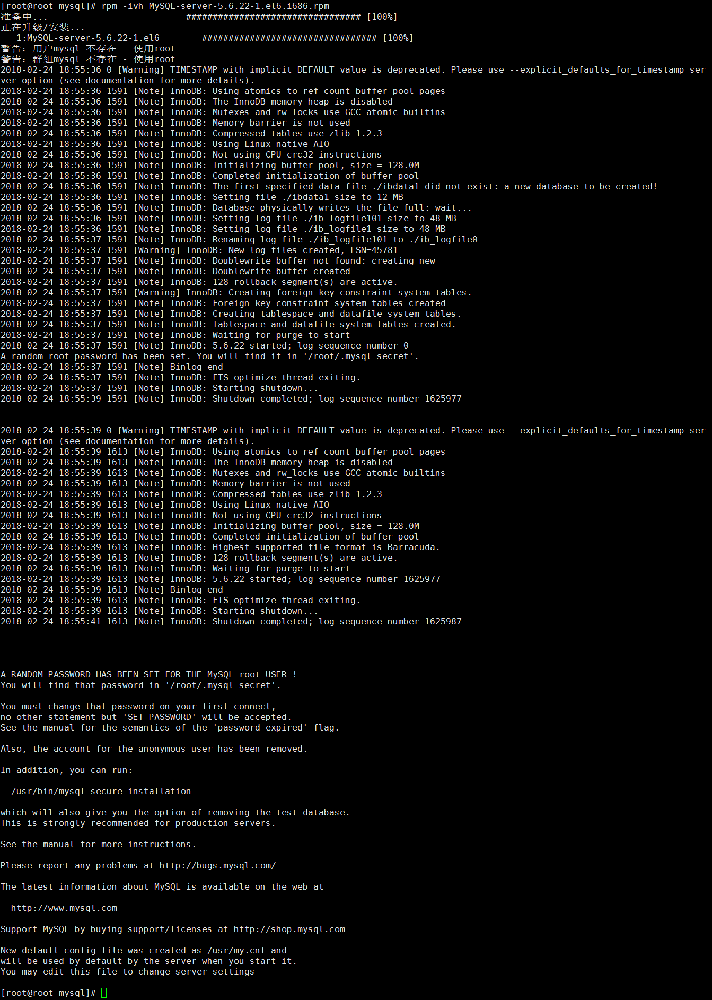

- 步骤4：安装客户端：rpm -ivh MySQL-client-5.6.22-1.el6.i686.rpm

  执行效果

  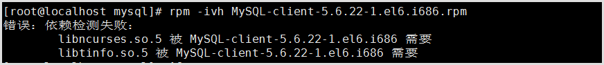

  从上图看出，需要安装如下软件

  ```
  libncurses.so.5
  ```

  执行安装软件

  ```
  yum install libncurses.so.5
  ```

  再次执行：rpm -ivh MySQL-client-5.6.22-1.el6.i686.rpm

  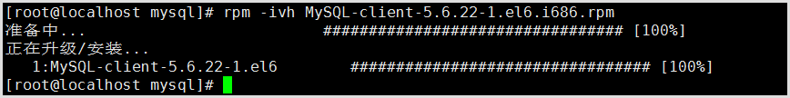

- 步骤5：启动mysql

  service mysql start

  

- 步骤6：将mysql加到系统服务中并设置开机启动

  加入到系统服务：chkconfig --add mysql
  自动启动：chkconfig mysql on

- 步骤7：登录mysql

  输入：mysql -uroot -p，会发送错误如下

  

  mysql安装好后会生成一个临时随机密码，存储位置在/root/.mysql_secret，看看安装mysql服务器端时提示

  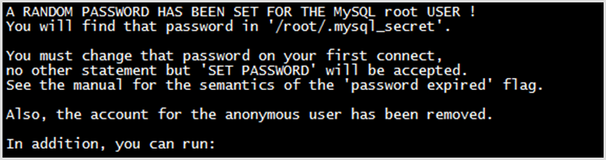

  进入用户目录输入如下命令

  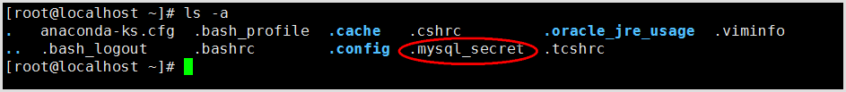

  cat .mysql_secret 查看随机生成密码

  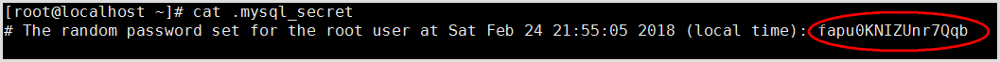

  使用该密码登录mysql

  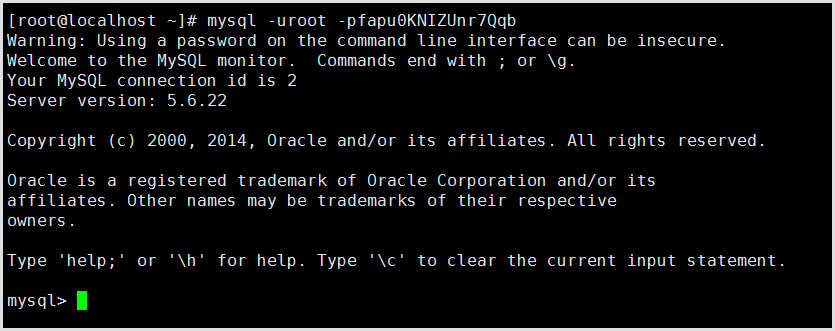

- 步骤8：修改mysql的密码

  set password = password('root'); //password函数的参数是密码

  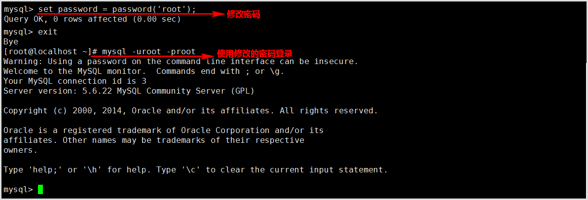

- 步骤9：开启mysql的远程登录权限

  默认情况下mysql为安全起见，不支持远程登录mysql，所以需要设置开启	远程登录mysql的权限
  登录mysql后输入如下命令：

  ```mysql
  grant all privileges on *.* to 'root'@'%' identified by 'root';
  flush privileges;
  ```

  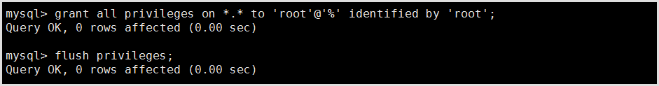

- 步骤10：开放Linux的对外访问的端口3306（重点）

  开启端口

  ```shell
  #开放3306端口
  /sbin/iptables -I INPUT -p tcp --dport 3306 -j ACCEPT
  #开放的端口永久保存到防火墙
  firewall-cmd --zone=public --add-port=3306/tcp --permanent

  #拓展资料
  #firewall-cmd --reload  //重启防火墙(这里不需要执行)
  ```


- 步骤11：在本地windows系统使用SQLyogEnt.exe软件连接虚拟机中的linux系统安装的mysql

  

  登录后的效果

  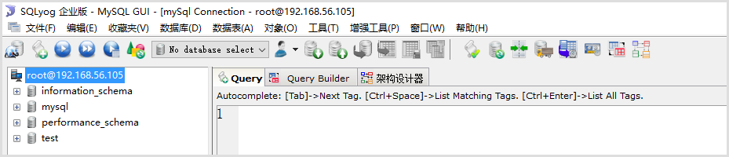


- 步骤12：执行如下命令

  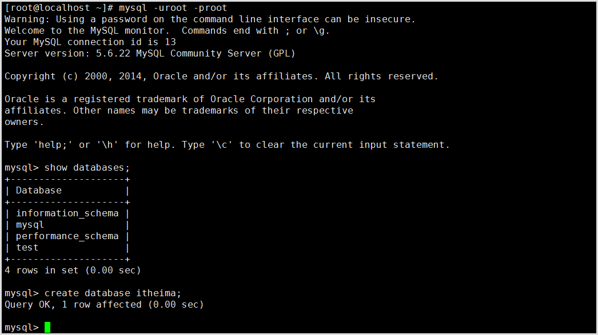

  使用本地客户端连接工具查看

  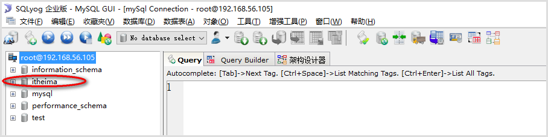

  到此说明mysql已经安装好了

### 2.2.4 tomcat安装

- 步骤1：解压Tomcat到/usr/local下

  ```
  tar -zxvf apache-tomcat-8.5.27.tar.gz  -C /usr/local/
  ```

- 步骤2：开放Linux的对外访问的端口8080

  ```
  /sbin/iptables -I INPUT -p tcp --dport 8080 -j ACCEPT
  firewall-cmd --zone=public --add-port=8080/tcp --permanent
  ```

- 步骤3：启动关闭Tomcat

  ```
  进入tomcat的bin下启动：./startup.sh
  进入tomcat的bin下关闭：./shutdown.sh
  ```

- 步骤4：打开浏览器浏览

  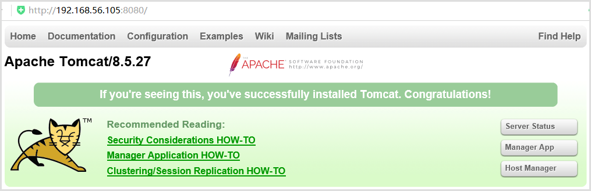

## 2.2 项目发布

2.2.1 linux系统myql导入数据库

- 步骤1：本地数据库导出

  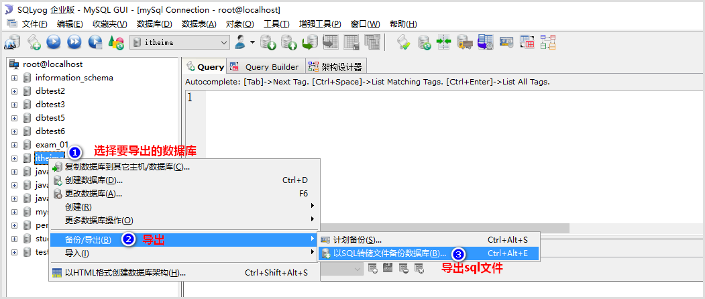

  导出sql文件位置

  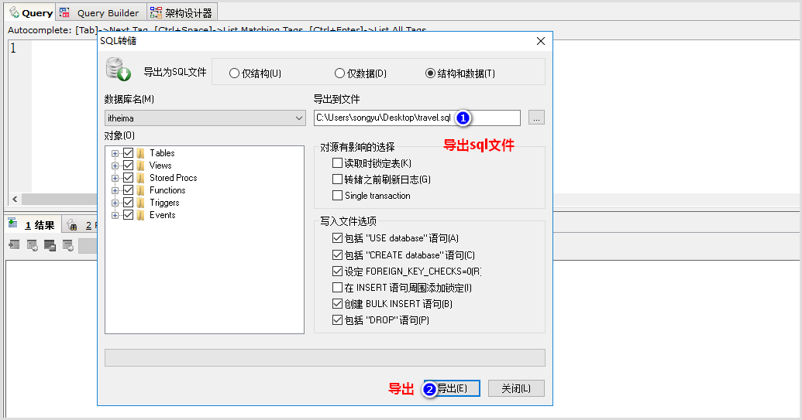

- 步骤2：linux系统mysql导入数据库文件

  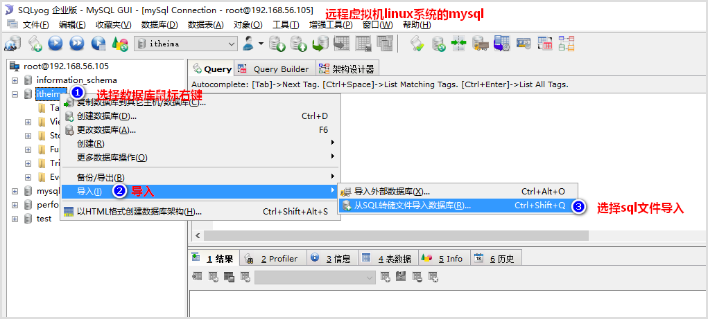

  选择sql文件导入

  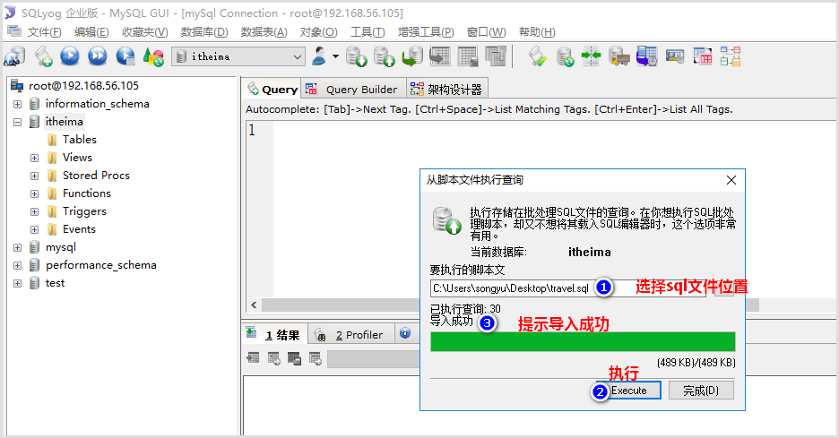

  查看导入的表与数据

  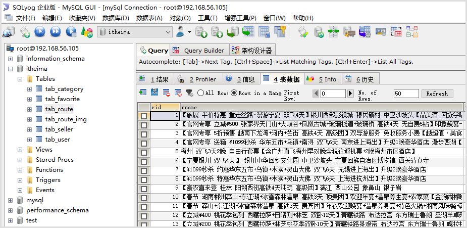

2.2.2 导出war包部署到tomcat上

步骤1：上传war文件

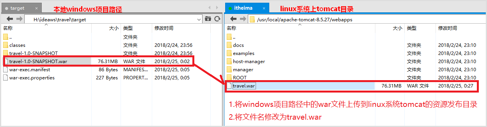

步骤2：修改配置文件

步骤3：打开浏览器浏览网站


## 2.3 nginx反向代理

### 2.3.1 正向代理

正向代理类似一个跳板机，代理访问外部资源。


举个例子：

　　我是一个用户，我访问不了某网站，但是我能访问一个代理服务器，这个代理服务器呢,它能访问那个我不能访问的网站，于是我先连上代理服务器,告诉他我需要那个无法访问网站的内容，代理服务器去取回来,然后返回给我。从那个网站的角度来看，只在代理服务器来取内容的时候有一次记录，有时候并不知道是用户的请求，也隐藏了用户的资料，这取决于代理告不告诉网站。

**注意：客户端必须设置正向代理服务器，当然前提是要知道正向代理服务器的IP地址，还有代理程序的端口。**

本地客户端设置代理服务器操作如下：

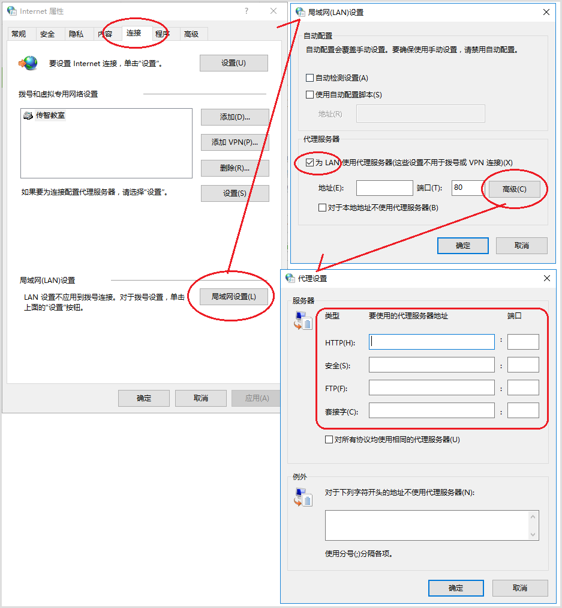

正向代理原理

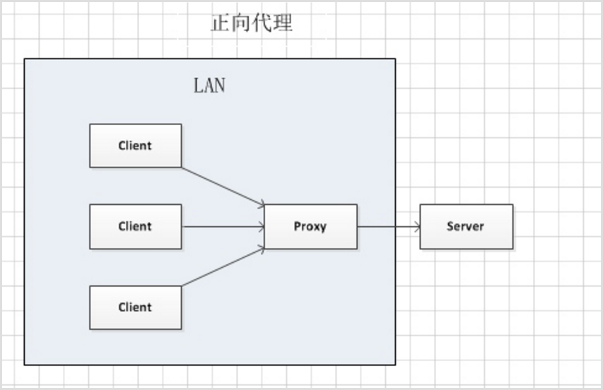

总结来说：正向代理 是一个位于客户端和原始服务器(origin server)之间的服务器，为了从原始服务器取得内容，客户端向代理发送一个请求并指定目标(原始服务器)，然后代理向原始服务器转交请求并将获得的内容返回给客户端。客户端必须要进行一些特别的设置才能使用正向代理。

**正向代理的用途：**

　　（1）访问原来无法访问的资源，如google

 	（2） 可以做缓存，加速访问资源


　　（3）对客户端访问授权，上网进行认证

　　（4）代理可以记录用户访问记录（上网行为管理），对外隐藏用户信息

### 2.3.2 反向代理介绍

反向代理（Reverse Proxy）方式是指以代理服务器来接受internet上的连接请求，然后将请求转发给内部网络上的服务器，并将从服务器上得到的结果返回给internet上请求连接的客户端，此时代理服务器对外就表现为一个服务器。

### 2.3.3 反向代理的作用

（1） 保证内网的安全，可以使用反向代理提供防火墙（WAF）功能，阻止web攻击。大型网站，通常将反向代理作为公网访问地址，Web服务器是内网。

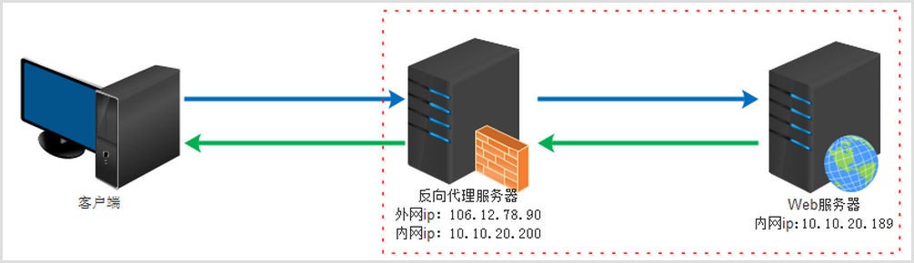

（2）负载均衡，通过反向代理服务器来优化网站的负载。当大量客户端请求代理服务器时，反向代理可以集中分发不同用户请求给不同的web服务器进行处理请求。（本阶段不实现，负载均衡技术项目阶段讲解）

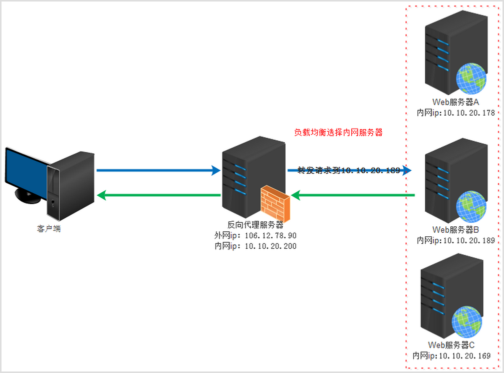

### 2.3.4 反向代理实现原理与正向代理区别

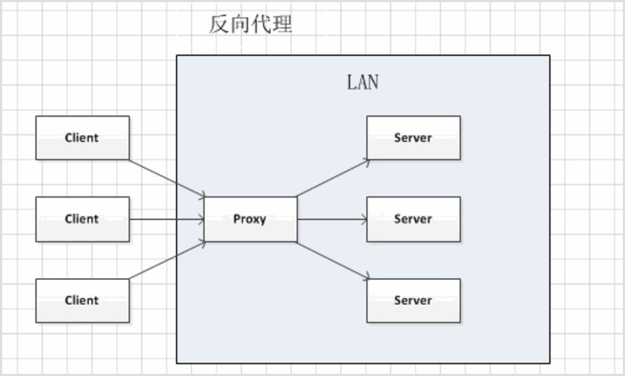

正向代理中，proxy和client同属一个局域网（Local Area Network，LAN），对server透明；

反向代理中，proxy和server同属一个局域网（Local Area Network，LAN），对client透明；

实际上proxy在两种代理中做的事都是代为收发请求和响应，不过从结构上来看正好左右互换了下，所以把后出现的那种代理方式叫反向代理。

### 2.3.5 nginx安装

**说明**：nginx的windows版是直接可以使用的软件，而linux版是c语言源代码。

- 步骤1：安装依赖软件

  执行如下命令，第一个命令下载38M

  ```shell
  yum -y install gcc gcc-c++ autoconf automake make
  yum -y install zlib zlib-devel openssl openssl-devel pcre pcre-devel
  ```


- 步骤2：解压“nginx-1.13.8.tar.gz”到"/usr/local"

  ```shell
  tar -zxvf nginx-1.13.8.tar.gz -C /usr/local/
  ```


- 步骤3：创建安装目录

  ```
  mkdir /usr/local/nginx
  ```

- 步骤4：修改配置

  ```shell
  cd  /usr/local/nginx-1.13.8/
  ./configure --prefix=/usr/local/nginx  
  ```

  执行命令的过程信息如下：

  ```
  [root@localhost soft]# cd  /usr/local/nginx-1.13.8/
  [root@localhost nginx-1.13.8]# ./configure --prefix=/usr/local/nginx
  checking for OS
   + Linux 3.10.0-693.el7.x86_64 x86_64
  checking for C compiler ... found
   + using GNU C compiler
   + gcc version: 4.8.5 20150623 (Red Hat 4.8.5-16) (GCC) 
  checking for gcc -pipe switch ... found
  checking for -Wl,-E switch ... found
  checking for gcc builtin atomic operations ... found
  checking for C99 variadic macros ... found
  checking for gcc variadic macros ... found
  checking for gcc builtin 64 bit byteswap ... found
  checking for unistd.h ... found
  checking for inttypes.h ... found
  checking for limits.h ... found
  checking for sys/filio.h ... not found
  checking for sys/param.h ... found
  checking for sys/mount.h ... found
  checking for sys/statvfs.h ... found
  checking for crypt.h ... found
  checking for Linux specific features
  checking for epoll ... found
  checking for EPOLLRDHUP ... found
  checking for EPOLLEXCLUSIVE ... not found
  checking for O_PATH ... found
  checking for sendfile() ... found
  checking for sendfile64() ... found
  checking for sys/prctl.h ... found
  checking for prctl(PR_SET_DUMPABLE) ... found
  checking for prctl(PR_SET_KEEPCAPS) ... found
  checking for capabilities ... found
  checking for crypt_r() ... found
  checking for sys/vfs.h ... found
  checking for nobody group ... found
  checking for poll() ... found
  checking for /dev/poll ... not found
  checking for kqueue ... not found
  checking for crypt() ... not found
  checking for crypt() in libcrypt ... found
  checking for F_READAHEAD ... not found
  checking for posix_fadvise() ... found
  checking for O_DIRECT ... found
  checking for F_NOCACHE ... not found
  checking for directio() ... not found
  checking for statfs() ... found
  checking for statvfs() ... found
  checking for dlopen() ... not found
  checking for dlopen() in libdl ... found
  checking for sched_yield() ... found
  checking for sched_setaffinity() ... found
  checking for SO_SETFIB ... not found
  checking for SO_REUSEPORT ... found
  checking for SO_ACCEPTFILTER ... not found
  checking for SO_BINDANY ... not found
  checking for IP_TRANSPARENT ... found
  checking for IP_BINDANY ... not found
  checking for IP_BIND_ADDRESS_NO_PORT ... not found
  checking for IP_RECVDSTADDR ... not found
  checking for IP_SENDSRCADDR ... not found
  checking for IP_PKTINFO ... found
  checking for IPV6_RECVPKTINFO ... found
  checking for TCP_DEFER_ACCEPT ... found
  checking for TCP_KEEPIDLE ... found
  checking for TCP_FASTOPEN ... found
  checking for TCP_INFO ... found
  checking for accept4() ... found
  checking for eventfd() ... found
  checking for int size ... 4 bytes
  checking for long size ... 8 bytes
  checking for long long size ... 8 bytes
  checking for void * size ... 8 bytes
  checking for uint32_t ... found
  checking for uint64_t ... found
  checking for sig_atomic_t ... found
  checking for sig_atomic_t size ... 4 bytes
  checking for socklen_t ... found
  checking for in_addr_t ... found
  checking for in_port_t ... found
  checking for rlim_t ... found
  checking for uintptr_t ... uintptr_t found
  checking for system byte ordering ... little endian
  checking for size_t size ... 8 bytes
  checking for off_t size ... 8 bytes
  checking for time_t size ... 8 bytes
  checking for AF_INET6 ... found
  checking for setproctitle() ... not found
  checking for pread() ... found
  checking for pwrite() ... found
  checking for pwritev() ... found
  checking for sys_nerr ... found
  checking for localtime_r() ... found
  checking for posix_memalign() ... found
  checking for memalign() ... found
  checking for mmap(MAP_ANON|MAP_SHARED) ... found
  checking for mmap("/dev/zero", MAP_SHARED) ... found
  checking for System V shared memory ... found
  checking for POSIX semaphores ... not found
  checking for POSIX semaphores in libpthread ... found
  checking for struct msghdr.msg_control ... found
  checking for ioctl(FIONBIO) ... found
  checking for struct tm.tm_gmtoff ... found
  checking for struct dirent.d_namlen ... not found
  checking for struct dirent.d_type ... found
  checking for sysconf(_SC_NPROCESSORS_ONLN) ... found
  checking for sysconf(_SC_LEVEL1_DCACHE_LINESIZE) ... found
  checking for openat(), fstatat() ... found
  checking for getaddrinfo() ... found
  checking for PCRE library ... found
  checking for PCRE JIT support ... found
  checking for zlib library ... found
  creating objs/Makefile

  Configuration summary
    + using system PCRE library
    + OpenSSL library is not used
    + using system zlib library

    nginx path prefix: "/usr/local/nginx"
    nginx binary file: "/usr/local/nginx/sbin/nginx"
    nginx modules path: "/usr/local/nginx/modules"
    nginx configuration prefix: "/usr/local/nginx/conf"
    nginx configuration file: "/usr/local/nginx/conf/nginx.conf"
    nginx pid file: "/usr/local/nginx/logs/nginx.pid"
    nginx error log file: "/usr/local/nginx/logs/error.log"
    nginx http access log file: "/usr/local/nginx/logs/access.log"
    nginx http client request body temporary files: "client_body_temp"
    nginx http proxy temporary files: "proxy_temp"
    nginx http fastcgi temporary files: "fastcgi_temp"
    nginx http uwsgi temporary files: "uwsgi_temp"
    nginx http scgi temporary files: "scgi_temp"

  [root@localhost nginx-1.13.8]#  
  ```

- 步骤5：安装

  ```shell
  make && make install
  ```

  执行命令信息：

  ```
  [root@localhost nginx-1.13.8]# make && make install
  make -f objs/Makefile
  make[1]: 进入目录“/usr/local/nginx-1.13.8”
  cc -c -pipe  -O -W -Wall -Wpointer-arith -Wno-unused-parameter -Werror -g  -I src/core -I src/event -I src/event/modules -I src/os/unix -I objs \
  	-o objs/src/core/nginx.o \
  	src/core/nginx.c
  cc -c -pipe  -O -W -Wall -Wpointer-arith -Wno-unused-parameter -Werror -g  -I src/core -I src/event -I src/event/modules -I src/os/unix -I objs \
  	-o objs/src/core/ngx_log.o \
  	src/core/ngx_log.c
  cc -c -pipe  -O -W -Wall -Wpointer-arith -Wno-unused-parameter -Werror -g  -I src/core -I src/event -I src/event/modules -I src/os/unix -I objs \
  	-o objs/src/core/ngx_palloc.o \
  	src/core/ngx_palloc.c
  cc -c -pipe  -O -W -Wall -Wpointer-arith -Wno-unused-parameter -Werror -g  -I src/core -I src/event -I src/event/modules -I src/os/unix -I objs \
  	-o objs/src/core/ngx_array.o \
  	src/core/ngx_array.c
  cc -c -pipe  -O -W -Wall -Wpointer-arith -Wno-unused-parameter -Werror -g  -I src/core -I src/event -I src/event/modules -I src/os/unix -I objs \
  	-o objs/src/core/ngx_list.o \
  	src/core/ngx_list.c
  cc -c -pipe  -O -W -Wall -Wpointer-arith -Wno-unused-parameter -Werror -g  -I src/core -I src/event -I src/event/modules -I src/os/unix -I objs \
  	-o objs/src/core/ngx_hash.o \
  	src/core/ngx_hash.c
  cc -c -pipe  -O -W -Wall -Wpointer-arith -Wno-unused-parameter -Werror -g  -I src/core -I src/event -I src/event/modules -I src/os/unix -I objs \
  	-o objs/src/core/ngx_buf.o \
  	src/core/ngx_buf.c
  cc -c -pipe  -O -W -Wall -Wpointer-arith -Wno-unused-parameter -Werror -g  -I src/core -I src/event -I src/event/modules -I src/os/unix -I objs \
  	-o objs/src/core/ngx_queue.o \
  	src/core/ngx_queue.c
  cc -c -pipe  -O -W -Wall -Wpointer-arith -Wno-unused-parameter -Werror -g  -I src/core -I src/event -I src/event/modules -I src/os/unix -I objs \
  	-o objs/src/core/ngx_output_chain.o \
  	src/core/ngx_output_chain.c
  cc -c -pipe  -O -W -Wall -Wpointer-arith -Wno-unused-parameter -Werror -g  -I src/core -I src/event -I src/event/modules -I src/os/unix -I objs \
  	-o objs/src/core/ngx_string.o \
  	src/core/ngx_string.c
  cc -c -pipe  -O -W -Wall -Wpointer-arith -Wno-unused-parameter -Werror -g  -I src/core -I src/event -I src/event/modules -I src/os/unix -I objs \
  	-o objs/src/core/ngx_parse.o \
  	src/core/ngx_parse.c
  cc -c -pipe  -O -W -Wall -Wpointer-arith -Wno-unused-parameter -Werror -g  -I src/core -I src/event -I src/event/modules -I src/os/unix -I objs \
  	-o objs/src/core/ngx_parse_time.o \
  	src/core/ngx_parse_time.c
  cc -c -pipe  -O -W -Wall -Wpointer-arith -Wno-unused-parameter -Werror -g  -I src/core -I src/event -I src/event/modules -I src/os/unix -I objs \
  	-o objs/src/core/ngx_inet.o \
  	src/core/ngx_inet.c
  cc -c -pipe  -O -W -Wall -Wpointer-arith -Wno-unused-parameter -Werror -g  -I src/core -I src/event -I src/event/modules -I src/os/unix -I objs \
  	-o objs/src/core/ngx_file.o \
  	src/core/ngx_file.c
  cc -c -pipe  -O -W -Wall -Wpointer-arith -Wno-unused-parameter -Werror -g  -I src/core -I src/event -I src/event/modules -I src/os/unix -I objs \
  	-o objs/src/core/ngx_crc32.o \
  	src/core/ngx_crc32.c
  cc -c -pipe  -O -W -Wall -Wpointer-arith -Wno-unused-parameter -Werror -g  -I src/core -I src/event -I src/event/modules -I src/os/unix -I objs \
  	-o objs/src/core/ngx_murmurhash.o \
  	src/core/ngx_murmurhash.c
  cc -c -pipe  -O -W -Wall -Wpointer-arith -Wno-unused-parameter -Werror -g  -I src/core -I src/event -I src/event/modules -I src/os/unix -I objs \
  	-o objs/src/core/ngx_md5.o \
  	src/core/ngx_md5.c
  cc -c -pipe  -O -W -Wall -Wpointer-arith -Wno-unused-parameter -Werror -g  -I src/core -I src/event -I src/event/modules -I src/os/unix -I objs \
  	-o objs/src/core/ngx_sha1.o \
  	src/core/ngx_sha1.c
  cc -c -pipe  -O -W -Wall -Wpointer-arith -Wno-unused-parameter -Werror -g  -I src/core -I src/event -I src/event/modules -I src/os/unix -I objs \
  	-o objs/src/core/ngx_rbtree.o \
  	src/core/ngx_rbtree.c
  cc -c -pipe  -O -W -Wall -Wpointer-arith -Wno-unused-parameter -Werror -g  -I src/core -I src/event -I src/event/modules -I src/os/unix -I objs \
  	-o objs/src/core/ngx_radix_tree.o \
  	src/core/ngx_radix_tree.c
  cc -c -pipe  -O -W -Wall -Wpointer-arith -Wno-unused-parameter -Werror -g  -I src/core -I src/event -I src/event/modules -I src/os/unix -I objs \
  	-o objs/src/core/ngx_slab.o \
  	src/core/ngx_slab.c
  cc -c -pipe  -O -W -Wall -Wpointer-arith -Wno-unused-parameter -Werror -g  -I src/core -I src/event -I src/event/modules -I src/os/unix -I objs \
  	-o objs/src/core/ngx_times.o \
  	src/core/ngx_times.c
  cc -c -pipe  -O -W -Wall -Wpointer-arith -Wno-unused-parameter -Werror -g  -I src/core -I src/event -I src/event/modules -I src/os/unix -I objs \
  	-o objs/src/core/ngx_shmtx.o \
  	src/core/ngx_shmtx.c
  cc -c -pipe  -O -W -Wall -Wpointer-arith -Wno-unused-parameter -Werror -g  -I src/core -I src/event -I src/event/modules -I src/os/unix -I objs \
  	-o objs/src/core/ngx_connection.o \
  	src/core/ngx_connection.c
  cc -c -pipe  -O -W -Wall -Wpointer-arith -Wno-unused-parameter -Werror -g  -I src/core -I src/event -I src/event/modules -I src/os/unix -I objs \
  	-o objs/src/core/ngx_cycle.o \
  	src/core/ngx_cycle.c
  cc -c -pipe  -O -W -Wall -Wpointer-arith -Wno-unused-parameter -Werror -g  -I src/core -I src/event -I src/event/modules -I src/os/unix -I objs \
  	-o objs/src/core/ngx_spinlock.o \
  	src/core/ngx_spinlock.c
  cc -c -pipe  -O -W -Wall -Wpointer-arith -Wno-unused-parameter -Werror -g  -I src/core -I src/event -I src/event/modules -I src/os/unix -I objs \
  	-o objs/src/core/ngx_rwlock.o \
  	src/core/ngx_rwlock.c
  cc -c -pipe  -O -W -Wall -Wpointer-arith -Wno-unused-parameter -Werror -g  -I src/core -I src/event -I src/event/modules -I src/os/unix -I objs \
  	-o objs/src/core/ngx_cpuinfo.o \
  	src/core/ngx_cpuinfo.c
  cc -c -pipe  -O -W -Wall -Wpointer-arith -Wno-unused-parameter -Werror -g  -I src/core -I src/event -I src/event/modules -I src/os/unix -I objs \
  	-o objs/src/core/ngx_conf_file.o \
  	src/core/ngx_conf_file.c
  cc -c -pipe  -O -W -Wall -Wpointer-arith -Wno-unused-parameter -Werror -g  -I src/core -I src/event -I src/event/modules -I src/os/unix -I objs \
  	-o objs/src/core/ngx_module.o \
  	src/core/ngx_module.c
  cc -c -pipe  -O -W -Wall -Wpointer-arith -Wno-unused-parameter -Werror -g  -I src/core -I src/event -I src/event/modules -I src/os/unix -I objs \
  	-o objs/src/core/ngx_resolver.o \
  	src/core/ngx_resolver.c
  cc -c -pipe  -O -W -Wall -Wpointer-arith -Wno-unused-parameter -Werror -g  -I src/core -I src/event -I src/event/modules -I src/os/unix -I objs \
  	-o objs/src/core/ngx_open_file_cache.o \
  	src/core/ngx_open_file_cache.c
  cc -c -pipe  -O -W -Wall -Wpointer-arith -Wno-unused-parameter -Werror -g  -I src/core -I src/event -I src/event/modules -I src/os/unix -I objs \
  	-o objs/src/core/ngx_crypt.o \
  	src/core/ngx_crypt.c
  cc -c -pipe  -O -W -Wall -Wpointer-arith -Wno-unused-parameter -Werror -g  -I src/core -I src/event -I src/event/modules -I src/os/unix -I objs \
  	-o objs/src/core/ngx_proxy_protocol.o \
  	src/core/ngx_proxy_protocol.c
  cc -c -pipe  -O -W -Wall -Wpointer-arith -Wno-unused-parameter -Werror -g  -I src/core -I src/event -I src/event/modules -I src/os/unix -I objs \
  	-o objs/src/core/ngx_syslog.o \
  	src/core/ngx_syslog.c
  cc -c -pipe  -O -W -Wall -Wpointer-arith -Wno-unused-parameter -Werror -g  -I src/core -I src/event -I src/event/modules -I src/os/unix -I objs \
  	-o objs/src/event/ngx_event.o \
  	src/event/ngx_event.c
  cc -c -pipe  -O -W -Wall -Wpointer-arith -Wno-unused-parameter -Werror -g  -I src/core -I src/event -I src/event/modules -I src/os/unix -I objs \
  	-o objs/src/event/ngx_event_timer.o \
  	src/event/ngx_event_timer.c
  cc -c -pipe  -O -W -Wall -Wpointer-arith -Wno-unused-parameter -Werror -g  -I src/core -I src/event -I src/event/modules -I src/os/unix -I objs \
  	-o objs/src/event/ngx_event_posted.o \
  	src/event/ngx_event_posted.c
  cc -c -pipe  -O -W -Wall -Wpointer-arith -Wno-unused-parameter -Werror -g  -I src/core -I src/event -I src/event/modules -I src/os/unix -I objs \
  	-o objs/src/event/ngx_event_accept.o \
  	src/event/ngx_event_accept.c
  cc -c -pipe  -O -W -Wall -Wpointer-arith -Wno-unused-parameter -Werror -g  -I src/core -I src/event -I src/event/modules -I src/os/unix -I objs \
  	-o objs/src/event/ngx_event_connect.o \
  	src/event/ngx_event_connect.c
  cc -c -pipe  -O -W -Wall -Wpointer-arith -Wno-unused-parameter -Werror -g  -I src/core -I src/event -I src/event/modules -I src/os/unix -I objs \
  	-o objs/src/event/ngx_event_pipe.o \
  	src/event/ngx_event_pipe.c
  cc -c -pipe  -O -W -Wall -Wpointer-arith -Wno-unused-parameter -Werror -g  -I src/core -I src/event -I src/event/modules -I src/os/unix -I objs \
  	-o objs/src/os/unix/ngx_time.o \
  	src/os/unix/ngx_time.c
  cc -c -pipe  -O -W -Wall -Wpointer-arith -Wno-unused-parameter -Werror -g  -I src/core -I src/event -I src/event/modules -I src/os/unix -I objs \
  	-o objs/src/os/unix/ngx_errno.o \
  	src/os/unix/ngx_errno.c
  cc -c -pipe  -O -W -Wall -Wpointer-arith -Wno-unused-parameter -Werror -g  -I src/core -I src/event -I src/event/modules -I src/os/unix -I objs \
  	-o objs/src/os/unix/ngx_alloc.o \
  	src/os/unix/ngx_alloc.c
  cc -c -pipe  -O -W -Wall -Wpointer-arith -Wno-unused-parameter -Werror -g  -I src/core -I src/event -I src/event/modules -I src/os/unix -I objs \
  	-o objs/src/os/unix/ngx_files.o \
  	src/os/unix/ngx_files.c
  cc -c -pipe  -O -W -Wall -Wpointer-arith -Wno-unused-parameter -Werror -g  -I src/core -I src/event -I src/event/modules -I src/os/unix -I objs \
  	-o objs/src/os/unix/ngx_socket.o \
  	src/os/unix/ngx_socket.c
  cc -c -pipe  -O -W -Wall -Wpointer-arith -Wno-unused-parameter -Werror -g  -I src/core -I src/event -I src/event/modules -I src/os/unix -I objs \
  	-o objs/src/os/unix/ngx_recv.o \
  	src/os/unix/ngx_recv.c
  cc -c -pipe  -O -W -Wall -Wpointer-arith -Wno-unused-parameter -Werror -g  -I src/core -I src/event -I src/event/modules -I src/os/unix -I objs \
  	-o objs/src/os/unix/ngx_readv_chain.o \
  	src/os/unix/ngx_readv_chain.c
  cc -c -pipe  -O -W -Wall -Wpointer-arith -Wno-unused-parameter -Werror -g  -I src/core -I src/event -I src/event/modules -I src/os/unix -I objs \
  	-o objs/src/os/unix/ngx_udp_recv.o \
  	src/os/unix/ngx_udp_recv.c
  cc -c -pipe  -O -W -Wall -Wpointer-arith -Wno-unused-parameter -Werror -g  -I src/core -I src/event -I src/event/modules -I src/os/unix -I objs \
  	-o objs/src/os/unix/ngx_send.o \
  	src/os/unix/ngx_send.c
  cc -c -pipe  -O -W -Wall -Wpointer-arith -Wno-unused-parameter -Werror -g  -I src/core -I src/event -I src/event/modules -I src/os/unix -I objs \
  	-o objs/src/os/unix/ngx_writev_chain.o \
  	src/os/unix/ngx_writev_chain.c
  cc -c -pipe  -O -W -Wall -Wpointer-arith -Wno-unused-parameter -Werror -g  -I src/core -I src/event -I src/event/modules -I src/os/unix -I objs \
  	-o objs/src/os/unix/ngx_udp_send.o \
  	src/os/unix/ngx_udp_send.c
  cc -c -pipe  -O -W -Wall -Wpointer-arith -Wno-unused-parameter -Werror -g  -I src/core -I src/event -I src/event/modules -I src/os/unix -I objs \
  	-o objs/src/os/unix/ngx_udp_sendmsg_chain.o \
  	src/os/unix/ngx_udp_sendmsg_chain.c
  cc -c -pipe  -O -W -Wall -Wpointer-arith -Wno-unused-parameter -Werror -g  -I src/core -I src/event -I src/event/modules -I src/os/unix -I objs \
  	-o objs/src/os/unix/ngx_channel.o \
  	src/os/unix/ngx_channel.c
  cc -c -pipe  -O -W -Wall -Wpointer-arith -Wno-unused-parameter -Werror -g  -I src/core -I src/event -I src/event/modules -I src/os/unix -I objs \
  	-o objs/src/os/unix/ngx_shmem.o \
  	src/os/unix/ngx_shmem.c
  cc -c -pipe  -O -W -Wall -Wpointer-arith -Wno-unused-parameter -Werror -g  -I src/core -I src/event -I src/event/modules -I src/os/unix -I objs \
  	-o objs/src/os/unix/ngx_process.o \
  	src/os/unix/ngx_process.c
  cc -c -pipe  -O -W -Wall -Wpointer-arith -Wno-unused-parameter -Werror -g  -I src/core -I src/event -I src/event/modules -I src/os/unix -I objs \
  	-o objs/src/os/unix/ngx_daemon.o \
  	src/os/unix/ngx_daemon.c
  cc -c -pipe  -O -W -Wall -Wpointer-arith -Wno-unused-parameter -Werror -g  -I src/core -I src/event -I src/event/modules -I src/os/unix -I objs \
  	-o objs/src/os/unix/ngx_setaffinity.o \
  	src/os/unix/ngx_setaffinity.c
  cc -c -pipe  -O -W -Wall -Wpointer-arith -Wno-unused-parameter -Werror -g  -I src/core -I src/event -I src/event/modules -I src/os/unix -I objs \
  	-o objs/src/os/unix/ngx_setproctitle.o \
  	src/os/unix/ngx_setproctitle.c
  cc -c -pipe  -O -W -Wall -Wpointer-arith -Wno-unused-parameter -Werror -g  -I src/core -I src/event -I src/event/modules -I src/os/unix -I objs \
  	-o objs/src/os/unix/ngx_posix_init.o \
  	src/os/unix/ngx_posix_init.c
  cc -c -pipe  -O -W -Wall -Wpointer-arith -Wno-unused-parameter -Werror -g  -I src/core -I src/event -I src/event/modules -I src/os/unix -I objs \
  	-o objs/src/os/unix/ngx_user.o \
  	src/os/unix/ngx_user.c
  cc -c -pipe  -O -W -Wall -Wpointer-arith -Wno-unused-parameter -Werror -g  -I src/core -I src/event -I src/event/modules -I src/os/unix -I objs \
  	-o objs/src/os/unix/ngx_dlopen.o \
  	src/os/unix/ngx_dlopen.c
  cc -c -pipe  -O -W -Wall -Wpointer-arith -Wno-unused-parameter -Werror -g  -I src/core -I src/event -I src/event/modules -I src/os/unix -I objs \
  	-o objs/src/os/unix/ngx_process_cycle.o \
  	src/os/unix/ngx_process_cycle.c
  cc -c -pipe  -O -W -Wall -Wpointer-arith -Wno-unused-parameter -Werror -g  -I src/core -I src/event -I src/event/modules -I src/os/unix -I objs \
  	-o objs/src/os/unix/ngx_linux_init.o \
  	src/os/unix/ngx_linux_init.c
  cc -c -pipe  -O -W -Wall -Wpointer-arith -Wno-unused-parameter -Werror -g  -I src/core -I src/event -I src/event/modules -I src/os/unix -I objs \
  	-o objs/src/event/modules/ngx_epoll_module.o \
  	src/event/modules/ngx_epoll_module.c
  cc -c -pipe  -O -W -Wall -Wpointer-arith -Wno-unused-parameter -Werror -g  -I src/core -I src/event -I src/event/modules -I src/os/unix -I objs \
  	-o objs/src/os/unix/ngx_linux_sendfile_chain.o \
  	src/os/unix/ngx_linux_sendfile_chain.c
  cc -c -pipe  -O -W -Wall -Wpointer-arith -Wno-unused-parameter -Werror -g  -I src/core -I src/event -I src/event/modules -I src/os/unix -I objs \
  	-o objs/src/core/ngx_regex.o \
  	src/core/ngx_regex.c
  cc -c -pipe  -O -W -Wall -Wpointer-arith -Wno-unused-parameter -Werror -g  -I src/core -I src/event -I src/event/modules -I src/os/unix -I objs -I src/http -I src/http/modules \
  	-o objs/src/http/ngx_http.o \
  	src/http/ngx_http.c
  cc -c -pipe  -O -W -Wall -Wpointer-arith -Wno-unused-parameter -Werror -g  -I src/core -I src/event -I src/event/modules -I src/os/unix -I objs -I src/http -I src/http/modules \
  	-o objs/src/http/ngx_http_core_module.o \
  	src/http/ngx_http_core_module.c
  cc -c -pipe  -O -W -Wall -Wpointer-arith -Wno-unused-parameter -Werror -g  -I src/core -I src/event -I src/event/modules -I src/os/unix -I objs -I src/http -I src/http/modules \
  	-o objs/src/http/ngx_http_special_response.o \
  	src/http/ngx_http_special_response.c
  cc -c -pipe  -O -W -Wall -Wpointer-arith -Wno-unused-parameter -Werror -g  -I src/core -I src/event -I src/event/modules -I src/os/unix -I objs -I src/http -I src/http/modules \
  	-o objs/src/http/ngx_http_request.o \
  	src/http/ngx_http_request.c
  cc -c -pipe  -O -W -Wall -Wpointer-arith -Wno-unused-parameter -Werror -g  -I src/core -I src/event -I src/event/modules -I src/os/unix -I objs -I src/http -I src/http/modules \
  	-o objs/src/http/ngx_http_parse.o \
  	src/http/ngx_http_parse.c
  cc -c -pipe  -O -W -Wall -Wpointer-arith -Wno-unused-parameter -Werror -g  -I src/core -I src/event -I src/event/modules -I src/os/unix -I objs -I src/http -I src/http/modules \
  	-o objs/src/http/modules/ngx_http_log_module.o \
  	src/http/modules/ngx_http_log_module.c
  cc -c -pipe  -O -W -Wall -Wpointer-arith -Wno-unused-parameter -Werror -g  -I src/core -I src/event -I src/event/modules -I src/os/unix -I objs -I src/http -I src/http/modules \
  	-o objs/src/http/ngx_http_request_body.o \
  	src/http/ngx_http_request_body.c
  cc -c -pipe  -O -W -Wall -Wpointer-arith -Wno-unused-parameter -Werror -g  -I src/core -I src/event -I src/event/modules -I src/os/unix -I objs -I src/http -I src/http/modules \
  	-o objs/src/http/ngx_http_variables.o \
  	src/http/ngx_http_variables.c
  cc -c -pipe  -O -W -Wall -Wpointer-arith -Wno-unused-parameter -Werror -g  -I src/core -I src/event -I src/event/modules -I src/os/unix -I objs -I src/http -I src/http/modules \
  	-o objs/src/http/ngx_http_script.o \
  	src/http/ngx_http_script.c
  cc -c -pipe  -O -W -Wall -Wpointer-arith -Wno-unused-parameter -Werror -g  -I src/core -I src/event -I src/event/modules -I src/os/unix -I objs -I src/http -I src/http/modules \
  	-o objs/src/http/ngx_http_upstream.o \
  	src/http/ngx_http_upstream.c
  cc -c -pipe  -O -W -Wall -Wpointer-arith -Wno-unused-parameter -Werror -g  -I src/core -I src/event -I src/event/modules -I src/os/unix -I objs -I src/http -I src/http/modules \
  	-o objs/src/http/ngx_http_upstream_round_robin.o \
  	src/http/ngx_http_upstream_round_robin.c
  cc -c -pipe  -O -W -Wall -Wpointer-arith -Wno-unused-parameter -Werror -g  -I src/core -I src/event -I src/event/modules -I src/os/unix -I objs -I src/http -I src/http/modules \
  	-o objs/src/http/ngx_http_file_cache.o \
  	src/http/ngx_http_file_cache.c
  cc -c -pipe  -O -W -Wall -Wpointer-arith -Wno-unused-parameter -Werror -g  -I src/core -I src/event -I src/event/modules -I src/os/unix -I objs -I src/http -I src/http/modules \
  	-o objs/src/http/ngx_http_write_filter_module.o \
  	src/http/ngx_http_write_filter_module.c
  cc -c -pipe  -O -W -Wall -Wpointer-arith -Wno-unused-parameter -Werror -g  -I src/core -I src/event -I src/event/modules -I src/os/unix -I objs -I src/http -I src/http/modules \
  	-o objs/src/http/ngx_http_header_filter_module.o \
  	src/http/ngx_http_header_filter_module.c
  cc -c -pipe  -O -W -Wall -Wpointer-arith -Wno-unused-parameter -Werror -g  -I src/core -I src/event -I src/event/modules -I src/os/unix -I objs -I src/http -I src/http/modules \
  	-o objs/src/http/modules/ngx_http_chunked_filter_module.o \
  	src/http/modules/ngx_http_chunked_filter_module.c
  cc -c -pipe  -O -W -Wall -Wpointer-arith -Wno-unused-parameter -Werror -g  -I src/core -I src/event -I src/event/modules -I src/os/unix -I objs -I src/http -I src/http/modules \
  	-o objs/src/http/modules/ngx_http_range_filter_module.o \
  	src/http/modules/ngx_http_range_filter_module.c
  cc -c -pipe  -O -W -Wall -Wpointer-arith -Wno-unused-parameter -Werror -g  -I src/core -I src/event -I src/event/modules -I src/os/unix -I objs -I src/http -I src/http/modules \
  	-o objs/src/http/modules/ngx_http_gzip_filter_module.o \
  	src/http/modules/ngx_http_gzip_filter_module.c
  cc -c -pipe  -O -W -Wall -Wpointer-arith -Wno-unused-parameter -Werror -g  -I src/core -I src/event -I src/event/modules -I src/os/unix -I objs -I src/http -I src/http/modules \
  	-o objs/src/http/ngx_http_postpone_filter_module.o \
  	src/http/ngx_http_postpone_filter_module.c
  cc -c -pipe  -O -W -Wall -Wpointer-arith -Wno-unused-parameter -Werror -g  -I src/core -I src/event -I src/event/modules -I src/os/unix -I objs -I src/http -I src/http/modules \
  	-o objs/src/http/modules/ngx_http_ssi_filter_module.o \
  	src/http/modules/ngx_http_ssi_filter_module.c
  cc -c -pipe  -O -W -Wall -Wpointer-arith -Wno-unused-parameter -Werror -g  -I src/core -I src/event -I src/event/modules -I src/os/unix -I objs -I src/http -I src/http/modules \
  	-o objs/src/http/modules/ngx_http_charset_filter_module.o \
  	src/http/modules/ngx_http_charset_filter_module.c
  cc -c -pipe  -O -W -Wall -Wpointer-arith -Wno-unused-parameter -Werror -g  -I src/core -I src/event -I src/event/modules -I src/os/unix -I objs -I src/http -I src/http/modules \
  	-o objs/src/http/modules/ngx_http_userid_filter_module.o \
  	src/http/modules/ngx_http_userid_filter_module.c
  cc -c -pipe  -O -W -Wall -Wpointer-arith -Wno-unused-parameter -Werror -g  -I src/core -I src/event -I src/event/modules -I src/os/unix -I objs -I src/http -I src/http/modules \
  	-o objs/src/http/modules/ngx_http_headers_filter_module.o \
  	src/http/modules/ngx_http_headers_filter_module.c
  cc -c -pipe  -O -W -Wall -Wpointer-arith -Wno-unused-parameter -Werror -g  -I src/core -I src/event -I src/event/modules -I src/os/unix -I objs -I src/http -I src/http/modules \
  	-o objs/src/http/ngx_http_copy_filter_module.o \
  	src/http/ngx_http_copy_filter_module.c
  cc -c -pipe  -O -W -Wall -Wpointer-arith -Wno-unused-parameter -Werror -g  -I src/core -I src/event -I src/event/modules -I src/os/unix -I objs -I src/http -I src/http/modules \
  	-o objs/src/http/modules/ngx_http_not_modified_filter_module.o \
  	src/http/modules/ngx_http_not_modified_filter_module.c
  cc -c -pipe  -O -W -Wall -Wpointer-arith -Wno-unused-parameter -Werror -g  -I src/core -I src/event -I src/event/modules -I src/os/unix -I objs -I src/http -I src/http/modules \
  	-o objs/src/http/modules/ngx_http_static_module.o \
  	src/http/modules/ngx_http_static_module.c
  cc -c -pipe  -O -W -Wall -Wpointer-arith -Wno-unused-parameter -Werror -g  -I src/core -I src/event -I src/event/modules -I src/os/unix -I objs -I src/http -I src/http/modules \
  	-o objs/src/http/modules/ngx_http_autoindex_module.o \
  	src/http/modules/ngx_http_autoindex_module.c
  cc -c -pipe  -O -W -Wall -Wpointer-arith -Wno-unused-parameter -Werror -g  -I src/core -I src/event -I src/event/modules -I src/os/unix -I objs -I src/http -I src/http/modules \
  	-o objs/src/http/modules/ngx_http_index_module.o \
  	src/http/modules/ngx_http_index_module.c
  cc -c -pipe  -O -W -Wall -Wpointer-arith -Wno-unused-parameter -Werror -g  -I src/core -I src/event -I src/event/modules -I src/os/unix -I objs -I src/http -I src/http/modules \
  	-o objs/src/http/modules/ngx_http_mirror_module.o \
  	src/http/modules/ngx_http_mirror_module.c
  cc -c -pipe  -O -W -Wall -Wpointer-arith -Wno-unused-parameter -Werror -g  -I src/core -I src/event -I src/event/modules -I src/os/unix -I objs -I src/http -I src/http/modules \
  	-o objs/src/http/modules/ngx_http_try_files_module.o \
  	src/http/modules/ngx_http_try_files_module.c
  cc -c -pipe  -O -W -Wall -Wpointer-arith -Wno-unused-parameter -Werror -g  -I src/core -I src/event -I src/event/modules -I src/os/unix -I objs -I src/http -I src/http/modules \
  	-o objs/src/http/modules/ngx_http_auth_basic_module.o \
  	src/http/modules/ngx_http_auth_basic_module.c
  cc -c -pipe  -O -W -Wall -Wpointer-arith -Wno-unused-parameter -Werror -g  -I src/core -I src/event -I src/event/modules -I src/os/unix -I objs -I src/http -I src/http/modules \
  	-o objs/src/http/modules/ngx_http_access_module.o \
  	src/http/modules/ngx_http_access_module.c
  cc -c -pipe  -O -W -Wall -Wpointer-arith -Wno-unused-parameter -Werror -g  -I src/core -I src/event -I src/event/modules -I src/os/unix -I objs -I src/http -I src/http/modules \
  	-o objs/src/http/modules/ngx_http_limit_conn_module.o \
  	src/http/modules/ngx_http_limit_conn_module.c
  cc -c -pipe  -O -W -Wall -Wpointer-arith -Wno-unused-parameter -Werror -g  -I src/core -I src/event -I src/event/modules -I src/os/unix -I objs -I src/http -I src/http/modules \
  	-o objs/src/http/modules/ngx_http_limit_req_module.o \
  	src/http/modules/ngx_http_limit_req_module.c
  cc -c -pipe  -O -W -Wall -Wpointer-arith -Wno-unused-parameter -Werror -g  -I src/core -I src/event -I src/event/modules -I src/os/unix -I objs -I src/http -I src/http/modules \
  	-o objs/src/http/modules/ngx_http_geo_module.o \
  	src/http/modules/ngx_http_geo_module.c
  cc -c -pipe  -O -W -Wall -Wpointer-arith -Wno-unused-parameter -Werror -g  -I src/core -I src/event -I src/event/modules -I src/os/unix -I objs -I src/http -I src/http/modules \
  	-o objs/src/http/modules/ngx_http_map_module.o \
  	src/http/modules/ngx_http_map_module.c
  cc -c -pipe  -O -W -Wall -Wpointer-arith -Wno-unused-parameter -Werror -g  -I src/core -I src/event -I src/event/modules -I src/os/unix -I objs -I src/http -I src/http/modules \
  	-o objs/src/http/modules/ngx_http_split_clients_module.o \
  	src/http/modules/ngx_http_split_clients_module.c
  cc -c -pipe  -O -W -Wall -Wpointer-arith -Wno-unused-parameter -Werror -g  -I src/core -I src/event -I src/event/modules -I src/os/unix -I objs -I src/http -I src/http/modules \
  	-o objs/src/http/modules/ngx_http_referer_module.o \
  	src/http/modules/ngx_http_referer_module.c
  cc -c -pipe  -O -W -Wall -Wpointer-arith -Wno-unused-parameter -Werror -g  -I src/core -I src/event -I src/event/modules -I src/os/unix -I objs -I src/http -I src/http/modules \
  	-o objs/src/http/modules/ngx_http_rewrite_module.o \
  	src/http/modules/ngx_http_rewrite_module.c
  cc -c -pipe  -O -W -Wall -Wpointer-arith -Wno-unused-parameter -Werror -g  -I src/core -I src/event -I src/event/modules -I src/os/unix -I objs -I src/http -I src/http/modules \
  	-o objs/src/http/modules/ngx_http_proxy_module.o \
  	src/http/modules/ngx_http_proxy_module.c
  cc -c -pipe  -O -W -Wall -Wpointer-arith -Wno-unused-parameter -Werror -g  -I src/core -I src/event -I src/event/modules -I src/os/unix -I objs -I src/http -I src/http/modules \
  	-o objs/src/http/modules/ngx_http_fastcgi_module.o \
  	src/http/modules/ngx_http_fastcgi_module.c
  cc -c -pipe  -O -W -Wall -Wpointer-arith -Wno-unused-parameter -Werror -g  -I src/core -I src/event -I src/event/modules -I src/os/unix -I objs -I src/http -I src/http/modules \
  	-o objs/src/http/modules/ngx_http_uwsgi_module.o \
  	src/http/modules/ngx_http_uwsgi_module.c
  cc -c -pipe  -O -W -Wall -Wpointer-arith -Wno-unused-parameter -Werror -g  -I src/core -I src/event -I src/event/modules -I src/os/unix -I objs -I src/http -I src/http/modules \
  	-o objs/src/http/modules/ngx_http_scgi_module.o \
  	src/http/modules/ngx_http_scgi_module.c
  cc -c -pipe  -O -W -Wall -Wpointer-arith -Wno-unused-parameter -Werror -g  -I src/core -I src/event -I src/event/modules -I src/os/unix -I objs -I src/http -I src/http/modules \
  	-o objs/src/http/modules/ngx_http_memcached_module.o \
  	src/http/modules/ngx_http_memcached_module.c
  cc -c -pipe  -O -W -Wall -Wpointer-arith -Wno-unused-parameter -Werror -g  -I src/core -I src/event -I src/event/modules -I src/os/unix -I objs -I src/http -I src/http/modules \
  	-o objs/src/http/modules/ngx_http_empty_gif_module.o \
  	src/http/modules/ngx_http_empty_gif_module.c
  cc -c -pipe  -O -W -Wall -Wpointer-arith -Wno-unused-parameter -Werror -g  -I src/core -I src/event -I src/event/modules -I src/os/unix -I objs -I src/http -I src/http/modules \
  	-o objs/src/http/modules/ngx_http_browser_module.o \
  	src/http/modules/ngx_http_browser_module.c
  cc -c -pipe  -O -W -Wall -Wpointer-arith -Wno-unused-parameter -Werror -g  -I src/core -I src/event -I src/event/modules -I src/os/unix -I objs -I src/http -I src/http/modules \
  	-o objs/src/http/modules/ngx_http_upstream_hash_module.o \
  	src/http/modules/ngx_http_upstream_hash_module.c
  cc -c -pipe  -O -W -Wall -Wpointer-arith -Wno-unused-parameter -Werror -g  -I src/core -I src/event -I src/event/modules -I src/os/unix -I objs -I src/http -I src/http/modules \
  	-o objs/src/http/modules/ngx_http_upstream_ip_hash_module.o \
  	src/http/modules/ngx_http_upstream_ip_hash_module.c
  cc -c -pipe  -O -W -Wall -Wpointer-arith -Wno-unused-parameter -Werror -g  -I src/core -I src/event -I src/event/modules -I src/os/unix -I objs -I src/http -I src/http/modules \
  	-o objs/src/http/modules/ngx_http_upstream_least_conn_module.o \
  	src/http/modules/ngx_http_upstream_least_conn_module.c
  cc -c -pipe  -O -W -Wall -Wpointer-arith -Wno-unused-parameter -Werror -g  -I src/core -I src/event -I src/event/modules -I src/os/unix -I objs -I src/http -I src/http/modules \
  	-o objs/src/http/modules/ngx_http_upstream_keepalive_module.o \
  	src/http/modules/ngx_http_upstream_keepalive_module.c
  cc -c -pipe  -O -W -Wall -Wpointer-arith -Wno-unused-parameter -Werror -g  -I src/core -I src/event -I src/event/modules -I src/os/unix -I objs -I src/http -I src/http/modules \
  	-o objs/src/http/modules/ngx_http_upstream_zone_module.o \
  	src/http/modules/ngx_http_upstream_zone_module.c
  cc -c -pipe  -O -W -Wall -Wpointer-arith -Wno-unused-parameter -Werror -g  -I src/core -I src/event -I src/event/modules -I src/os/unix -I objs \
  	-o objs/ngx_modules.o \
  	objs/ngx_modules.c
  cc -o objs/nginx \
  objs/src/core/nginx.o \
  objs/src/core/ngx_log.o \
  objs/src/core/ngx_palloc.o \
  objs/src/core/ngx_array.o \
  objs/src/core/ngx_list.o \
  objs/src/core/ngx_hash.o \
  objs/src/core/ngx_buf.o \
  objs/src/core/ngx_queue.o \
  objs/src/core/ngx_output_chain.o \
  objs/src/core/ngx_string.o \
  objs/src/core/ngx_parse.o \
  objs/src/core/ngx_parse_time.o \
  objs/src/core/ngx_inet.o \
  objs/src/core/ngx_file.o \
  objs/src/core/ngx_crc32.o \
  objs/src/core/ngx_murmurhash.o \
  objs/src/core/ngx_md5.o \
  objs/src/core/ngx_sha1.o \
  objs/src/core/ngx_rbtree.o \
  objs/src/core/ngx_radix_tree.o \
  objs/src/core/ngx_slab.o \
  objs/src/core/ngx_times.o \
  objs/src/core/ngx_shmtx.o \
  objs/src/core/ngx_connection.o \
  objs/src/core/ngx_cycle.o \
  objs/src/core/ngx_spinlock.o \
  objs/src/core/ngx_rwlock.o \
  objs/src/core/ngx_cpuinfo.o \
  objs/src/core/ngx_conf_file.o \
  objs/src/core/ngx_module.o \
  objs/src/core/ngx_resolver.o \
  objs/src/core/ngx_open_file_cache.o \
  objs/src/core/ngx_crypt.o \
  objs/src/core/ngx_proxy_protocol.o \
  objs/src/core/ngx_syslog.o \
  objs/src/event/ngx_event.o \
  objs/src/event/ngx_event_timer.o \
  objs/src/event/ngx_event_posted.o \
  objs/src/event/ngx_event_accept.o \
  objs/src/event/ngx_event_connect.o \
  objs/src/event/ngx_event_pipe.o \
  objs/src/os/unix/ngx_time.o \
  objs/src/os/unix/ngx_errno.o \
  objs/src/os/unix/ngx_alloc.o \
  objs/src/os/unix/ngx_files.o \
  objs/src/os/unix/ngx_socket.o \
  objs/src/os/unix/ngx_recv.o \
  objs/src/os/unix/ngx_readv_chain.o \
  objs/src/os/unix/ngx_udp_recv.o \
  objs/src/os/unix/ngx_send.o \
  objs/src/os/unix/ngx_writev_chain.o \
  objs/src/os/unix/ngx_udp_send.o \
  objs/src/os/unix/ngx_udp_sendmsg_chain.o \
  objs/src/os/unix/ngx_channel.o \
  objs/src/os/unix/ngx_shmem.o \
  objs/src/os/unix/ngx_process.o \
  objs/src/os/unix/ngx_daemon.o \
  objs/src/os/unix/ngx_setaffinity.o \
  objs/src/os/unix/ngx_setproctitle.o \
  objs/src/os/unix/ngx_posix_init.o \
  objs/src/os/unix/ngx_user.o \
  objs/src/os/unix/ngx_dlopen.o \
  objs/src/os/unix/ngx_process_cycle.o \
  objs/src/os/unix/ngx_linux_init.o \
  objs/src/event/modules/ngx_epoll_module.o \
  objs/src/os/unix/ngx_linux_sendfile_chain.o \
  objs/src/core/ngx_regex.o \
  objs/src/http/ngx_http.o \
  objs/src/http/ngx_http_core_module.o \
  objs/src/http/ngx_http_special_response.o \
  objs/src/http/ngx_http_request.o \
  objs/src/http/ngx_http_parse.o \
  objs/src/http/modules/ngx_http_log_module.o \
  objs/src/http/ngx_http_request_body.o \
  objs/src/http/ngx_http_variables.o \
  objs/src/http/ngx_http_script.o \
  objs/src/http/ngx_http_upstream.o \
  objs/src/http/ngx_http_upstream_round_robin.o \
  objs/src/http/ngx_http_file_cache.o \
  objs/src/http/ngx_http_write_filter_module.o \
  objs/src/http/ngx_http_header_filter_module.o \
  objs/src/http/modules/ngx_http_chunked_filter_module.o \
  objs/src/http/modules/ngx_http_range_filter_module.o \
  objs/src/http/modules/ngx_http_gzip_filter_module.o \
  objs/src/http/ngx_http_postpone_filter_module.o \
  objs/src/http/modules/ngx_http_ssi_filter_module.o \
  objs/src/http/modules/ngx_http_charset_filter_module.o \
  objs/src/http/modules/ngx_http_userid_filter_module.o \
  objs/src/http/modules/ngx_http_headers_filter_module.o \
  objs/src/http/ngx_http_copy_filter_module.o \
  objs/src/http/modules/ngx_http_not_modified_filter_module.o \
  objs/src/http/modules/ngx_http_static_module.o \
  objs/src/http/modules/ngx_http_autoindex_module.o \
  objs/src/http/modules/ngx_http_index_module.o \
  objs/src/http/modules/ngx_http_mirror_module.o \
  objs/src/http/modules/ngx_http_try_files_module.o \
  objs/src/http/modules/ngx_http_auth_basic_module.o \
  objs/src/http/modules/ngx_http_access_module.o \
  objs/src/http/modules/ngx_http_limit_conn_module.o \
  objs/src/http/modules/ngx_http_limit_req_module.o \
  objs/src/http/modules/ngx_http_geo_module.o \
  objs/src/http/modules/ngx_http_map_module.o \
  objs/src/http/modules/ngx_http_split_clients_module.o \
  objs/src/http/modules/ngx_http_referer_module.o \
  objs/src/http/modules/ngx_http_rewrite_module.o \
  objs/src/http/modules/ngx_http_proxy_module.o \
  objs/src/http/modules/ngx_http_fastcgi_module.o \
  objs/src/http/modules/ngx_http_uwsgi_module.o \
  objs/src/http/modules/ngx_http_scgi_module.o \
  objs/src/http/modules/ngx_http_memcached_module.o \
  objs/src/http/modules/ngx_http_empty_gif_module.o \
  objs/src/http/modules/ngx_http_browser_module.o \
  objs/src/http/modules/ngx_http_upstream_hash_module.o \
  objs/src/http/modules/ngx_http_upstream_ip_hash_module.o \
  objs/src/http/modules/ngx_http_upstream_least_conn_module.o \
  objs/src/http/modules/ngx_http_upstream_keepalive_module.o \
  objs/src/http/modules/ngx_http_upstream_zone_module.o \
  objs/ngx_modules.o \
  -ldl -lpthread -lcrypt -lpcre -lz \
  -Wl,-E
  sed -e "s|%%PREFIX%%|/usr/local/nginx|" \
  	-e "s|%%PID_PATH%%|/usr/local/nginx/logs/nginx.pid|" \
  	-e "s|%%CONF_PATH%%|/usr/local/nginx/conf/nginx.conf|" \
  	-e "s|%%ERROR_LOG_PATH%%|/usr/local/nginx/logs/error.log|" \
  	< man/nginx.8 > objs/nginx.8
  make[1]: 离开目录“/usr/local/nginx-1.13.8”
  make -f objs/Makefile install
  make[1]: 进入目录“/usr/local/nginx-1.13.8”
  test -d '/usr/local/nginx' || mkdir -p '/usr/local/nginx'
  test -d '/usr/local/nginx/sbin' \
  	|| mkdir -p '/usr/local/nginx/sbin'
  test ! -f '/usr/local/nginx/sbin/nginx' \
  	|| mv '/usr/local/nginx/sbin/nginx' \
  		'/usr/local/nginx/sbin/nginx.old'
  cp objs/nginx '/usr/local/nginx/sbin/nginx'
  test -d '/usr/local/nginx/conf' \
  	|| mkdir -p '/usr/local/nginx/conf'
  cp conf/koi-win '/usr/local/nginx/conf'
  cp conf/koi-utf '/usr/local/nginx/conf'
  cp conf/win-utf '/usr/local/nginx/conf'
  test -f '/usr/local/nginx/conf/mime.types' \
  	|| cp conf/mime.types '/usr/local/nginx/conf'
  cp conf/mime.types '/usr/local/nginx/conf/mime.types.default'
  test -f '/usr/local/nginx/conf/fastcgi_params' \
  	|| cp conf/fastcgi_params '/usr/local/nginx/conf'
  cp conf/fastcgi_params \
  	'/usr/local/nginx/conf/fastcgi_params.default'
  test -f '/usr/local/nginx/conf/fastcgi.conf' \
  	|| cp conf/fastcgi.conf '/usr/local/nginx/conf'
  cp conf/fastcgi.conf '/usr/local/nginx/conf/fastcgi.conf.default'
  test -f '/usr/local/nginx/conf/uwsgi_params' \
  	|| cp conf/uwsgi_params '/usr/local/nginx/conf'
  cp conf/uwsgi_params \
  	'/usr/local/nginx/conf/uwsgi_params.default'
  test -f '/usr/local/nginx/conf/scgi_params' \
  	|| cp conf/scgi_params '/usr/local/nginx/conf'
  cp conf/scgi_params \
  	'/usr/local/nginx/conf/scgi_params.default'
  test -f '/usr/local/nginx/conf/nginx.conf' \
  	|| cp conf/nginx.conf '/usr/local/nginx/conf/nginx.conf'
  cp conf/nginx.conf '/usr/local/nginx/conf/nginx.conf.default'
  test -d '/usr/local/nginx/logs' \
  	|| mkdir -p '/usr/local/nginx/logs'
  test -d '/usr/local/nginx/logs' \
  	|| mkdir -p '/usr/local/nginx/logs'
  test -d '/usr/local/nginx/html' \
  	|| cp -R html '/usr/local/nginx'
  test -d '/usr/local/nginx/logs' \
  	|| mkdir -p '/usr/local/nginx/logs'
  make[1]: 离开目录“/usr/local/nginx-1.13.8”
  [root@localhost nginx-1.13.8]# 
  ```

  安装完成的目录

  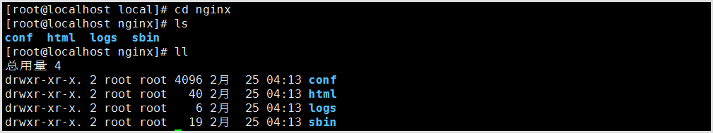

步骤6：启动nginx

```shell
#程序位置：/usr/local/nginx/sbin/nginx 
#配置文件位置：/usr/local/nginx/conf/nginx.conf
cd /usr/local/nginx/sbin/
./nginx
```

步骤7：开放端口80

```shell
#开放3306端口
/sbin/iptables -I INPUT -p tcp --dport 80 -j ACCEPT
#开放的端口永久保存到防火墙
firewall-cmd --zone=public --add-port=80/tcp --permanent
```

步骤8：打开浏览器远程访问nginx


### 2.3.6 常用命令

```shell
#查看运行进程状态：
ps aux | grep nginx

#停止nginx:
./nginx -s stop

#重启nginx(配置文件变动后需要重启才能生效):
./nginx -s reload

#检查配置文件是否正确:
./nginx -t

#查看nginx版本
$ ./nginx -v
```

### 2.3.7 nginx配置反向代理

- 步骤1：编辑配置文件

  ```shell
  vim nginx.conf
  ```

  执行信息如下，nginx.conf默认配置文件内容

  ```
  [root@localhost conf]# vim nginx.conf
  user  nobody;

  worker_processes  1;

  error_log  logs/error.log;

  error_log  logs/error.log  notice;

  error_log  logs/error.log  info;

  pid        logs/nginx.pid;

    events {

        worker_connections  1024;

    }

    http {

        include       mime.types;
        default_type  application/octet-stream;
      
        #log_format  main  '$remote_addr - $remote_user [$time_local] "$request" '
        #                  '$status $body_bytes_sent "$http_referer" '
        #                  '"$http_user_agent" "$http_x_forwarded_for"';
      
        #access_log  logs/access.log  main;
      
        sendfile        on;
        #tcp_nopush     on;
      
        #keepalive_timeout  0;
        keepalive_timeout  65;
      
        #gzip  on;
      
        server {
            listen       80;
            server_name  localhost;
      
            #charset koi8-r;
      
            #access_log  logs/host.access.log  main;
      
            location / {
               root   html;
               index  index.html index.htm;
            }
      
            #error_page  404              /404.html;
      
            # redirect server error pages to the static page /50x.html
            #
            error_page   500 502 503 504  /50x.html;
            location = /50x.html {
                root   html;
            }
      
            # proxy the PHP scripts to Apache listening on 127.0.0.1:80
            #
            #location ~ \.php$ {
            #    proxy_pass   http://127.0.0.1;
            #}
      
            # pass the PHP scripts to FastCGI server listening on 127.0.0.1:9000
            #
            #location ~ \.php$ {
            #    root           html;
            #    fastcgi_pass   127.0.0.1:9000;
            #    fastcgi_index  index.php;
            #    fastcgi_param  SCRIPT_FILENAME  /scripts$fastcgi_script_name;
            #    include        fastcgi_params;
            #}
      
            # deny access to .htaccess files, if Apache's document root
            # concurs with nginx's one
            #
            #location ~ /\.ht {
            #    deny  all;
            #}
        }

        # another virtual host using mix of IP-, name-, and port-based configuration
        #
        #server {
        #    listen       8000;
        #    listen       somename:8080;
        #    server_name  somename  alias  another.alias;
      
        #    location / {
        #        root   html;
        #        index  index.html index.htm;
        #    }
        #}

        # HTTPS server
        #
        #server {
        #    listen       443 ssl;
        #    server_name  localhost;
      
        #    ssl_certificate      cert.pem;
        #    ssl_certificate_key  cert.key;
      
        #    ssl_session_cache    shared:SSL:1m;
        #    ssl_session_timeout  5m;
      
        #    ssl_ciphers  HIGH:!aNULL:!MD5;
        #    ssl_prefer_server_ciphers  on;
      
        #    location / {
        #        root   html;
        #        index  index.html index.htm;
        #    }
        #}
      
    }
  ```


- 步骤2：修改配置文件nginx.conf   

  增加或修改如下内容： 

  ```
  #增加反向代理tomcat
  upstream test{server localhost:8080;}
  server {
  　　　　listen 80;
  　　　　server_name localhost;

  　　　　location / {
             # root   html;
             index  index.html index.htm;
             # 访问tomcat
             proxy_pass http://test;
          }
  }
  ```

   修改后的配置文件

  ```
    [root@localhost sbin]# vim ../conf/nginx.conf
    #增加反向代理tomcat
    upstream test{server localhost:8080;}  
    server {
          listen       80;
          server_name  localhost;

          #charset koi8-r;

          #access_log  logs/host.access.log  main;

          location / {
             # root   html;
             index  index.html index.htm;
             # 访问tomcat
             proxy_pass http://test;
          }

          #error_page  404              /404.html;

          # redirect server error pages to the static page /50x.html
          #
          error_page   500 502 503 504  /50x.html;
          location = /50x.html {
              root   html;
          }

          # proxy the PHP scripts to Apache listening on 127.0.0.1:80
          #
          #location ~ \.php$ {
          #    proxy_pass   http://127.0.0.1;
          #}

          # pass the PHP scripts to FastCGI server listening on 127.0.0.1:9000
          #
          #location ~ \.php$ {
          #    root           html;
          #    fastcgi_pass   127.0.0.1:9000;
          #    fastcgi_index  index.php;
          #    fastcgi_param  SCRIPT_FILENAME  /scripts$fastcgi_script_name;
          #    include        fastcgi_params;
          #}

          # deny access to .htaccess files, if Apache's document root
          # concurs with nginx's one
          #
          #location ~ /\.ht {
          #    deny  all;
          #}
      }
       # another virtual host using mix of IP-, name-, and port-based configuration
      #
      #server {
      #    listen       8000;
      #    listen       somename:8080;
      #    server_name  somename  alias  another.alias;

      #    location / {
      #        root   html;
      #        index  index.html index.htm;
      #    }
      #}
          # HTTPS server
      #
      #server {
      #    listen       443 ssl;
      #    server_name  localhost;

      #    ssl_certificate      cert.pem;
      #    ssl_certificate_key  cert.key;

      #    ssl_session_cache    shared:SSL:1m;
      #    ssl_session_timeout  5m;

      #    ssl_ciphers  HIGH:!aNULL:!MD5;
      #    ssl_prefer_server_ciphers  on;

      #    location / {
      #        root   html;
      #        index  index.html index.htm;
      #    }
      #}

  }
  ```

- 步骤3：打开浏览器，远程浏览

  

# 第3章 shell编程

Shell是用户与内核进行交互操作的一种接口，目前最流行的Shell称为bash Shell
Shell也是一门编程语言\<解释型的编程语言>，即shell脚本\<就是在用linux的shell命令编程>
一个系统可以存在多个shell，可以通过cat /etc/shells命令查看系统中安装的shell，不同的shell可能支持的命令语法是不相同的。

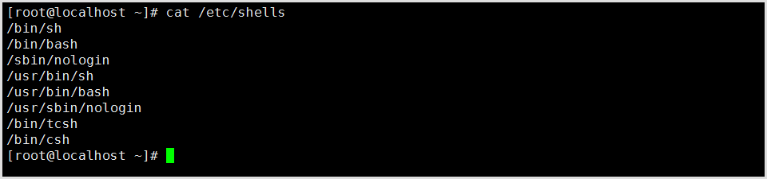

使用shell编程可以实现项目自动部署，今天我们目的就是自动部署我们的项目。

## 3.1 基本格式

代码写在普通文本文件中，通常以 .sh为后缀名

- 编写shell脚本：vim hello.sh

  ```shell
    #!/bin/bash    #表示用哪一种shell解析器来解析执行我们的这个脚本程序
    echo "hello world"   #注释也可以写在这里
    #这是一行注释
  ```

    说明：

  ```shell
    最常用的是 Bash，也就是 Bourne Again Shell，由于易用和免费，Bash 在日常工作中被广泛使用。同时，Bash 也是大多数Linux 系统默认的 Shell。
    在一般情况下，人们并不区分  Bourne Again Shell 和 Bourne Shell，所以，像 #!/bin/bash，它同样也可以改为 #!/bin/sh 。
    #! 告诉系统其后路径所指定的程序即是解释此脚本文件的 Shell 程序。
    以"#"开头的行就是注释，会被解释器忽略。
    sh里没有多行注释，只能每一行加一个#号
  ```

- 执行shell脚本：sh hello.sh

  

  如果hello.sh脚本文件拥有执行权限可以直接执行：./hello.sh

  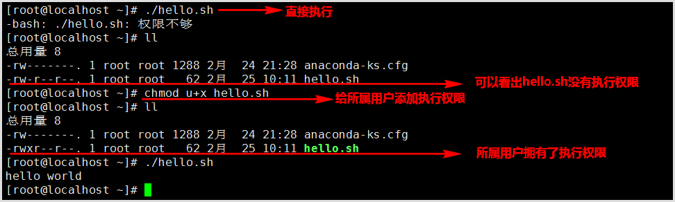

## 3.2 基本语法

Linux Shell中的变量分为“系统环境变量”和“用户自定义变量”

### 3.2.1 系统环境变量

可以通过env命令查看系统变量

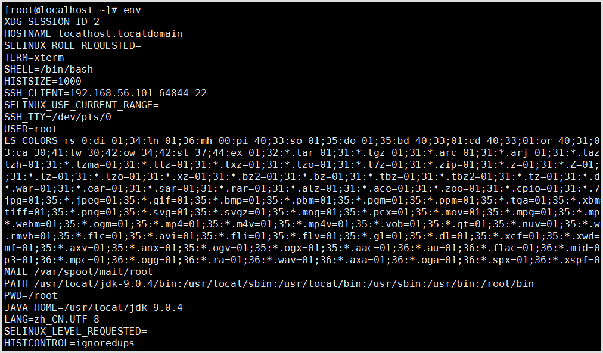

常用的系统环境变量：

```
$HOME、$PWD、$SHELL、$USER
```

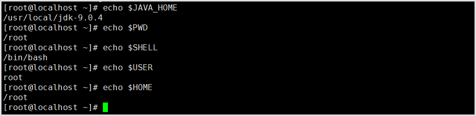

### 3.2.2 自定义变量

#### 3.2.2.1 语法

变量＝值，示例：

```
STR="hello world"
```

**注意**，变量名和等号之间不能有空格。同时，变量名的命名须遵循如下规则：

- 命名只能使用英文字母，数字和下划线，首个字符不能以数字开头。
- 中间不能有空格，可以使用下划线（_）。
- 不能使用标点符号。
- 不能使用bash里的关键字（可用help命令查看保留关键字）。

使用变量：\$变量名称  或  \${变量名称}，示例：

```
echo $STR
```

#### 3.2.2.2 示例

```
A=9
echo $A
```

如果想打印 hello worlds is greater  怎么办？

```shell
echo $STRs is greate #这是错误的
```

正确写法

```shell
echo ${STR}s is greate
```

已定义的变量，可以被重新定义，如：

```shell
YOUR_NAME="tom"
echo $YOUR_NAME
YOUR_NAME="itheima"
echo $YOUR_NAME
```

这样写是合法的，但是第二次赋值的时候不能写$YOUR_NAME="itheima"，使用变量的时候才加美元符（\$）。

#### 3.2.2.2 删除变量

删除变量语法：unset 变量名称

```shell
unset A   #撤销变量A
```

#### 3.2.2.3 只读变量

使用 readonly 命令可以将变量定义为只读变量，只读变量的值不能被改变。
下面的例子尝试更改只读变量，结果报错：

vim hello2.sh内容如下：

```
#!/bin/bash
MYURL="http://www.itheima.com"
readonly MYURL
MYURL="http://www.itcast.com"
```

运行效果如下


#### 3.2.2.4 shell进程全局变量

语法

```
#!/bin/bash
export 变量名=变量值
```

介绍

当前shell进程全局变量含义是，当前shell脚本中定义全局变量，那么当前shell进程中的”子进程shell脚本“也可以使用到当前shell进程的全局变量

示例：a.sh脚本文件内容

```shell
#!/bin/bash
X="123"
echo $X
/root/b.sh   #子shell脚本，运行在当前shell进程的”子进程“空间内
```

b.sh脚本文件内容

```shell
#!/bin/bash
Y="456"
echo $Y
echo $X
```

给2个脚本文件添加执行权限

```shell
chmod u+x a.sh b.sh
```

执行a.sh效果

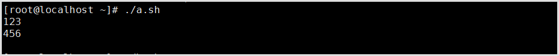

结果表明普通的局部变量在子进程shell脚本空间内是无法引用的，现在修改a.sh脚本文件内容如下

```shell
#!/bin/bash
export X="123"
echo $X
/root/b.sh   #子shell脚本，运行在当前shell进程的”子进程“空间内
```

执行a.sh效果，运行子shell脚本b.sh输出了父shell进程中的全局变量

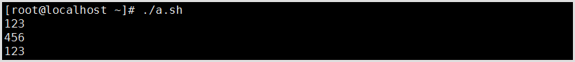

另一种方式引用脚本文件

```shell
. 引用脚本文件位置   #注意前面是一个"."符号
#或
source 引用脚本文件位置
```

如上，引用脚本文件的运行会在当前脚本文件所属的进程空间内，也就是当前脚本文件与引用脚本文件在一个空间内，一个域内，所以引用的脚本文件就可以直接使用当前脚本文件的局部变量

示例：修改a.sh脚本文件内容

```shell
#!/bin/bash
export X="123"
echo $X
Z="789"    #局部变量
. ./b.sh   #引用的shell脚本，运行在当前shell所属进程空间内
```

b.sh脚本文件内容

```
#!/bin/bash
Y="456"
echo $Y
echo $X
echo $Z
```

运行a.sh效果如下：

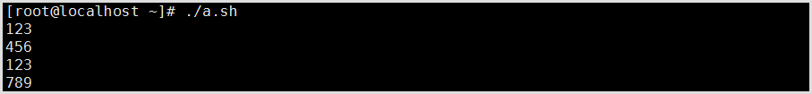

**总结：**

*1、a.sh中直接调用b.sh，会让b.sh在a所在的bash进程的“子进程”空间中执行*
*2、而子进程空间只能访问父进程中用export定义的变量*
*3、一个shell进程无法将自己定义的变量提升到父进程空间中去*
*4、“.”号执行脚本时，会让脚本在调用者所在的shell进程空间中执行* 

#### 3.2.2.5 定义全局环境变量

语法(注意全局变量的定义不可以写在文本文件内)

```
export 变量名称=变量值
```

效果如下：

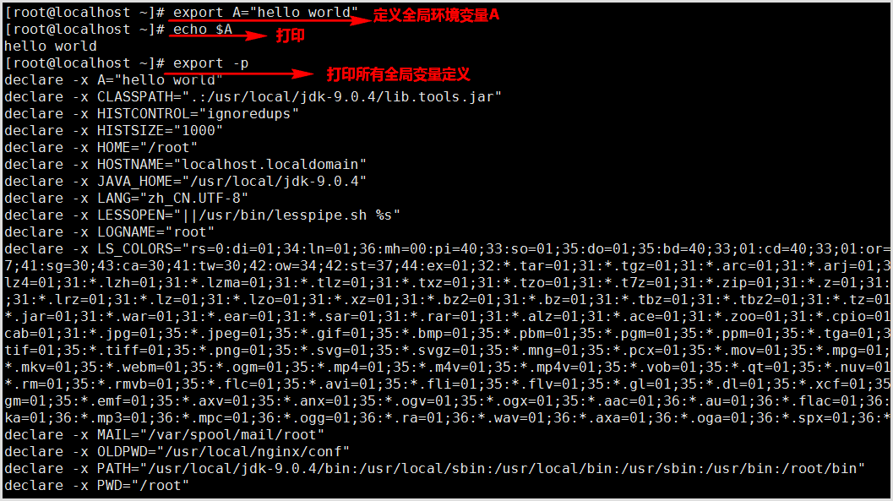

#### 3.2.2.6 反引号赋值

```shell
A=`ls -la`    ## 反引号，运行里面的命令，并把结果返回给变量A
A=$(ls -la)   ## 等价于反引号
```

#### 3.2.2.7 特殊变量

```shell
$? 表示上一个命令退出的状态码
$$ 表示当前进程编号
$0 表示当前脚本名称
$n 表示n位置的输入参数（n代表数字，n>=1）
$# 	表示参数的个数，常用于循环
$*和$@ 都表示参数列表 
```

**注：\$*与\$@区别**

```shell
$* 和 $@ 都表示传递给函数或脚本的所有参数
不被双引号" "包含时:
	$* 和 $@ 都以$1  $2  … $n 的形式组成参数列表
当它们被双引号" "包含时:
	"$*" 会将所有的参数作为一个整体，以"$1 $2 … $n"的形式组成一个整串；
	"$@" 会将各个参数分开，以"$1" "$2" … "$n" 的形式组成一个参数列表
```

## 3.3 算术运算符

1. 用expr

   ```shell
   格式 expr m + n 或$((m+n)) 注意expr运算符间要有空格
   ```

   例如计算（2＋3 ）×4 的值

   分步计算

   ```shell
   S=`expr 2 + 3`
   T=`expr $S \* 4`       ##   *号需要转义
   ```

   一步完成计算

   ```shell
   expr `expr 2 + 3 ` \* 4
   echo `expr \`expr 2 + 3\` \* 4`  ## ``里面使用``需要转义
   ```

   注意：整个表达式必须使用``括起来，否则会以字符串形式输出所有字符

2. 用(())

   ```shell
   ((1+2))
   (((2+3)*4))
   count=1
   ((count++))
   echo $count
   ```

   但是要想取到运算结果，需要用\$引用

   ```shell
   a=$((1+2))
   ```

3. 用$[]

   ```shell
   a=$[1+2]
   echo $a
   ```

## 3.4 流程控制语句

### 3.4.1 if语法

1. 语法格式

   if 格式

   ```shell
   if condition
   then
       command1 
       command2
       ...
       commandN 
   fi
   ```

   if-else 格式

   ```shell
   if condition
   then
       command1 
       command2
       ...
       commandN
   else
       command
   fi
   ```

   if-elseif-else 格式

   ```
   if condition1
   then
       command1
   elif condition2 
   then 
       command2
   else
       commandN
   fi
   ```

2. 示例

   ```
   #!/bin/bash
   read -p "please input your name:" NAME   ## read命令用于从控制台读取输入数据
   ## printf '%s\n' $NAME
   if [ $NAME = root ]
           then
                   echo "hello ${NAME},  welcome !"
           elif [ $NAME = itcast ]
                   then
                           echo "hello ${NAME},  welcome !"
           else
                   echo "SB, get out here !"
   fi
   ```

   运行效果

   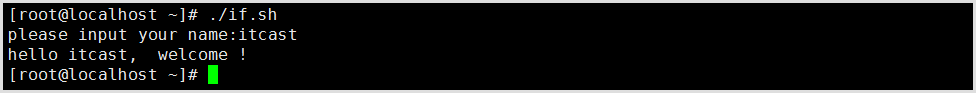

3. 判断条件

   - 条件判断基本语法

     ```shell
     [ condition ]   (注意condition前后要有空格)
     #非空返回true，可使用$?验证（0为true，>1为false）
     [ itcast ]
     #空返回false
     [  ]
     ```

     使用\$?输出上一条指令的状态码效果如下

     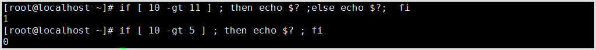

     注意：如果if表达式全部写在一行，需要在如图位置输入”;“进行分割，如果不写在一行，就不用输入”;“

     注意[  ]内部的=周边的空格，有区别：

     ```shell
     [root@localhost ~]# if [ a = b ];then echo ok;else echo notok;fi
     notok
     [root@localhost ~]# if [ a=b ];then echo ok;else echo notok;fi
     Ok
     # 第一条，有分割才能识别条件比较表达式，对比a 不等于 b所以输出notok
     # 第二条，由于没有分割，表达式认为是非空，返回true，所以输出ok
     ```

     短路（理解为三元运算符）

     ```shell
     [ condition ] && echo OK || echo notok
     # 条件满足，执行&&后面的语句；条件不满足，执行|| 后面的语句
     ```

     示例

     ```shell
     [root@localhost ~]# [ 1 -lt 2 ] && echo ok || echo notok
     ok
     ```

   - 条件判断组合

     注：[] 与[[ ]] 的区别：[[ ]] 中逻辑组合可以使用 "&&" 并且 和 "||"或者 符号
     而[] 里面逻辑组合可以用  ”-a“并且 和 ” -o“或者

     ```shell
     [root@localhost ~]# if [ a = b && b = c ]; then echo ok;else echo notok;fi
     -bash: [: missing `]'
     notok

     [root@localhost ~]# if [ a = b -a b = b ]; then echo ok;else echo notok;fi
     notok
     [root@localhost ~]# if [ a = b -o b = b ]; then echo ok;else echo notok;fi
     ok

     [root@localhost ~]# if [[ a = b && b = b ]]; then echo ok;else echo notok;fi
     notok
     [root@localhost ~]# if [[ a = b || b = b ]]; then echo ok;else echo notok;fi
     ok
     ```

   - 常用判断运算符

     ```shell
     #字符串比较：=    !=      
     -z 字符串长度是为0返回true
     -n 字符串长度是不为0返回true
     if [ 'aa' = 'bb' ]; then echo ok; else echo notok;fi
     if [ -n "aa" ]; then echo ok; else echo notok;fi
     if [ -z "" ]; then echo ok; else echo notok;fi

     #整数比较：
     -lt 小于
     -le 小于等于
     -eq 等于
     -gt 大于
     -ge 大于等于
     -ne 不等于
     ```


     #文件判断：
     -d 是否为目录
     if [ -d /bin ]; then echo ok; else echo notok;fi
     -f 是否为文件 
     if [ -f /bin/ls ]; then echo ok; else echo notok;fi
     -e 是否存在
     if [ -e /bin/ls ]; then echo ok; else echo notok;fi
     ```

### 3.4.2 while语法

1. 格式

   ```shell
   while expression
   do
   command
   …
   done
   ```

2. 示例

   ```shell
   i=1
   while ((i<=3))
   do
     echo $i
     let i++  #循环变量递增
   done
   ```

   使用中使用了 Bash let 命令，它用于执行一个或多个表达式，变量计算中不需要加上 $ 来表示变量

   命令行运行效果

   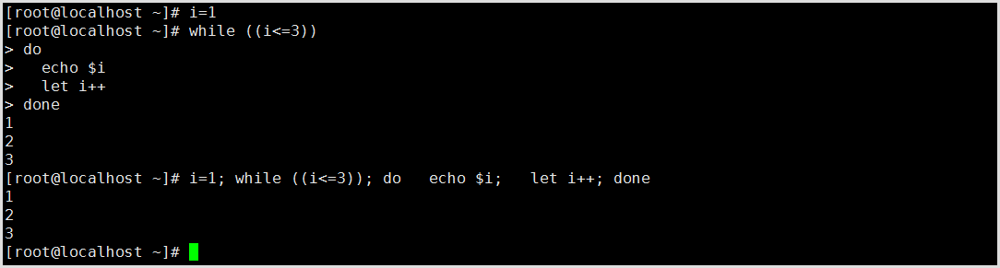

### 3.4.3 case语法

Shell case语句为多选择语句。可以用case语句匹配一个值与一个模式，如果匹配成功，执行相匹配的命令。case语句格式如下：

```shell
case 值 in
模式1)
    command1
    command2
    ...
    commandN
    ;;
模式2）
    command1
    command2
    ...
    commandN
    ;;
esac
```

示例

```shell
echo '输入 1 到 4 之间的数字:'
echo '你输入的数字为:'
read aNum # 命令行读取一个数据赋值给aNum变量
case $aNum in
    1)  echo '你选择了 1'
    ;;
    2)  echo '你选择了 2'
    ;;
    3)  echo '你选择了 3'
    ;;
    4)  echo '你选择了 4'
    ;;
    *)  echo '你没有输入 1 到 4 之间的数字'
    ;;
esac
```

case工作方式如上所示。取值后面必须为单词in，每一模式必须以右括号结束。取值可以为变量或常数。匹配发现取值符合某一模式后，其间所有命令开始执行直至 ;;。

取值将检测匹配的每一个模式。一旦模式匹配，则执行完匹配模式相应命令后不再继续其他模式。如果无一匹配模式，使用星号 * 捕获该值，再执行后面的命令。

### 3.4.4 for语法

与其他编程语言类似，Shell支持for循环。

for循环一般格式为：

```shell
for var in item1 item2 ... itemN
do
    command1
    command2
    ...
    commandN
done
```

写成一行：

```shell
for var in item1 item2 ... itemN; do command1; command2… done;
```

示例

```shell
for N in 1 2 3; do echo $N; done
或
for N in {1..3}; do echo $N; done
```

还有另一种方式

```shell
for ((i = 0; i <= 5; i++))
do
	echo "welcome $i times"
done
或
for ((i = 0; i <= 5; i++)); do echo "welcome $i times"; done

```

## 3.5 函数使用

### 3.5.1 函数定义

格式

```shell
函数名(){
    command1
    command2
    ...
    # return  数字      #返回值是状态码，只能在[0-255]范围内
}
```

示例：d.sh脚本文件

```shell
#!/bin/bash
hello() # 函数定义
{
        #date +%Y-%m-%d 输出格式化系统日期
        echo "Hello there today's date is `date +%Y-%m-%d`"  
        return  2      #返回值其实是状态码，只能在[0-255]范围内
}
hello
echo $?  #获取函数的return值
```

运行效果


函数的调用方式总结：

```shell
函数调用：
function hello()  #方式一
function hello	  #方式二
hello			  #方式三
```

**注意：**

*1.必须在调用函数地方之前，先声明函数，shell脚本是逐行运行。不会像其它语言一样先预编译*
*2.函数返回值，只能通过$? 系统变量获得，可以显示加：return 返回，如果不加，将以最后一条命令运行结果，作为返回值。 return后跟数值n(0-255)*

脚本调试，会逐句运行每一句话和输出信息

```
sh -vx d.sh
```

运行效果如下

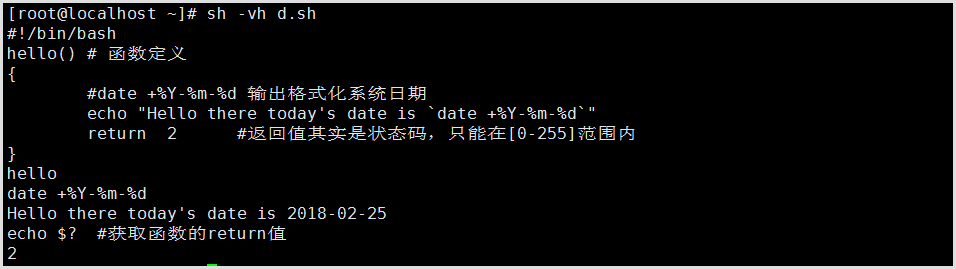

### 3.5.2 函数参数

格式

```shell
#!/bin/bash
函数名(){
    echo "第一个参数为 $1 !"
    echo "第二个参数为 $2 !"
    echo "第十个参数为 $10 !"
    echo "第十个参数为 ${10} !"  
    echo "第十一个参数为 ${11} !"
    echo "参数总数有 $# 个!"
    echo "作为一个字符串输出所有参数 $* !"
}
#注意，$10 不能获取第十个参数，获取第十个参数需要${10}。当n>=10时，需要使用${n}来获取参数。
函数名 参数1 参数2 参数3 ... 参数N    #调用函数并传递参数
```

示例：e.sh脚本文件

```shell
#!/bin/bash
funWithParam(){
    echo "第一个参数为 $1 !"
    echo "第二个参数为 $2 !"
    echo "第十个参数为 $10 !"
    echo "第十个参数为 ${10} !"
    echo "第十一个参数为 ${11} !"
    echo "参数总数有 $# 个!"
    echo "作为一个字符串输出所有参数 $* !"
}
funWithParam 1 2 3 4 5 6 7 8 9 34 73
```

调试运行效果

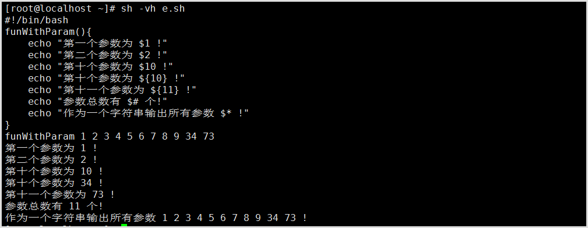

### 3.5.3 函数返回值

示例：f.sh脚本文件

```shell
#!/bin/bash
funWithReturn(){
    echo "这个函数会对输入的两个数字进行相加运算..."
    echo "输入第一个数字: "
    read aNum
    echo "输入第二个数字: "
    read anotherNum
    echo "两个数字分别为 $aNum 和 $anotherNum !"
    return $(($aNum+$anotherNum))
}
funWithReturn
echo "输入的两个数字之和为 $? !"

```

运行效果


### 3.5.4 跨脚本调用函数

假如e.sh保存在此路径：   /root/e.sh
则可在脚本h.sh中调用脚本e.sh中的函数，h.sh脚本文件代码如下：

```shell
#!/bin/bash
# e.sh
. /root/e.sh    ## 注：  . 和 / 之间有空格
# 或者 source /root/fun2.sh
funWithParam 11 22 33 44 55 66 77 88 99 100 101
```

运行效果

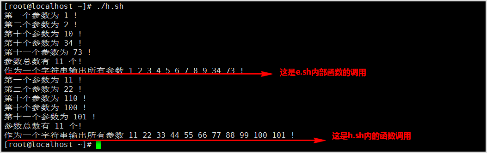

## 3.6 案例-自动化部署软件

### 3.6.1 案例需求

在企业中项目代码有更新，项目代码war包部署到服务器都是00:00凌晨整点时间进行部署应用的，因为这个时间在线应用的人非常少，所以可以达到最小的影响更新项目部署。那么在企业中项目运维人员或开发人员真的要半夜不睡觉等到凌晨在进行部署操作吗？

答案：是否定的，不需要人等，只需要写shell编程脚本完成自动化部署项目软件。

**自动化部署项目软件要求：**将事先准备好的war文件”/soft/travel.war“在00:00点整部署到”/usr/local/apache-tomcat-8.5.27/webapps/“目录下

### 3.6.2 安装脚本

/root/script/install.sh

```shell
#!/bin/bash
## 将/soft/travel.war拷贝到/usr/local/apache-tomcat-8.5.27/webapps/
cp /soft/travel.war /usr/local/apache-tomcat-8.5.27/webapps
echo "deploy success `date \"+%Y-%m-%d %H:%M:%S\"`"
```

执行定时计划执行install.sh，脚本

```shell
crontab -e #进入编辑模式
#定时计划
* * * * * /root/script/install.sh >> /root/myInstall.txt
```

说明：

```
以下是 crontab 文件的格式：
{minute} {hour} {day-of-month} {month} {day-of-week} {full-path-to-shell-script}
o minute: 区间为 0 – 59
o hour: 区间为0 – 23
o day-of-month: 区间为0 – 31
o month: 区间为1 – 12. 1 是1月. 12是12月.
o Day-of-week: 区间为0 – 7. 周日可以是0或7.
```

### 3.6.3 测试脚本运行

- 步骤1：生成最新的项目war包（travel.war）

  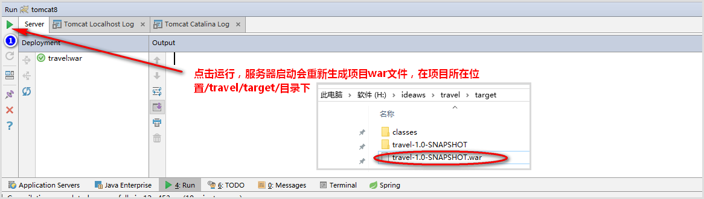

- 步骤2：将travel-1.0-SNAPSHOT.war包拷贝到h:/deploy目录（任意目录都可以，目的是复制到其他位置）下

  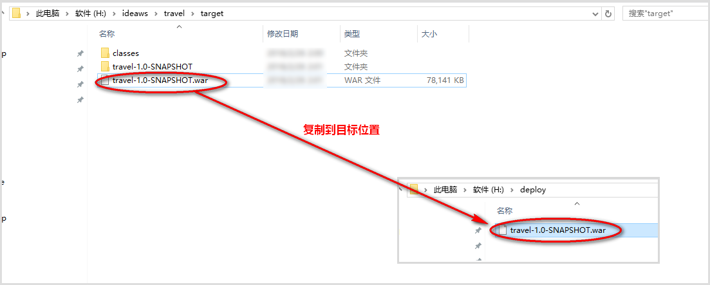

- 步骤2：修改war中配置文件配置数据，并将war包重命名为travel.war

  使用压缩工具打开war文件

  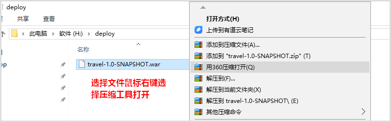

  进入classes目录修改配置文件信息符合linux系统的信息配置，尤其mysql数据库密码注意保持一致

  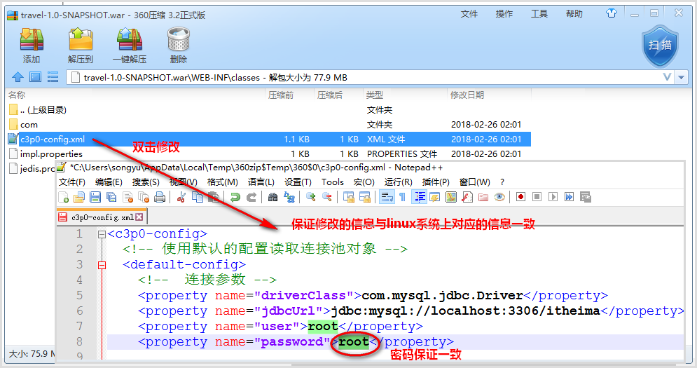

  修改之后记得保持，并会提示是否将更新写入压缩，选择”确定“更新到压缩

  将war包重命名为travel.war

  

- 步骤3：将travel.war上传到linux中"/soft"目录下

  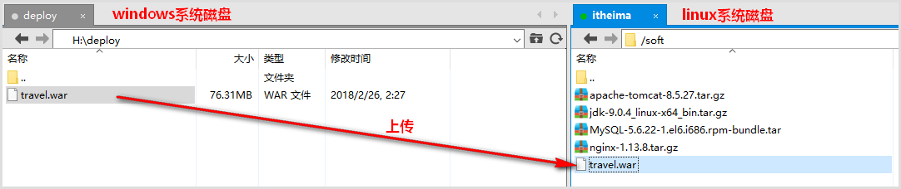

- 步骤4：在linux系统中，创建/root/script目录，并运行 vim /root/script/install.sh，脚本如下：

  ```shell
  #!/bin/bash
  ## 将/soft/travel.war拷贝到/usr/local/apache-tomcat-8.5.27/webapps/
  cp /soft/travel.war /usr/local/apache-tomcat-8.5.27/webapps
  echo "deploy success `date \"+%Y-%m-%d %H:%M:%S\"`"
  ```

  并授予install.sh文件所属用户执行的权限

  ```shell
  chmod u+x /root/script/install.sh
  ```

- 步骤5：创建定时任务计划运行，crontab -e，计划如下：

  ```shell
  * * * * * /root/script/install.sh >> /root/myInstall.txt
  ```

- 步骤6：将”/usr/local/apache-tomcat-8.5.27/webapps“目录下已有的travel.war和travel删除

  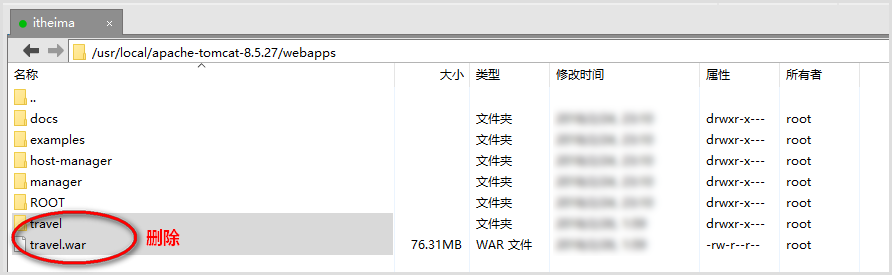

- 步骤7：待定时任务计划执行后，查看/root/myInstall.txt文件内容，查看效果

  ```shell
  [root@localhost ~]# vim myInstall.txt 

  deploy success 2018-02-26 09:53:01
  deploy success 2018-02-26 09:54:02
  deploy success 2018-02-26 09:55:01
  deploy success 2018-02-26 09:56:02
  deploy success 2018-02-26 09:57:01
  deploy success 2018-02-26 09:58:01
  deploy success 2018-02-26 09:59:02
  ```

  如上内容，说明install.sh脚本成功运行

- 步骤8：待上面有效果后，打开浏览器浏览：http://192.168.56.105:8080/travel/

  

