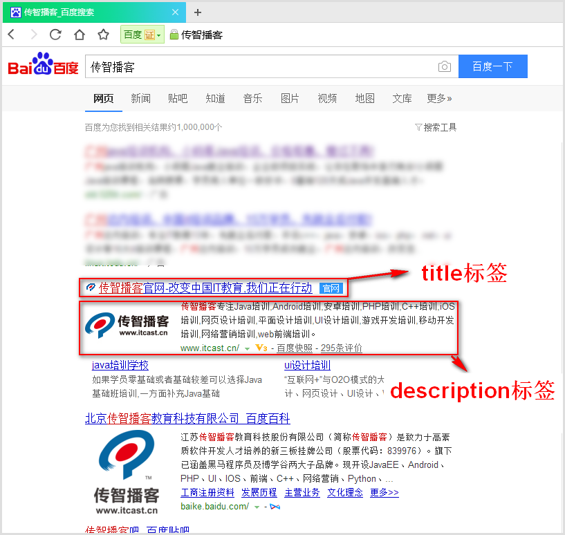
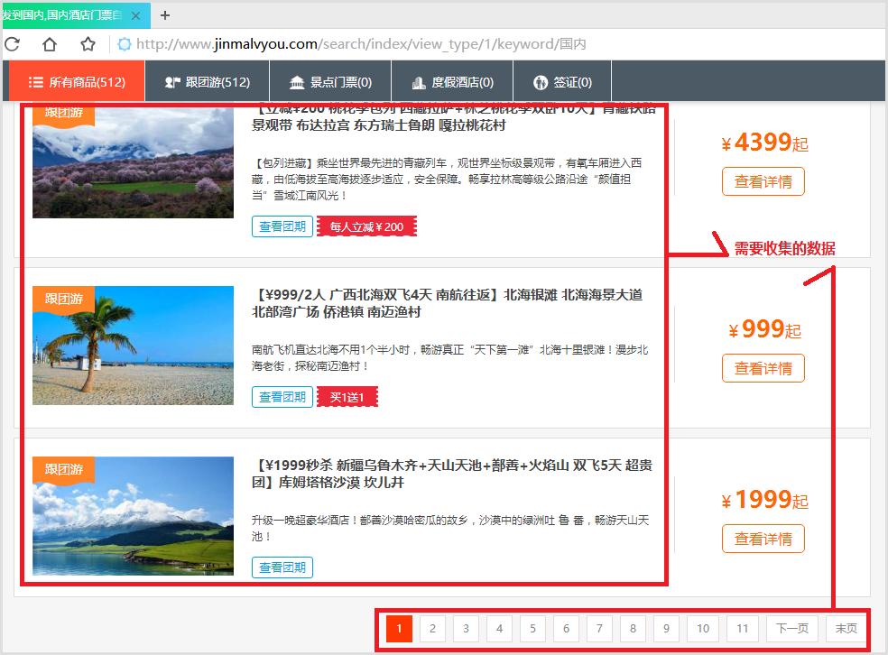
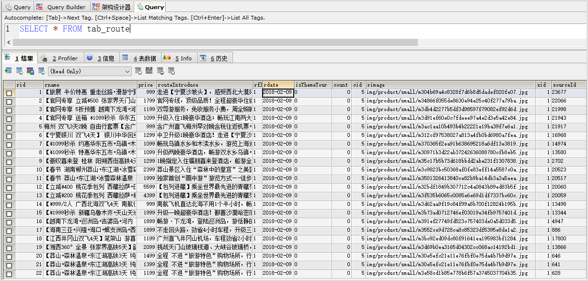
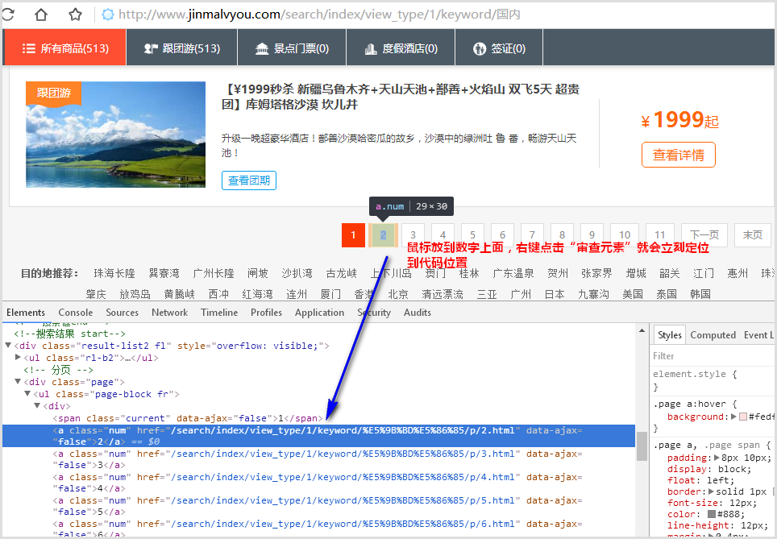
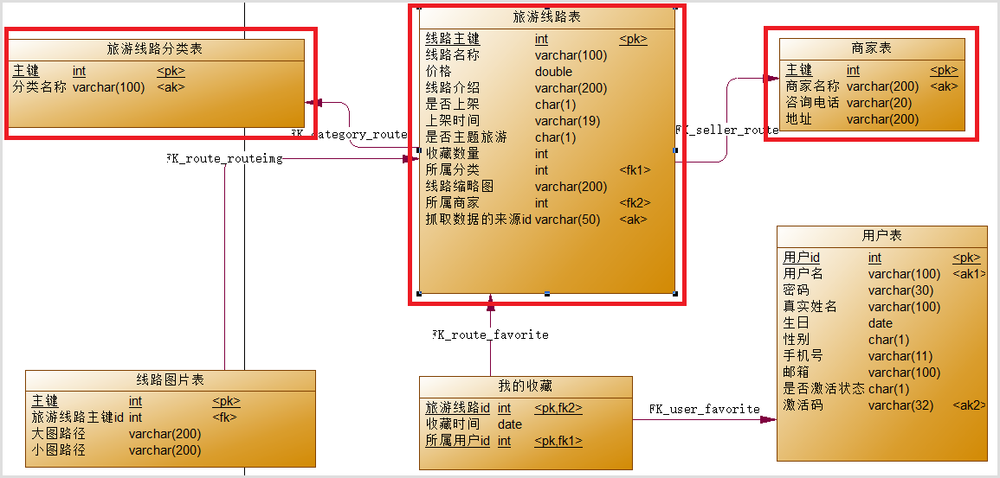
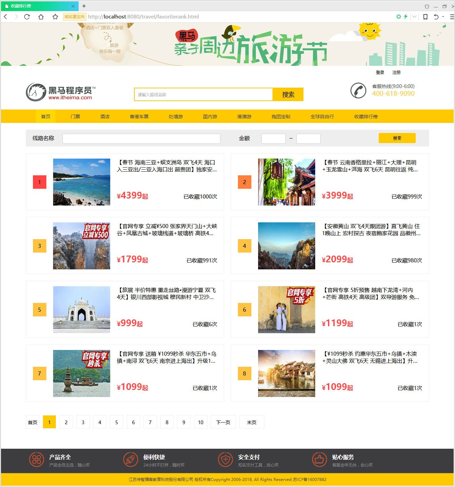
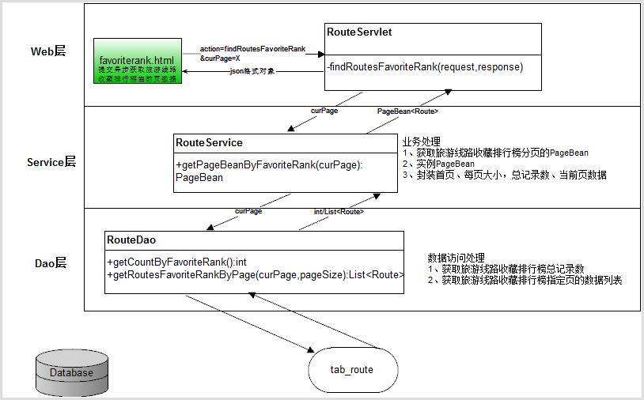
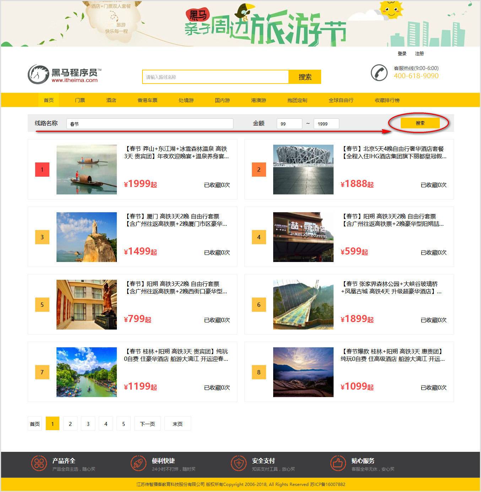
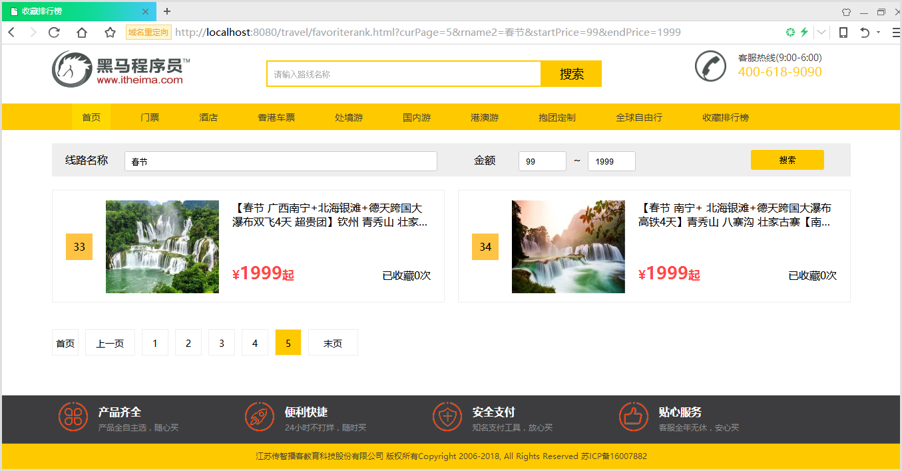
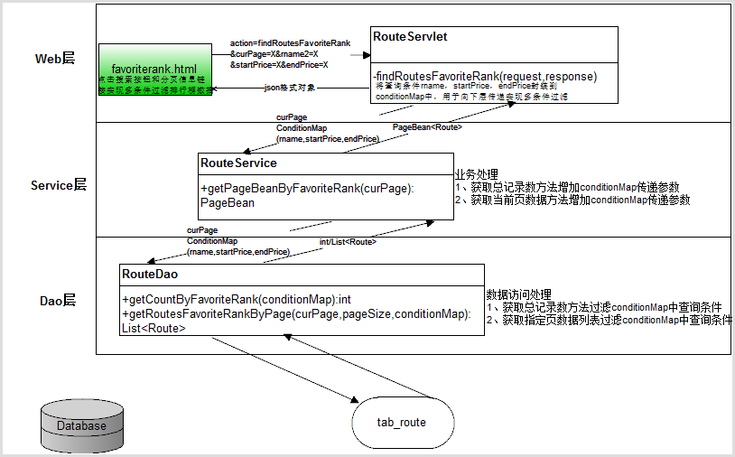

# day55-项目第五天

# 学习目标

1. 能够完成分页查看收藏排行榜页面案例
2. 能够完成收藏排行榜多条件筛选分页案例
3. 能够完成爬虫收集数据案例

# 第1章 内容回顾

# 第2章 案例：爬虫

## 2.1 思考问题

有什么技术问题我们会经常百度一下，那么百度是如何根据我们搜索的问题在浩瀚的互联网中查找答案的呢？难道是点击百度搜索立刻去互联网所有资源中去搜索数据？如下图：



答案：当用户点击百度搜索引擎查询时，百度不是立刻去互联网中搜索资源，而是搜索百度自己服务器内部数据库数据，但是百度有专门的服务器利用爬虫技术在浩瀚的互联网资源中收集数据（url、title、description、其他等信息）到内部数据库中。这个收集互联网数据的技术就是网络爬虫技术。

## 2.2 网络爬虫技术的好处

1. 可以实现搜索引擎

   我们学会了爬虫编写之后，就可以利用爬虫自动地采集互联网中的信息，采集回来后进行相应的存储或处理，在需要检索某些信息的时候，只需在采集回来的信息中进行检索，即实现了私人的搜索引擎。当然，信息怎么爬取、怎么存储、怎么进行分词、怎么进行相关性计算等，都是需要我们进行设计的，爬虫技术主要解决信息爬取的问题。

2. 大数据时代，可以让我们获取更多的数据源

   在进行大数据分析或者进行数据挖掘的时候，数据源可以从某些提供数据统计的网站获得，也可以从某些文献或内部资料中获得，但是这些获得数据的方式，有时很难满足我们对数据的需求，而手动从互联网中去寻找这些数据，则耗费的精力过大。此时就可以利用爬虫技术，自动地从互联网中获取我们感兴趣的数据内容，并将这些数据内容爬取回来，作为我们的数据源，从而进行更深层次的数据分析，并获得更多有价值的信息。

3. 可以更好地进行搜索引擎优化（SEO）

   对于很多SEO从业者来说，为了更好的完成工作，那么就必须要对搜索引擎的工作原理非常清楚，同时也需要掌握搜索引擎爬虫的工作原理。而学习爬虫，可以更深层次地理解搜索引擎爬虫的工作原理，这样在进行搜索引擎优化时，才能知己知彼，百战不殆。

4. 有利于就业

   从就业来说，爬虫工程师方向是不错的选择之一，因为目前爬虫工程师的需求越来越大，而能够胜任这方面岗位的人员较少，所以属于一个比较紧缺的职业方向，并且随着大数据时代和人工智能的来临，爬虫技术的应用将越来越广泛，在未来会拥有很好的发展空间。
   爬虫工程师目前来说属于紧缺人才，并且薪资待遇普遍较高。所以，深层次地掌握这门技术，对于就业来说，是非常有帮助的。

## 2.3 案例需求


收集金马国旅首页搜索框搜索“国内”的结果列表中，将所有页面所有产品数据收集到tab_route旅游线路商品数据到数据库中和将商品缩略图图片收集到本地硬盘上（H:/img/product/small/目录下）

资源页面地址：http://www.jinmalvyou.com/search/index/view_type/1/keyword/%E5%9B%BD%E5%86%85

%E5%9B%BD%E5%86%85是“国内”的URL编码数据，页面效果如下



## 2.4 案例效果

我们通过jsoup爬虫抓取的数据有2部分，一个是收集到数据库表，一个资源图片收集到本地硬盘上。

数据库表tab_route旅游线路表收集到的数据如下：



收集到的缩略图资源文件


## 2.5 案例实现步骤

### 2.5.1 实现分析

一个url资源地址可以使用jsoup解析获的一个Document对象，国内搜索结果列表页面地址http://www.jinmalvyou.com/search/index/view_type/1/keyword/%E5%9B%BD%E5%86%85，使用jsoup根据url获得一个Document对象进行解析，但问题是这里只能获得第1页数据，如果获取其他页的旅游线路商品列表数据呢？

点击分页数字观察发现，如下图



当前页默认就是第1页数据地址：

http://www.jinmalvyou.com/search/index/view_type/1/keyword/%E5%9B%BD%E5%86%85

第2页数据地址：

http://www.jinmalvyou.com/search/index/view_type/1/keyword/%E5%9B%BD%E5%86%85/p/2.html

第3页数据地址：

http://www.jinmalvyou.com/search/index/view_type/1/keyword/%E5%9B%BD%E5%86%85/p/3.html

...

第35页数据地址（打开浏览器访问这个资源，鼠标悬浮到末页，查看审查元素会发现最后一个的数字）：

http://www.jinmalvyou.com/search/index/view_type/1/keyword/%E5%9B%BD%E5%86%85/p/35.html

根据上面的分页数据列表地址，可以分析出分页数字1~35页。每一页的旅游线路列表数据都是一个独立的地址，所以我们需要遍历1~35所有页，获得每一页Document对象进行解析抓取旅游线路列表数据。

### 2.5.2 数据库表结构分析



sql脚本

```sql
/*创建旅游线路商品表2，用于存储抓取数据的表，为了不让抓取数据覆盖旅游线路表，所以新建tab_route2存储数据*/
CREATE TABLE tab_route2
(
   rid                  INT NOT NULL AUTO_INCREMENT,
   rname                VARCHAR(100) NOT NULL,
   price                DOUBLE NOT NULL,
   routeIntroduce       VARCHAR(200),
   rflag                CHAR(1) NOT NULL,
   rdate                VARCHAR(19),
   isThemeTour          CHAR(1) NOT NULL,
   COUNT                INT DEFAULT 0,
   cid                  INT NOT NULL,
   rimage               VARCHAR(200),
   sid                  INT,
   sourceId             VARCHAR(50),
   PRIMARY KEY (rid),
   UNIQUE KEY AK_nq_sourceId (sourceId)
);
```

### 2.5.3 实现步骤

1. 根据http://www.jinmalvyou.com/search/index/view_type/1/keyword/%E5%9B%BD%E5%86%85地址使用jsoup获取Document对象
2. 根据Doucument对象解析出末页的数字，这样就获得了1~末页的分页数字
3. 循环遍历每一页的数字，jsoup根据http://www.jinmalvyou.com/search/index/view_type/1/keyword/%E5%9B%BD%E5%86%85/p/2.html地址就会得到每一页的Document对象
4. 获取到了分页的每一页的Document对象，就可以解析出每页的旅游线路商品列表元素列表
5. 遍历每页的旅游线路元素列表，将每个元素解析出来的数据封装到一条旅游线路Java对象中
6. 根据封装好的旅游线路对象，执行数据库添加操作添加的数据中

### 2.5.4 实现代码

- RouteDao.java数据访问类代码

  ```java
  package com.itheima.dao;

  import com.itheima.entity.Route;
  import com.itheima.util.C3P0Utils;
  import org.springframework.jdbc.core.JdbcTemplate;

  public class RouteDao {
      //实例jdbcTemplate
      private JdbcTemplate jdbcTemplate = new JdbcTemplate(JdbcUtils.getDataSource());

      /**
       * 添加旅游线路
       * @param route
       * @return int,影响行数
       */
      public int addRoute(Route route){
          int count = 0;
          String sql="INSERT INTO tab_route2 VALUES(NULL,?,?,?,?,?,?,?,?,?,?,?)";
          return jdbcTemplate.update(sql,
                  route.getRname(),
                  route.getPrice(),
                  route.getRouteIntroduce(),
                  route.getRflag(),
                  route.getRdate(),
                  route.getIsThemeTour(),
                  route.getCount(),
                  route.getCid(),
                  route.getRimage(),
                  route.getSid(),
                  route.getSourceId()

          );
      }

  }
  ```

- RouteService.java业务逻辑代码

  ```java
  package com.itheima.service;

  import com.itheima.dao.RouteDao;
  import com.itheima.entity.Route;

  public class RouteService {
      /**
       * 实例旅游线路数据访问类
       */
      private RouteDao routeDao = new RouteDao();
        /**
     * 添加旅游线路业务方法
     * @param route
     * @return boolean，true代表添加成功，否则返回false
     */
     public boolean addRoute(Route route){
         return routeDao.addRoute(route)>1;
     }
  }
  ```

- pom.xml导入依赖

  ```xml
  <!--导入jsoup依赖-->
  <dependency>
      <groupId>org.jsoup</groupId>
      <artifactId>jsoup</artifactId>
      <version>1.11.2</version>
  </dependency>
  <!--导入JsoupXpath依赖-->
  <dependency>
      <groupId>cn.wanghaomiao</groupId>
      <artifactId>JsoupXpath</artifactId>
      <version>0.3.2</version>
  </dependency>
  <!--导入httpclient依赖-->
  <dependency>
      <groupId>org.apache.httpcomponents</groupId>
      <artifactId>httpclient</artifactId>
      <version>4.5.3</version>
  </dependency>
  <!--导入httpcore依赖-->
  <dependency>
      <groupId>org.apache.httpcomponents</groupId>
      <artifactId>httpcore</artifactId>
      <version>4.4.6</version>
  </dependency>
  <!--导入commons-io依赖 -->
  <dependency>
      <groupId>commons-io</groupId>
      <artifactId>commons-io</artifactId>
      <version>1.4</version>
  </dependency>
  ```

- GrepRouteDataTest.java测试抓取数据代码

  ```java
  package com.itheima.test;

  import com.itheima.travel.model.Route;
  import com.itheima.travel.service.RouteService;
  import org.apache.commons.io.IOUtils;
  import org.apache.http.HttpEntity;
  import org.apache.http.client.methods.CloseableHttpResponse;
  import org.apache.http.client.methods.HttpGet;
  import org.apache.http.impl.client.CloseableHttpClient;
  import org.apache.http.impl.client.HttpClients;
  import org.jsoup.Jsoup;
  import org.jsoup.nodes.Document;
  import org.jsoup.nodes.Element;
  import org.jsoup.select.Elements;

  import java.io.FileOutputStream;
  import java.io.InputStream;
  import java.io.OutputStream;
  import java.net.URLEncoder;
  import java.text.SimpleDateFormat;
  import java.util.Date;

  public class GrepRouteDataTest {
      /**
       * 程序入口
       * @param args
       */
      public static void main(String[] args) {
          //实例业务类
          RouteService routeService = new RouteService();

          try {
              //1.获取抓取资源的Document
              Document document = Jsoup.connect("http://www.jinmalvyou.com/search/index/view_type/1/keyword/" +
                      URLEncoder.encode("国内", "utf-8")).get();
              //2.获取当前页的商品列表标签元素列表（默认获取的是第一页数据）
              Elements elements = document.select(".rl-b-li");
              //3.解析末页数字（要从1~末页全部爬到收集数据）
              //3.1获取末页连接的a标签元素
              Element endPageEle = document.select(".page .end").first();
              //3.2获取a标签中href属性值
              String endPageHref =endPageEle.attr("href"); //http://www.jinmalvyou.com/search/index/view_type/1/keyword/%E5%9B%BD%E5%86%85/p/35.html
              //3.3通过分析href跳转地址截取35这个数字字符串
              String pageNoStr = endPageHref.substring(endPageHref.indexOf("/p/")+3,endPageHref.indexOf(".html"));
              //3.4将字符串35转换为数字
              int pageNo = Integer.parseInt(pageNoStr);
              //4.从第1页面爬到末页，所以循环抓取数据，遍历1~末页
              for (int i=1;i<=pageNo;i++){
                  //4.1第1页的文档Document上面已经获取了，所以只获取i>1的
                  if(i>1){
                      //4.2获取当前页的Document对象
                      document = Jsoup.connect("http://www.jinmalvyou.com/search/index/view_type/1/keyword/" +
                              URLEncoder.encode("国内", "utf-8")+"/p/"+i+".html").get();
                      //抓取当前页上的旅游线路列表数据标签
                      elements = document.select(".rl-b-li");
                  }
                  //4.3遍历当前页旅游线路列表elements数据标签，每个routeEle都可以抓取出来一个旅游线路Route对象
                  for (Element routeEle:elements) {
                      //解析routeEle元素节点封装成Route对象
                      Route route = new Route();
                      //封装sourceid，在<a href="/travel/show?good_id=13344" target="_blank">中
                      Element aEle = routeEle.selectFirst(".pro-title>a");
                      //获得的href的值：/travel/show?good_id=13344
                      String href = aEle.attr("href");
                      //截取出商品来源id
                      String sourceId = href.substring(href.indexOf("=")+1);
                      route.setSourceId(sourceId);
                      //封装线路名称
                      String rname = aEle.text();
                      route.setRname(rname);
                      //封装价格
                      Element priceEle = routeEle.selectFirst(".price>strong");
                      String priceStr = priceEle.text();
                      double price = Double.parseDouble(priceStr);
                      route.setPrice(price);
                      //封装线路介绍
                      Element routeIntroduceEle = routeEle.selectFirst(".pro-con-txt>br+p");
                      String routeIntroduce = routeIntroduceEle.text();
                      route.setRouteIntroduce(routeIntroduce);
                      //是否上架
                      route.setRflag("1");//上架
                      //上架时间
                      route.setRdate(new SimpleDateFormat("yyyy-MM-dd HH:mm:ss").format(new Date()));
                      //是否主题旅游
                      route.setIsThemeTour("0");
                      //所属分类
                      route.setCid(5);//国内游

                      //缩略图，图片存储路径img/product/image/图片路径
                      Element rimageEle = routeEle.selectFirst("img");
                      //抓取的元素：
                      String src = rimageEle.attr("src");
                      String imageName = src.substring(src.lastIndexOf("/")+1);
                      //4.5下载图片（发送http协议Get请求）
                      //4.5.1定义http协议核心类
                      CloseableHttpClient httpClient = HttpClients.createDefault();
                      //4.5.2定义请求对象并设置请求资源地址
                      HttpGet httpGet = new HttpGet(src);
                      //4.5.3使用HttpClient执行请求发送,执行会返回response响应数据对象
                      CloseableHttpResponse response = httpClient.execute(httpGet);
                      //4.5.4判断影响的http状态码为200代表通信过程正常。
                      if (response.getStatusLine().getStatusCode() == 200) {
                          //通信正常说明成功获取了资源
                          //数据库只存储缩略图路径，所以封装旅游线路缩略图路径
                          String rimagePath = "img/product/small/"+imageName;
                          route.setRimage(rimagePath);
                          //4.6接下来抓取图片资源文件到本地硬盘
                          //4.6.1使用response获取返回的数据资源对象
                          HttpEntity entity = response.getEntity();
                          //4.6.2获取返回数据资源的输入流
                          InputStream inputStream = entity.getContent();
                          //4.6.3定义本地存储接收图片的地址（注意目录结构要存在，否则会抛出异常）
                          OutputStream outputStream = new FileOutputStream("h:/"+rimagePath);
                          //4.6.4将输入流数据写入到输出流
                          IOUtils.copy(inputStream,outputStream);
                          //4.6.5关闭流
                          outputStream.close();
                          inputStream.close();
                      }
                      //所属商家
                      route.setSid(1);//m
                      try {
                          //4.7添加当前线路
                          routeService.addRoute(route);
                          System.out.println("来源线路ID："+route.getSourceId()+",抓取成功");
                      }catch (Exception e){
                          System.out.println("来源线路ID："+route.getSourceId()+",抓取失败");
                      }
                  }
                  System.out.println("第"+i+"页抓取成功================");
              }
          }catch (Exception e){
              e.printStackTrace();
          }
      }
  }

  ```

  ​

# 第3章 案例：分页查看收藏排行榜页面

## 3.1 案例需求

用户点击头部导航“收藏排行榜”进入favoriterank.html页面，显示目前所有旅游线路数据按照收藏数量降序的排行榜数据，并且在每条旅游线路需要显示排行第多少位和被收藏了多少次。

## 3.2 实现效果

点击导航“收藏排行榜”连接显示排行榜分页数据效果



## 3.3 实现分析



## 3.4 实现步骤

1. favoriterank.html代码，收藏排行榜页面加载完成时提交异步请求到RouteServlet获取旅游线路收藏排行榜分页数据，并在回调函数里面将获取的数据更新到页面上。更新数据时注意排行数字显示的判断，只有第一页排行在第1、第2的数字样式特殊，其他数字样式一样。还有就是排行榜第一页数字是1~8，第二页数字应是9~16,其他依次类推。
2. RouteServlet.java代码，旅游线路处理前端请求，获取前端传递过来的curPage查询第几页，并调用旅游线路业务类RouteService获取分页PageBean数据
3. RouteService.java代码，旅游线路业务类通过实例PageBean，并封装当前页、没每页大小、总记录数和当前页数据获得PageBean并进行返回。其中总记录数和当前页数据列表是调用旅游线路数据访问类RouteDao获取。
4. RouteDao.java代码，旅游旅游数据访问类获取总记录数和当前页数据列表，当前页数据列表注意要根据收藏数量降序获取。

## 3.5 实现代码

### 步骤1：favoriterank.html代码

```html
<script type="text/javascript" src="js/jquery-3.3.1.js"></script>
<!--导入获取传递过来参数js代码-->
<script type="text/javascript" src="js/getParameter.js"></script>
<script type="text/javascript">
    //加载完成事件
    $(function () {
        //提交异步请求获取分页的收藏排行榜数据
        getRoutesFavoriteRankByPage();
    });

    //提交异步请求获取分页的收藏排行榜数据
    function getRoutesFavoriteRankByPage() {
        var url = "route";//访问RouteServlet
        //获取分页获取请求传递的curPage
        var curPage = getParameter("curPage");
        var data = {action:"findRoutesFavoriteRank",curPage:curPage};//提交数据
        //异步请求回调函数
        var callback = function(resultInfo){
            //判断返回结果有效性
            if(resultInfo.flag){
                //resultInfo.flag为true代表正确获得了返回结果
                //获取pageBean对象数据
                var pageBean = resultInfo.data;
                //遍历当前页数据列表添加到列表位置
                var html = "";
                for (var i = 0; i < pageBean.data.length; i++) {
                    var route = pageBean.data[i];
                    html+="<li>";
                    //当前访问第一页第一条数据时，处理排行第1样式
                    if(i==0 && pageBean.curPage==1){
                        html += "<span class=\"num one\">1</span>";
                    }else if(i==1 && pageBean.curPage==1){
                        //当前访问第一页第二条数据时，处理排行第2样式
                        html+="<span class=\"num two\">2</span>";
                    }else if(pageBean.curPage>1 || i>1){
                        //处理其他排行数字
                        //计算当前排行数字
                        var pageNo = (pageBean.curPage-1)*pageBean.pageSize+(i+1);
                        html+="<span class=\"num\">"+pageNo+"</span>";
                    }

                    html+="<a href=\"route_detail.html?rid="+route.rid+"\"></a>\n" +
                        "                        <h4><a href=\"route_detail.html?rid="+route.rid+"\">"+route.rname+"</a></h4>\n" +
                        "                        <p>\n" +
                        "                            <b class=\"price\">¥<span>"+route.price+"</span>起</b>\n" +
                        "                            <span class=\"shouchang\">已收藏"+route.count+"次</span>\n" +
                        "                        </p>\n" +
                        "                    </li>";

                }
                //将生成的html设置到具体位置
                $(".contant .list ul").html(html);
                //更新分页信息
                //首页
                html = "<li><a href=\"favoriterank.html?curPage=" + pageBean.firstPage + "\">首页</a></li>";
                //上一页,如果用户访问页数>1才显示上一页
                if (pageBean.curPage > 1) {
                    html += "<li class=\"threeword\"><a href=\"favoriterank.html?curPage=" + pageBean.prePage + "\">上一页</a></li>";
                }
                var begin;//起始页
                var end;//结束页
                //总页数<=10的情况
                if (pageBean.totalPage <= 10) {
                    begin = 1;
                    end = pageBean.totalPage;
                } else {
                    //pageBean.totalPage总页数>10情况
                    begin = pageBean.curPage - 5;
                    end = pageBean.curPage + 4;
                    //由于有加减计算，begin和end计算出来的结果就有可能越界，所以我们需要判断边界
                    if (begin < 1) {
                        begin = 1;
                        end = 10;
                    }
                    if (end > pageBean.totalPage) {
                        end = pageBean.totalPage;
                        begin = pageBean.totalPage - 9;
                    }
                }
                //遍历分页数字数据
                for (var i = begin; i <= end; i++) {
                    //如果遍历数字与当前访问页相等，那么当前页应用类样式curPage
                    if (pageBean.curPage == i) {
                        html += " <li class='curPage'><a href=\"favoriterank.html?curPage=" + i + "\">" + i + "</a></li>";
                    } else {
                        html += " <li><a href=\"favoriterank.html?curPage=" + i + "\">" + i + "</a></li>";
                    }
                }
                //下一页 ，如果当前页<总页数才显示下一页
                if (pageBean.curPage < pageBean.totalPage) {
                    html += "<li class=\"threeword\"><a href=\"favoriterank.html?curPage=" + pageBean.nextPage + "\">下一页</a></li>";
                }
                //拼接尾部
                html += "<li class=\"threeword\"><a href=\"favoriterank.html?curPage=" + pageBean.totalPage + "\">末页</a></li>"
                //更新到分页信息位置
                $(".pageNum ul").html(html);
            }else{
                alert("服务器正忙，请稍后再试。。。");
            }
        };
        var type ="json";//返回数据类型
        //发送请求
        $.post(url,data,callback,type);
    }
```

### 步骤2：RouteServlet.java代码

```java
 /**
     * 处理分页获取旅游线路收藏排行榜数据列表请求
     * @param request
     * @param response
     * @throws ServletException
     * @throws IOException
     */
    private void findRoutesFavoriteRank(HttpServletRequest request,
                                 HttpServletResponse response) throws ServletException, IOException {
        //定义返回数据对象
        ResultInfo resultInfo = null;
        try {
            //获取用户请求第几页数据
            int curPage = 1;//默认第1页
            String curPageStr = request.getParameter("curPage");
            if(curPageStr!=null && !curPageStr.trim().equals("")){
                curPage = Integer.parseInt(curPageStr);
            }
            //获取分页对象
            PageBean<Route> pageBean = routeService.getPageBeanByFavoriteRank(curPage);
            //初始化返回数据对象
            resultInfo = new ResultInfo(true,pageBean,null);
        }catch (Exception e){
            e.printStackTrace();
            //返回错误数据对象
            resultInfo = new ResultInfo(false);
        }
        //将ResultInfo转换为json
        String jsonData =  new ObjectMapper().writeValueAsString(resultInfo);
        //输出给浏览器
        response.getWriter().write(jsonData);
    }
```

### 步骤3：RouteService.java代码

```java
/**
     * 分页获取旅游线路的收藏排行榜数据列表
     * @param curPage
     * @return PageBean<Route>
     * @throws Exception
     */
    public PageBean<Route> getPageBeanByFavoriteRank(
            int curPage)throws Exception{
        //实例PageBean
        PageBean<Route> pageBean = new PageBean<Route>();
        //封装查询当前页
        pageBean.setCurPage(curPage);
        //封装每页大小
        int pageSize= 8;
        pageBean.setPageSize(pageSize);
        //封装总记录数
        int count = routeDao.getCountByFavoriteRank();
        pageBean.setCount(count);
        //封装当前页的旅游线路收藏排行榜数据列表
        List<Route> routeList = routeDao.getRoutesFavoriteRankByPage(curPage,pageSize);
        pageBean.setData(routeList);
        return pageBean;
    }
```

### 步骤4：RouteDao.java

```java
/**
     * 获取旅游线路收藏排行榜总记录数
     * @return int
     * @throws SQLException
     */
    public int getCountByFavoriteRank() throws SQLException {
        String sql = "SELECT COUNT(*) FROM tab_route WHERE rflag='1'";
        //执行sql返回一个int整型数据
        return jdbcTemplate.queryForObject(sql,Integer.class);
    }

    /**
     * 获取旅游线路收藏数量降序的排行榜当前页数据列表
     * @param curPage
     * @param pageSize
     * @return List<Route>
     */
    public List<Route> getRoutesFavoriteRankByPage(int curPage, int pageSize)throws SQLException {
        //按照收藏数量降序的分页sql语句
        String sql = "SELECT * FROM tab_route WHERE rflag='1' ORDER BY COUNT DESC LIMIT ?,?";
        int start = (curPage-1)*pageSize;
        int length = pageSize;
        //执行sql语句
        return  jdbcTemplate.query(sql, new BeanPropertyRowMapper<Route>(Route.class),start,length);
    }
```

# 第4章 案例：收藏排行榜多条件筛选分页

## 4.1 案例需求

在收藏排行榜页面上根据“线路名称”和“金额范围”条件点击“搜索”按钮进行过滤收藏排行榜数据并显示，显示后的数据依然具有分页功能。

## 4.2 实现效果

点击“搜索”进行多条件过滤默认查询第1页数据效果



在上面结果的基础上，点击第5页效果



## 4.3 实现分析



## 4.4 实现步骤

1. favoriterank.html代码，收藏排行榜页面点击“搜索”按钮提交多条件（旅游线路名称、最小金额、最大金额等条件）过滤查询排行榜分页数据，默认web后端返回的数据是符合过滤要求的第1页数据，用户通过点击分页信息中第2页（或者其它页）依然是获取多条件过滤结果中的第2页数据，也就是点击分页信息请求数据也要提交查询的多条件（旅游线路名称、最小金额、最大金额等条件）数据进行过滤查询排行榜分页数据。所以提交请求由两部分组成，点击搜索按钮请求和分页信息请求。点击搜索按钮是通过表单元素里面的数据得到多条件值，再发送异步请求web后端RouteServlet数据，通过回调函数将web后端返回的数据更新到页面上，页同时将多条件数据拼接到分页请求的url上；分页信息请求favoriterank.html页面的url以get有刷新的提交请求方式传递多条件数据，当用户点击分页信息的时候，web后端返回avoriterank.html，浏览器刷新页面（此时地址栏具有分页信息请求的多条件拼接数据），在页面加载完成js事件时获得地址栏的多条件数据，再提交异步多条件查询请求给到RouteServlet。
2. RouteServlet.java代码，旅游线路处理前端排行榜多条件过滤请求，获取过滤多条件（旅游线路名称、、最小金额、最大金额等条件）封装到Map中，此Map取名为conditionMap。servlet调用旅游线路业务类RouteService获取分页类PageBean方法需要传递conditonMap参数，传递到下一层进行过滤数据。
3. RouteService.java代码，旅游线路业务类获取分页PageBean的方法中调用旅游线路数据访问类RouteDao获取总记录数据方法和获取当前页数据列表方法增加conditionMap参数，传递到下一层进行过滤数据。
4. RouteDao.java代码，旅游线路数据访问类获取总记录数和当前页数据列表实现对conditionMap条件数据进行过滤。

## 4.5 实现代码

### 步骤1：favoriterank.html代码g

给“搜索”按钮注册点击事件，给表单元素增加id属性，用于定位元素

```html
<div class="shaixuan">
                <span>线路名称</span>
                <input type="text" id="rname2">
                <span>金额</span>
                <input type="text" id="startPrice">~<input type="text" id="endPrice">
                <button onclick="searchRouteFavoriteRank();">搜索</button>
</div>
```

“搜索按钮”点击事件行数，获取多条件数据，调用异步请求js代码

```javascript
//多条件搜索点击事件
    function  searchRouteFavoriteRank() {
        //从表单元素上获取多条件搜索的数据
        var rname2 = $("#rname2").val();//旅游线路名称搜索条件
        var startPrice = $("#startPrice").val();//最小金额搜索条件
        var endPrice = $("#endPrice").val();//最大金额搜索条件
        //调用提交异步请求获取多条件搜索分页的收藏排行榜数据
        getRoutesFavoriteRankByPage(rname2,startPrice,endPrice);
}
```

“页面加载完成事件“（点击分页信息请求，触发页面加载完成事件）获取多条件数据，调用异步请求js代码

```javascript
//加载完成事件
    $(function () {
        //从当前页面浏览器地址栏上获取多条件搜索的数据
        var rname2 = getParameter("rname2");//旅游线路名称搜索条件
        rname2 = rname2?rname2:"";//非空判断，如果获取到null就返回空字符串
        rname2=decodeURI(rname2);//地址栏上的中文是编码数据，这里进行解码得到原始中文数据
        $("#rname2").val(rname2);//将地址栏上的数据更新到对应表单元素内
        var startPrice = getParameter("startPrice");//最小金额搜索条件
        startPrice=startPrice?startPrice:"";
        $("#startPrice").val(startPrice);
        var endPrice = getParameter("endPrice");//最大金额搜索条件
        endPrice=endPrice?endPrice:"";
        $("#endPrice").val(endPrice);
        //调用提交异步请求获取多条件搜索分页的收藏排行榜数据
        getRoutesFavoriteRankByPage(rname2,startPrice,endPrice);
    });
```

提交异步请求获取多条件搜索分页的收藏排行榜数据js代码

```javascript
/**
     * 提交异步请求获取多条件搜索分页的收藏排行榜数据
     * @param rname2 ,旅游线路名称搜索条件
     * @param startPrice，最小金额搜索条件
     * @param endPrice，最大金额搜索条件
     */
    function getRoutesFavoriteRankByPage(rname2,startPrice,endPrice) {
        var url = "route";//访问RouteServlet
        //获取分页获取请求传递的curPage
        var curPage = getParameter("curPage");
        //提交参数数据
        var data = {
            action:"findRoutesFavoriteRank",//请求类型
            curPage:curPage,//当前页数据
            //多条件搜索参数数据
            rname:rname2,
            startPrice:startPrice,
            endPrice:endPrice
        };
        //异步请求回调函数
        var callback = function(resultInfo){
            //判断返回结果有效性
            if(resultInfo.flag){
                //resultInfo.flag为true代表正确获得了返回结果
                //获取pageBean对象数据
                var pageBean = resultInfo.data;
                //遍历当前页数据列表添加到列表位置
                var html = "";
                for (var i = 0; i < pageBean.data.length; i++) {
                    var route = pageBean.data[i];
                    html+="<li>";
                    //当前访问第一页第一条数据时，处理排行第1样式
                    if(i==0 && pageBean.curPage==1){
                        html += "<span class=\"num one\">1</span>";
                    }else if(i==1 && pageBean.curPage==1){
                        //当前访问第一页第二条数据时，处理排行第2样式
                        html+="<span class=\"num two\">2</span>";
                    }else if(pageBean.curPage>1 || i>1){
                        //处理其他排行数字
                        //计算当前排行数字
                        var pageNo = (pageBean.curPage-1)*pageBean.pageSize+(i+1);
                        html+="<span class=\"num\">"+pageNo+"</span>";
                    }

                    html+="<a href=\"route_detail.html?rid="+route.rid+"\"></a>\n" +
                        "                        <h4><a href=\"route_detail.html?rid="+route.rid+"\">"+route.rname+"</a></h4>\n" +
                        "                        <p>\n" +
                        "                            <b class=\"price\">¥<span>"+route.price+"</span>起</b>\n" +
                        "                            <span class=\"shouchang\">已收藏"+route.count+"次</span>\n" +
                        "                        </p>\n" +
                        "                    </li>";

                }
                //将生成的html设置到具体位置
                $(".contant .list ul").html(html);
                //更新分页信息
                //首页
                html = "<li><a href=\"favoriterank.html?curPage=" + pageBean.firstPage +
                    "&rname2="+rname2+"&startPrice="+startPrice+"&endPrice="+endPrice+"\">首页</a></li>";
                //上一页,如果用户访问页数>1才显示上一页
                if (pageBean.curPage > 1) {
                    html += "<li class=\"threeword\"><a href=\"favoriterank.html?curPage=" + pageBean.prePage + "&rname2="+rname2+"&startPrice="+startPrice+"&endPrice="+endPrice+"\">上一页</a></li>";
                }
                var begin;//起始页
                var end;//结束页
                //总页数<=10的情况
                if (pageBean.totalPage <= 10) {
                    begin = 1;
                    end = pageBean.totalPage;
                } else {
                    //pageBean.totalPage总页数>10情况
                    begin = pageBean.curPage - 5;
                    end = pageBean.curPage + 4;
                    //由于有加减计算，begin和end计算出来的结果就有可能越界，所以我们需要判断边界
                    if (begin < 1) {
                        begin = 1;
                        end = 10;
                    }
                    if (end > pageBean.totalPage) {
                        end = pageBean.totalPage;
                        begin = pageBean.totalPage - 9;
                    }
                }
                //遍历分页数字数据
                for (var i = begin; i <= end; i++) {
                    //如果遍历数字与当前访问页相等，那么当前页应用类样式curPage
                    if (pageBean.curPage == i) {
                        html += " <li class='curPage'><a href=\"favoriterank.html?curPage=" + i + "&rname2="+rname2+"&startPrice="+startPrice+"&endPrice="+endPrice+"\">" + i + "</a></li>";
                    } else {
                        html += " <li><a href=\"favoriterank.html?curPage=" + i + "&rname2="+rname2+"&startPrice="+startPrice+"&endPrice="+endPrice+"\">" + i + "</a></li>";
                    }
                }
                //下一页 ，如果当前页<总页数才显示下一页
                if (pageBean.curPage < pageBean.totalPage) {
                    html += "<li class=\"threeword\"><a href=\"favoriterank.html?curPage=" + pageBean.nextPage + "&rname2="+rname2+"&startPrice="+startPrice+"&endPrice="+endPrice+"\">下一页</a></li>";
                }
                //拼接尾部
                html += "<li class=\"threeword\"><a href=\"favoriterank.html?curPage=" + pageBean.totalPage + "&rname2="+rname2+"&startPrice="+startPrice+"&endPrice="+endPrice+"\">末页</a></li>"
                //更新到分页信息位置
                $(".pageNum ul").html(html);
            }else{
                alert("服务器正忙，请稍后再试。。。");
            }
        };
        var type ="json";//返回数据类型
        //发送请求
        $.post(url,data,callback,type);
    }
```

### 步骤2：RouteServlet.java代码

```java
/**
     * 处理分页获取旅游线路收藏排行榜数据列表请求
     * @param request
     * @param response
     * @throws ServletException
     * @throws IOException
     */
    private void findRoutesFavoriteRank(HttpServletRequest request,
                                 HttpServletResponse response) throws ServletException, IOException {
        //定义返回数据对象
        ResultInfo resultInfo = null;
        try {
            //获取用户请求第几页数据
            int curPage = 1;//默认第1页
            String curPageStr = request.getParameter("curPage");
            if(curPageStr!=null && !curPageStr.trim().equals("")){
                curPage = Integer.parseInt(curPageStr);
            }
            //获取搜索条件数据并封装到Map<String,Object>中
            Map<String,Object> conditionMap = new HashMap<String,Object>();
            conditionMap.put("rname",request.getParameter("rname"));//封装旅游线路名称搜索条件
            conditionMap.put("startPrice",request.getParameter("startPrice"));//封装最小金额搜索条件
            conditionMap.put("endPrice",request.getParameter("endPrice"));//封装最大金额搜索条件

            //获取分页对象
            PageBean<Route> pageBean = routeService.getPageBeanByFavoriteRank(curPage,conditionMap);
            //初始化返回数据对象
            resultInfo = new ResultInfo(true,pageBean,null);
        }catch (Exception e){
            e.printStackTrace();
            //返回错误数据对象
            resultInfo = new ResultInfo(false);
        }
        //将ResultInfo转换为json
        String jsonData =  new ObjectMapper().writeValueAsString(resultInfo);
        //输出给浏览器
        response.getWriter().write(jsonData);
    }
```

### 步骤3：RouteService.java代码

```java
/**
     * 分页获取旅游线路的收藏排行榜数据列表
     * @param curPage
     * @return PageBean<Route>
     * @throws Exception
     */
    public PageBean<Route> getPageBeanByFavoriteRank(
            int curPage,Map<String,Object> conditionMap)throws Exception{
        //实例PageBean
        PageBean<Route> pageBean = new PageBean<Route>();
        //封装查询当前页
        pageBean.setCurPage(curPage);
        //封装每页大小
        int pageSize= 8;
        pageBean.setPageSize(pageSize);
        //封装总记录数
        int count = routeDao.getCountByFavoriteRank(conditionMap);
        pageBean.setCount(count);
        //封装当前页的旅游线路收藏排行榜数据列表
        List<Route> routeList = routeDao.getRoutesFavoriteRankByPage(curPage,pageSize,conditionMap);
        pageBean.setData(routeList);
        return pageBean;
    }
```

### 步骤4：RouteDao.java代码

```java
/**
     * 获取旅游线路收藏排行榜总记录数
     * @return int
     * @throws SQLException
     */
    public int getCountByFavoriteRank(Map<String,Object> conditionMap) throws SQLException {
        //按照收藏数量降序的分页sql语句
        StringBuilder sqlBuilder = new StringBuilder("SELECT COUNT(*) FROM tab_route WHERE rflag='1'");
        //定义动态参数列表集合
        List<Object> paramList = new ArrayList<Object>();
        //判断搜索条件rname,如果有效就进行拼接过滤条件
        Object rnameObj = conditionMap.get("rname");
        if(rnameObj!=null && !rnameObj.toString().trim().equals("")){
            sqlBuilder.append(" and rname like ?");
            //将占位符的参数值加入动态参数列表集合
            paramList.add("%"+rnameObj.toString().trim()+"%");
        }
        //判断搜索条件rname,如果有效就进行拼接过滤条件
        Object startPriceObj = conditionMap.get("startPrice");
        if(startPriceObj!=null && !startPriceObj.toString().trim().equals("")){
            sqlBuilder.append(" and price >= ?");
            //将占位符的参数值加入动态参数列表集合
            paramList.add(startPriceObj.toString());
        }
        //判断搜索条件rname,如果有效就进行拼接过滤条件
        Object endPriceObj = conditionMap.get("endPrice");
        if(endPriceObj!=null && !endPriceObj.toString().trim().equals("")){
            sqlBuilder.append(" and price <= ?");
            //将占位符的参数值加入动态参数列表集合
            paramList.add(endPriceObj.toString().trim());
        }

        //将参数动态列表结合List<Object>转换为参数数组Object[]
        Object[] params = paramList.toArray();
        //执行sql返回一个int整型数据
        return jdbcTemplate.queryForObject(sqlBuilder.toString(),params,Integer.class);
    }

    /**
     * 获取旅游线路收藏数量降序的排行榜当前页数据列表
     * @param curPage
     * @param pageSize
     * @return List<Route>
     */
    public List<Route> getRoutesFavoriteRankByPage(
            int curPage,int pageSize,Map<String,Object> conditionMap)throws SQLException {
        //按照收藏数量降序的分页sql语句
        StringBuilder sqlBuilder = new StringBuilder("SELECT * FROM tab_route WHERE rflag='1'");
        //定义动态参数列表集合
        List<Object> paramList = new ArrayList<Object>();
        //判断搜索条件rname,如果有效就进行拼接过滤条件
        Object rnameObj = conditionMap.get("rname");
        if(rnameObj!=null && !rnameObj.toString().trim().equals("")){
            sqlBuilder.append(" and rname like ?");
            //将占位符的参数值加入动态参数列表集合
            paramList.add("%"+rnameObj.toString().trim()+"%");
        }
        //判断搜索条件rname,如果有效就进行拼接过滤条件
        Object startPriceObj = conditionMap.get("startPrice");
        if(startPriceObj!=null && !startPriceObj.toString().trim().equals("")){
            sqlBuilder.append(" and price >= ?");
            //将占位符的参数值加入动态参数列表集合
            paramList.add(startPriceObj.toString());
        }
        //判断搜索条件rname,如果有效就进行拼接过滤条件
        Object endPriceObj = conditionMap.get("endPrice");
        if(endPriceObj!=null && !endPriceObj.toString().trim().equals("")){
            sqlBuilder.append(" and price <= ?");
            //将占位符的参数值加入动态参数列表集合
            paramList.add(endPriceObj.toString().trim());
        }
        sqlBuilder.append(" ORDER BY COUNT DESC LIMIT ?,?");
        int start = (curPage-1)*pageSize;
        int length = pageSize;
        //将start,length加入动态参数列表集合
        paramList.add(start);
        paramList.add(length);
        //将参数动态列表结合List<Object>转换为参数数组Object[]
        Object[] params = paramList.toArray();
        //执行sql语句
        return  jdbcTemplate.query(sqlBuilder.toString(), new BeanPropertyRowMapper<Route>(Route.class),params);
    }
```


